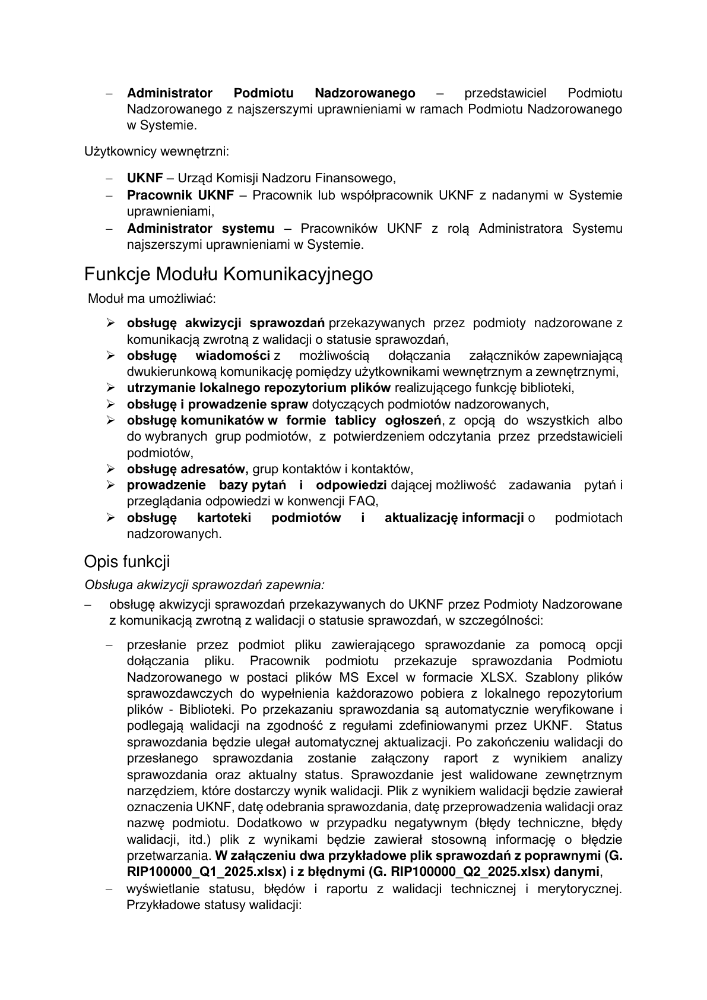
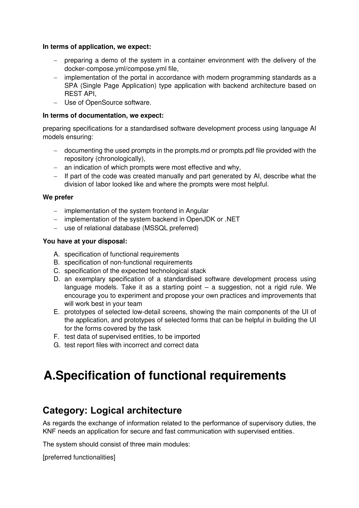

# DETAILS UKNF Prompt2Code2

> Converted from PDF automatically with section detection.
> Verify formatting, links, and section hierarchy manually.

<!-- Page 1 -->

# Zadanie #Prompt2Code2

W erze sztucznej inteligencji proces wytwarzania oprogramowania przechodzi fundamentalną
transformację. Tradycyjne podejście do pisania kodu linia po linii ustępuje miejsca nowej
metodologii, w której deweloperzy stają się prompt inżynierami, a kod jest generowany przy
użyciu odpowiednio zaprojektowanych instrukcji dla dużych modeli językowych.
Zadanie ma na celu stworzenie demo systemu, z maksymalnym wsparciem modeli AI podczas
procesu
wytwórczego.
Oprócz
dostarczenia
działającej
aplikacji,
zespoły
muszą
udokumentować proces pracy z modelami do generowania kodu. Celem jest pokazanie, jak
poprzez odpowiednie konstruowanie i iterowanie promptów udało się uzyskać finalny efekt.
UKNF w zakresie wymiany informacji związanych z realizowaniem obowiązków nadzorczych
potrzebuje aplikacji do bezpiecznej i szybkiej komunikacji z Podmiotami nadzorowanymi.
Demo systemu powinno składać się z trzech głównych modułów: Modułu Uwierzytelnienia i
Autoryzacji, Modułu Komunikacyjnego oraz Modułu Administracji systemem.
Zależy nam na

## funkcjonalności preferowanych

. Ale są również innowacje, usprawnienia,

## funkcjonalności dodatkowe

- które będą dodatkowym punktem w ocenie.

## Funkcjonalności preferowane

Moduł Komunikacyjny, który ma umożliwiać:
-

## obsługę przyjmowania sprawozdań

przekazywanych przez podmioty nadzorowane
z komunikacją zwrotną,
-

## obsługę wiadomości

z możliwością dołączania załączników zapewniającą
dwukierunkową komunikację pomiędzy użytkownikami wewnętrznym a zewnętrznymi,
-

## utrzymanie lokalnego repozytorium plików

realizującego funkcję biblioteki,
-

## obsługę i prowadzenie spraw

dotyczących podmiotów nadzorowanych,
-

## obsługę komunikatów

w formie tablicy ogłoszeń, z opcją do wszystkich albo do
wybranych grup podmiotów, z potwierdzeniem odczytania przez użytkowników
podmiotów,
-

## obsługę adresatów, grup kontaktów i kontaktów,

-

## prowadzenie bazy pytań i odpowiedzi

dającej możliwość zadawania pytań i
przeglądania odpowiedzi w konwencji FAQ,
-

## obsługę

## kartoteki

## podmiotów

## i

## aktualizację

## informacji

o
podmiotach
nadzorowanych.

## Funkcjonalności dodatkowe

Moduł Uwierzytelnienia i Autoryzacji ma umożliwiać:
-

## rejestrację użytkowników zewnętrznych

poprzez formularz online,
-

## obsługę wniosków o dostęp

z przypisywaniem uprawnień dla użytkowników
zewnętrznym,
-

## wybór podmiotu reprezentowanego w ramach sesji

przez uwierzytelnionego
użytkownika zewnętrznego.
Moduł Administracyjny ma umożliwiać:
-

## zarządzanie

## kontami

## użytkowników

wewnętrznych
i
zewnętrznych
przez
pracowników UKNF z rolą administratora systemu,
-

## zarządzanie polityką haseł

w systemie,
-

## zarządzanie rolami użytkowników

wewnętrznych i zewnętrznych.

<!-- Page 2 -->

## W zakresie aplikacji oczekujemy:

-
przygotowaniu demo systemu w środowisku kontenerowym wraz z dostarczeniem pliku
docker-compose.yml/compose.yml,
-
zaimplementowaniu portalu zgodnie z nowoczesnymi standardami programistycznymi
jako aplikacja typu SPA (Single Page Application) z architekturą backend opartą o
REST API,
-
wykorzystaniu oprogramowania typu OpenSource.

## W zakresie dokumentacji oczekujemy

przygotowania specyfikacji ustandaryzowanego procesu tworzenia oprogramowania przy
pomocy językowych modeli AI zapewniającej:
-
udokumentowanie wykorzystanych promptów w pliku prompts.md lub prompts.pdf
dostarczonym wraz z repozytorium (chronologicznie),
-
wskaznie, które prompty były najbardziej efektywne i dlaczego,
-
jeśli część kodu została wytworzona ręcznie, a część wygenerowana przez AI, należy
opisać jak wyglądał podział pracy i gdzie prompty były najbardziej pomocne.

## Preferujemy

-
implementację frontendu systemu w Angular
-
implementację backendu systemu w OpenJDK lub .NET
-
wykorzystanie relacyjnej bazy danych (preferowany MSSQL)

## Udostępniamy

A. specyfikację wymagań funkcjonalnych
B. specyfikację wymagań niefunkcjonalnych
C. specyfikację oczekiwanego stosu technologicznego
D. specyfikację ustandaryzowanego procesu tworzenia oprogramowania przy pomocy
modeli językowych. Potraktujcie ją jako punkt wyjścia - sugestię, a nie sztywną regułę.
Zachęcamy do eksperymentowania i proponowania własnych praktyk oraz
usprawnień, które najlepiej sprawdzą się w Waszym zespole
E. prototypy wybranych ekranów o niskiej szczegółowości, przedstawiające główne
komponenty składowe UI aplikacji, oraz prototypy wybranych formularzy, które mogą
być pomocne w budowie UI dla formularzy objętych zadaniem
F. testowe dane podmiotów nadzorowanych, do zaimportowania
G. testowe pliki sprawozdań z błędnymi i poprawnymi danymi

# A. Specyfikacja wymagań funkcjonalnych

## Architektura logiczna

KNF w zakresie wymiany informacji związanych z realizowaniem obowiązków nadzorczych
potrzebuje aplikacji do bezpiecznej i szybkiej komunikacji z Podmiotami nadzorowanymi.

<!-- Page 3 -->

System powinien składać się z trzech głównych modułów:
[funkcjonalności preferowane]
-

## Modułu Komunikacyjnego

powiązanego z usługą

## Aktualizator danych podmiotu

[funkcjonalności dodatkowe]
-

## Modułu Uwierzytelnienia i Autoryzacji,

-

## Modułu Administracyjnego.

## Cechy UI

Ogólne cechy całego UI:
-
spójna nawigacja - główne menu z podziałem na moduły z zastosowaniem
breadcrumbs,
-
personalizacja - widoki dostosowane do roli użytkownika (pracownik urzędu,
administrator podmiotu, przedstawiciel podmiotu).
Cechy UI dla Modułu Komunikacyjnego:
-
dashboard komunikacyjny - skróty do sprawozdań, wiadomości, spraw, powiadomień
i tablicy ogłoszeń,
-
obsługa sprawozdań - zestawienie sprawozdań ze statusami w formie etykiet (np.
„przyjęte”, „w trakcie walidacji”, „odrzucone”), z możliwością podglądu szczegółów,

## business Architektura logiczna - Platforma Komunikacyjna

## PLATFORMA KOMUNIKACYJNA

## Moduł Komunikacyjny

## Sprawozdania

## Sprawy

## Komunikaty

## Biblioteka

## Moduł Uwierzytelniania i Autoryzacji

## Uwierzytelnienie

## Wnioski

## Autoryzacja

## Formularz kontaktowy

## Moduł Adminstracyjny

## Zarządzanie

## użytkownikami

## Polityka haseł

## Role i uprawnienia

## Baza Podmiotów

## Aktualizator danych podmiotu

## Użytkownik

## zewnętrzny

## Użytkownik

## wewnętrzny

<!-- Page 4 -->

-
wiadomości dwukierunkowe - przypominające pocztę elektroniczną, z opcją
załączników i filtrowania po wątku / podmiocie,
-
repozytorium plików - biblioteka z możliwością wyszukiwania, filtrowania, oznaczania
wersji i uprawnień dostępu,
-
obsługa spraw administracyjnych - widok w formie „teczki sprawy”, z etapami procesu
i przypisanymi dokumentami,
-
aktualizacja danych podmiotów - formularze z walidacją pól i historią zmian.
Cechy UI dla Modułu Uwierzytelnienia i Autoryzacji:
-
ekran rejestracji - prosty intuicyjny formularz rejestracji online,
-
logowanie - poprzez konto zewnętrzne,
-
panel zarządzania dostępami - status wniosków o dostęp widoczny dla użytkowników
i administratorów,
-
wybór roli / podmiotu reprezentowanego - rozwijane menu podczas sesji, przyjazny
przełącznik kontekstu użytkownika.
Cechy UI dla Modułu Administracyjnego:
-
panel administracyjny - widok tabelaryczny z listą użytkowników, podmiotów i
przypisanych ról,
-
zarządzanie kontami - funkcje aktywacji/dezaktywacji kont, reset haseł, blokady
konta i nadawania ról,
-
polityka haseł - panel ustawień (siła hasła, długość).
Zawartość przykładowej strony głównej

## Nagłówek i nawigacja:

-
pasek główny z logo instytucji, nazwą systemu, opcją wylogowania,
-
widoczne aktualnie obsługiwane konto/rola/podmiot oraz szybkie przełączanie
reprezentowanego podmiotu.

## Panel powitalny (górny panel):

-
informacja o zalogowanym użytkowniku (imię, nazwisko, rola, nazwa podmiotu),

## Pulpit główny z kafelkami (przykładowy układ)

## Kafelek lub sekcja

## Funkcja

Dostępne podmioty
Lista dostępnych podmiotów
Status wniosków o dostęp
Liczba oczekujących i rozpatrzonych wniosków
Nowe
wiadomości
i
powiadomienia
Liczba nowych/oczekujących wiadomości z możliwością
szybkiego podglądu
Statusy sprawozdań
Lista kilku ostatnich sprawozdań z etykietami: do przesłania, w
trakcie walidacji, odrzucone, zaakceptowane
Tablica
ogłoszeń
(komunikaty)
Ostatnie komunikaty z opcją potwierdzenia odczytu
Panel zadań/aktywności „do
zrobienia”
Powiadomienia o nowych zdarzeniach

## Sekcje szczegółowe (rozwijane/kontekstowe panele)

Sekcja/panel

## Funkcja

Ostatnie sprawy
Lista ostatnich spraw administracyjnych z możliwością
filtrowania po podmiocie/statusie

<!-- Page 5 -->

Ostatnie zdarzenia
Oś czasu (timeline) głównych zdarzeń: sprawozdania, zmiany
w kontach, działania administracyjne np.:
- 10.09.2025, 11:00: Nowy komunikat w tablicy ogłoszeń
-
10.09.2025,
09:45:
Złożono
sprawozdanie
"XYZ"
- 09.09.2025, 17:30: Zmieniono uprawnienia użytkownika
Wskaźniki bezpieczeństwa
Np. ostatnie udane logowanie, ostatnia zmiana hasła,
aktywność na koncie

## Powiadomienia i alerty:

-
panel powiadomień z ikoną i licznikiem (dostępny z każdego ekranu).
UI widoków zestawień i list
Podstrony prezentujące zestawienia i listy np. spraw, wiadomości, sprawozdań, zdarzeń oraz
komunikatów powinny opierać się na interaktywnych, konfigurowalnych tabelach, które
zapewniają efektywne zarządzanie dużą liczbą rekordów poprzez intuicyjne wyszukiwanie,
sortowanie, filtrowanie i eksport danych do różnych formatów

## Kluczowe cechy UI list i tabel:

-
widoczne pole wyszukiwania nad tabelą, umożliwiające szybkie filtrowanie rekordów
po dowolnym ciągu znaków (np. tytuł sprawy, ID, nazwisko użytkownika),
-
możliwość
sortowania
każdej
kolumny
przez
kliknięcie
nagłówka
(strzałki
rosnąco/malejąco; podwójne kliknięcie resetuje do domyślnej kolejności),
-
zaawansowane filtrowanie:
o
filtry kontekstowe w nagłówkach (np. wybór parametru z listy rozwijanej,
zakres dat, statusy, typy dokumentów),
o
możliwość nakładania wielu filtrów naraz i ich szybkiego resetowania,
-
stronicowanie (paginacja) dla dużych tabel, z możliwością wyboru liczby rekordów na
stronie oraz przejściem do wybranego numeru strony.

## Funkcje eksportu danych:

-
dedykowany przycisk „Eksportuj” nad lub pod tabelą, rozwijający menu wyboru
formatu: XLSX, CSV, JSON,
-
eksport z zachowaniem bieżących filtrów, sortowania i wyselekcjonowanych kolumn,
-
Informacja o limicie eksportowanych rekordów (jeśli taki istnieje),
-
komunikat zwrotny po udanej lub nieudanej próbie eksportu.

## Funkcje użytkowe:

-
każdy wiersz zawiera akcje kontekstowe (np. „Podgląd”, „Edytuj”, „Pobierz”, „Usuń”)
w formie ikon lub menu hamburgera,
-
nagłówki tabel pozostają przyklejone przy przewijaniu (sticky header),
-
każda z funkcjonalności powinna być jasno oznaczona, łatwo dostępna i reagować
natychmiast (dynamiczne zawężanie wyświetlanej listy wyników, animacje ładowania,
wyraźne przyciski).

## Aktorzy

Użytkownicy zewnętrzni:
-

## Podmiot Nadzorowany

- podmiot nadzorowany przez UKNF występujący w
Katalogu Podmiotów oraz w Bazie Podmiotów,
-

## Pracownik Podmiotu Nadzorowanego

- przedstawiciel Podmiotu Nadzorowanego
z nadanymi w Systemie uprawnieniami, zgodnie z nadaną konfiguracją uprawnień,

<!-- Page 6 -->

-

## Administrator

## Podmiotu

## Nadzorowanego

-
przedstawiciel
Podmiotu
Nadzorowanego z najszerszymi uprawnieniami w ramach Podmiotu Nadzorowanego
w Systemie.
Użytkownicy wewnętrzni:
-

## UKNF

- Urząd Komisji Nadzoru Finansowego,
-

## Pracownik UKNF

- Pracownik lub współpracownik UKNF z nadanymi w Systemie
uprawnieniami,
-

## Administrator systemu

- Pracowników UKNF z rolą Administratora Systemu
najszerszymi uprawnieniami w Systemie.

## Funkcje Modułu Komunikacyjnego

Moduł ma umożliwiać:
-

## obsługę akwizycji sprawozdań

przekazywanych przez podmioty nadzorowane z
komunikacją zwrotną z walidacji o statusie sprawozdań,
-

## obsługę

## wiadomości

z
możliwością
dołączania
załączników zapewniającą
dwukierunkową komunikację pomiędzy użytkownikami wewnętrznym a zewnętrznymi,
-

## utrzymanie lokalnego repozytorium plików

realizującego funkcję biblioteki,
-

## obsługę i prowadzenie spraw

dotyczących podmiotów nadzorowanych,
-

## obsługę komunikatów w formie tablicy ogłoszeń

, z opcją do wszystkich albo
do wybranych grup podmiotów, z potwierdzeniem odczytania przez przedstawicieli
podmiotów,
-

## obsługę adresatów,

grup kontaktów i kontaktów,
-

## prowadzenie bazy pytań i odpowiedzi

dającej możliwość zadawania pytań i
przeglądania odpowiedzi w konwencji FAQ,
-

## obsługę

## kartoteki

## podmiotów

## i

## aktualizację informacji

o
podmiotach
nadzorowanych.

### Opis funkcji

Obsługa akwizycji sprawozdań zapewnia:
-
obsługę akwizycji sprawozdań przekazywanych do UKNF przez Podmioty Nadzorowane
z komunikacją zwrotną z walidacji o statusie sprawozdań, w szczególności:
-
przesłanie przez podmiot pliku zawierającego sprawozdanie za pomocą opcji
dołączania
pliku.
Pracownik
podmiotu
przekazuje
sprawozdania
Podmiotu
Nadzorowanego w postaci plików MS Excel w formacie XLSX. Szablony plików
sprawozdawczych do wypełnienia każdorazowo pobiera z lokalnego repozytorium
plików - Biblioteki. Po przekazaniu sprawozdania są automatycznie weryfikowane i
podlegają walidacji na zgodność z regułami zdefiniowanymi przez UKNF. Status
sprawozdania będzie ulegał automatycznej aktualizacji. Po zakończeniu walidacji do
przesłanego
sprawozdania
zostanie
załączony
raport
z
wynikiem
analizy
sprawozdania oraz aktualny status. Sprawozdanie jest walidowane zewnętrznym
narzędziem, które dostarczy wynik walidacji. Plik z wynikiem walidacji będzie zawierał
oznaczenia UKNF, datę odebrania sprawozdania, datę przeprowadzenia walidacji oraz
nazwę podmiotu. Dodatkowo w przypadku negatywnym (błędy techniczne, błędy
walidacji, itd.) plik z wynikami będzie zawierał stosowną informację o błędzie
przetwarzania.
W załączeniu dwa przykładowe plik sprawozdań z poprawnymi (G.

## RIP100000_Q1_2025.xlsx) i z błędnymi (G. RIP100000_Q2_2025.xlsx) danymi

,
-
wyświetlanie statusu, błędów i raportu z walidacji technicznej i merytorycznej.
Przykładowe statusy walidacji:

<!-- Page 7 -->

## Status walidacji

## Znaczenie

## Robocze

przejściowy,
ustawiany
po
dodaniu
pliku
ze
sprawozdaniem

## Przekazane

przejściowy, ustawiany po rozpoczęciu procesu walidacji
sprawozdania.
Potwierdzony
nadaniem
unikalnego
Identyfikatora.

## W trakcie

przejściowy, ustawiany w momencie, gdy przetwarzanie
sprawozdania jest w toku

## Proces

## walidacji

## zakończony

## sukcesem

przetwarzanie
sprawozdania
zostało
zakończone
sukcesem,
w
wyniku
walidacji
sprawozdania
nie
stwierdzono błędów w walidacji. Sprawozdanie zostało
zapisane i dane ze sprawozdania będą podlegały analizie.

## Błędy

## z

## reguł

## walidacji

przetwarzanie sprawozdania zostało zakończone, ale w
wyniku walidacji sprawozdania wykryto błędy w regułach
walidacyjnych

## Błąd techniczny w

## procesie walidacji

przetwarzanie
sprawozdania
zakończyło
się błędem
procesu walidacji

## Błąd - przekroczono

## czas

ustawiany automatycznie w sytuacji, gdy w przeciągu 24h
od dodania pliku ze sprawozdaniem proces przetwarzania
sprawozdania nie zostanie zakończony

## Zakwestionowane

## przez UKNF

ustawiany wyłącznie na żądanie w sytuacji, gdy Pracownik
UKNF użyje akcji „Zakwestionuj” wraz z uzupełnieniem
treścią pola „Opis nieprawidłowości”
-
możliwość
przeglądu
wyników
walidacji
przekazanych
do
UKNF
plików
sprawozdawczych oraz monitorowania zmian statusów przekazanych sprawozdań,
-
możliwość kategoryzacji sprawozdań, przez pracownika UKNF, (organizowanie w tzw.
Rejestry Sprawozdań) na podstawie metadanych przekazywanych w plikach jako
rejestrów np. „Sprawozdania kwartalne”, „Sprawozdania roczne” w tym „aktualne” i
„archiwalne” - możliwość przeniesienia (oznaczenia) przez Pracownika UKNF
sprawozdania do archiwum poprzez akcję Archiwizacji sprawozdania,
-
możliwość obsługi korekt sprawozdań. Użytkownik zewnętrzny może przesłać korektę
do złożonego sprawozdania. Korekta powinna być powiązana w systemie ze
sprawozdaniem korygowanym,
-
możliwość wyświetlania, przez pracownika UKNF, w formie zestawień tzw. Rejestrów
Sprawozdań z podstawowymi informacjami o sprawozdaniu, w tym danych
użytkownika, który dodał sprawozdanie tj. Imię, Nazwisko, E-mail, Telefon, czy złożono
korektę oraz filtrowania tych rejestrów w oparciu o szybki filtry „Moje podmioty”
(sprawozdania podmiotów, przypisanych do „Moje podmioty” u Pracownika UKNF)
oraz o filtr statusu walidacji okres sprawozdawczy itp.,
-
możliwość podglądu, przez pracownika UKNF, informacji o sprawozdaniu w widoku
szczegółów, m.in. o pliku, nazwie, numerze, osobie składającej, podmiocie
składającym, okresie sprawozdawczym, statusie walidacji, złożonych korektach itp.
metadanych,
-
utrzymanie tzw. kalendarza sprawozdawczości (harmonogramu), który m.in.: informuje
podmioty o zbliżających się terminach wysyłki sprawozdań, obsługuje monity, raportuje
postęp i kompletność spływu danych w ramach konkretnej akcji sprawozdawczej,
-
wykorzystanie w sprawozdawczości funkcji Obsługa wiadomości - obsługa
dwukierunkowej komunikacji pomiędzy użytkownikami wewnętrznymi (Pracownicy
UKNF), a zewnętrznymi (Administratorzy Podmiotu Nadzorowanego i Pracownicy
Podmiotu Nadzorowanego,

<!-- Page 8 -->

-
możliwość wyświetlania w formie zestawienia, przez pracownika UKNF, listy
Podmiotów które, nie złożyły wybranego sprawozdania (w systemie nie ma złożonego
sprawozdania o statusie „Proces walidacji zakończony sukcesem” dla wybranego
okresu) i wygenerowania nowego komunikatu.
Obsługa wiadomości zapewnia:
-
obsługę
dwukierunkowej
komunikacja
pomiędzy
użytkownikami
wewnętrznymi
(Pracownikami UKNF), a zewnętrznymi (Administratorzy Podmiotu Nadzorowanego
i Pracownicy Podmiotu Nadzorowanego), w szczególności:
-
obsługę wiadomości z możliwością dołączania załączników w dozwolonych formatach
tj. PDF, DOC/DOCX, XLS/XLSX, CSV/TXT, MP3 i pliki spakowane zip przy warunku,
że łączny rozmiar plików przed spakowaniem nie przekracza 100 MB,
-
odrzucenie plików o niespodziewanych formatach lub przekraczających rozmiar pliku,
-
odrzucanie wiadomości z zainfekowanych i zawierających SPAM,
-
wykorzystanie komunikacji w komponentach systemu - we wnioskach o dostęp
(konwersacji w ramach składanych przez użytkowników zewnętrznych wniosków),
sprawach, akwizycji sprawozdań,
-
możliwość oznaczania statusów wiadomości. Statusy wiadomości:

## Status

## Znaczenie

## Oczekuje na odpowiedź UKNF

wiadomość dodana przez Użytkownika zewnętrznego

## Oczekuje

## na

## odpowiedź

## Użytkownika

wiadomość dodana przez Pracownika UKNF

## Zamknięty

wiadomość, dla której jest odpowiedź Pracownika
UKNF/Użytkownika zewnętrznego
-
możliwość wyświetlania w formie zestawienia wiadomości kierowanych do podmiotów
przez Pracownikami UKNF oraz filtrowania zestawienia w oparciu o szybkie filtry: „Moje
podmioty” (wnioski podmiotów, przypisanych do „Moje podmioty” u Pracownika UKNF),
„Wymaga odpowiedzi UKNF" (wiadomości o statusie „Oczekuje na odpowiedź UKNF”)
oraz filtr komponentu w którym została użyta wiadomość,
-
zapewnienie możliwości grupowania podmiotów nadzorowanych i użytkowników
zewnętrznych (kategoryzowanie odbiorców) w celu ich jednoczesnego informowania.
Przekazywanie wiadomości masowych przez UKNF do wskazanych Podmiotów
Nadzorowanych (wybranych z listy lub według rodzajów rynkowych albo przez
wskazanie grup).
Utrzymanie lokalnego repozytorium plików zapewnia:
-
utrzymywanie repozytorium plików w formie Biblioteki na potrzeby ich udostępniania
użytkownikom systemu (np. szablony sprawozdań w formacie plików Excel, instrukcje,
opisy itp.), repozytorium plików jest wspólnym zasobem wszystkich Użytkowników
zewnętrznych. O tym do jakich plików mają dostęp Użytkownicy zewnętrzni decyduje
Pracownik UKNF. Repozytorium zapewnia w szczególności:
-
dodawanie pliku i modyfikowanie informacji o pliku (metadanych) przez Pracowników
UKNF - np. pola „Nazwa pliku”, „Okres sprawozdawczy”, „Data aktualizacji wzoru” i
„Załącznik” (plik szablonu). Pracownik UKNF ma dostęp do wszystkich plików w
repozytorium i może dodawać, modyfikować oraz usuwać pliki i ich metadane,
-
udostępnianie plików wszystkim lub pojedynczym użytkownikom oraz wybranym
grupom użytkowników,
-
możliwość kategoryzowania, filtrowania oraz sortowania plików,
-
możliwość podglądu historii pliku oraz przejrzenia historii zmian,

<!-- Page 9 -->

-
oznaczanie plików dostępnych w wersji aktualnej oraz archiwalnej wraz z datą ostatniej
aktualizacji.
Obsługa i prowadzenie spraw w trybie administracyjnym zapewnia:
-
obsługę i prowadzenie spraw w trybie administracyjnym dotyczących podmiotów
nadzorowanych, w szczególności:
-
tworzenie spraw (rejestrowanie), przypisywanie i monitorowanie postępów w
poszczególnych sprawach (statusy spraw). Sprawy są prowadzone pomiędzy
Pracownikami Podmiotu Nadzorowanego i Pracownikami UKNF w kontekście tylko
jednego wybranego Podmiotu Nadzorowanego i dotyczące jednej z kategorii np.:
„Zmiana danych rejestrowych”, „Zmiana składu osobowego”, „Wezwanie do Podmiotu
Nadzorowanego”, „Uprawnienia do Systemu”, „Sprawozdawczość”, „Inne” z
ustaleniem
priorytetu:
„Niski”,
„Średni”
lub
„Wysoki”.
Przykładowe statusy spraw:

## Status sprawy

## Znaczenie

## Wersja robocza

ustawiany po zapisaniu wersji roboczej sprawy. Sprawy takie
nie są widoczne dla Pracownika UKNF

## Nowa sprawa

ustawiany po uruchomieniu/przekazaniu sprawy. Sprawa takie
są widoczne dla Pracownika UKNF

## W toku

ustawiany
automatycznie
po
otwarciu
sprawy
przez
Pracownika Podmiotu Nadzorowanego lub Pracownika UKNF

## Do

## uzupełnienia

ustawiany przez Pracownika UKNF, wskazuje na potrzebę
uzupełnienia przez Pracownika Podmiotu Nadzorowanego
informacji lub załącznika w sprawie

## Zakończona

status sprawy ustawiany przez Pracownika UKNF, oznacza
zakończenie sprawy

## Anulowana

ustawiany przez Pracownika UKNF, możliwa do ustawienia
jeżeli Pracownika Podmiotu Nadzorowanego jeszcze się z nią
nie zapoznał
-
przechowywanie i zarządzania dokumentami elektronicznymi związanymi z
poszczególnymi sprawami - dodawanie załączników do sprawy,
-
anulowanie sprawy, która nie została jeszcze podjęta przez Pracownika Podmiotu
Nadzorowanego. Mechanizm, który pozwoli, w wypadku utworzenia wiadomości o
przydzielaniu nowej sprawy, która została wysłana do Pracownika Podmiotu
Nadzorowanego, anulować tę wiadomość (sprawę), o ile ten pracownik jeszcze się z
nią nie zapoznał (tj. ma status: Nowa Sprawa). Treść wiadomości nie będzie od tego
momentu dostępna dla Pracownika Podmiotu Nadzorowanego a zamiast tego będzie
widział
komunikat
„wiadomość
anulowana”.
Dodatkowo
wysyłane
będzie
powiadomienie do podmiotu o anulowaniu wiadomości. Przez UKNF taka sprawa
będzie widoczna ze statusem Anulowana. W takiej sprawie będzie zablokowana
możliwości edycji,
-
wykorzystanie w sprawie funkcji Obsługa wiadomości - obsługa dwukierunkowej
komunikacja pomiędzy użytkownikami wewnętrznymi (Pracownicy UKNF), a
zewnętrznymi (Administratorzy Podmiotu Nadzorowanego i Pracownicy Podmiotu
Nadzorowanego. Przekazywanie wiadomości elektronicznych w ramach sprawy lub w
związku ze sprawozdaniem, z załącznikami, przez Podmioty Nadzorowane do UKNF i
przez UKNF do Podmiotów Nadzorowanych,
-
możliwość wyświetlenia zestawienia Spraw z podstawowymi informacjami o sprawach,
w tym danych użytkownika, który dodał sprawę tj. Imię, Nazwisko, E-mail, Telefon,

<!-- Page 10 -->

-
możliwość przeglądu informacji o sprawie w widoku szczegółów, m.in. o, nazwie,
numerze,
podmiocie
którego
dotyczy,
prowadzącym
sprawę,
kategorii,
wiadomościach przekazywanych w ramach sprawy, itp. metadanych,
-
podgląd historii zmian sprawy przez Pracownika UKNF i użytkownika zewnętrznego.
Obsługa komunikatów w formie tablicy ogłoszeń zapewnia:
-
obsługę komunikatów udostępnianych przez pracowników UKNF w formie tablicy
ogłoszeń z możliwością "tylko do odczytu" z zarejestrowaniem odczytania przez
przedstawicieli podmiotów, w szczególności:
-
dodawanie i publikowanie ogłoszeń przez uprawnionych użytkowników wewnętrznych,
-
redagowanie treści komunikatu z użyciem edytora WYSWIG,
-
edytowanie, zdejmowanie z publikacji i usuwanie istniejących zbędnych ogłoszeń,
-
dołączanie do komunikatów plików (załączników),
-
przeglądanie komunikatu z historią zmian,
-
ustawianie daty wygaśnięcia ogłoszeń,
-
ustawienie priorytetu dla komunikatu tj. „Niski”, „Średni”, „Wysoki”,
-
przypisywanie ogłoszeń do różnych kategorii (np. informacje ogólne, zdarzenia),
-
definiowanie grup odbiorców tj. do pojedynczych użytkowników zewnętrznych, grup
użytkowników zewnętrznych lub wszystkich użytkowników zewnętrznych,
-
wyświetlanie ogłoszeń na stronie startowej w aplikacji określonym grupom odbiorców,
-
oznaczenie np. wyróżnienie po stronie podmiotu gdy otrzyma nowy komunikat,
-
możliwość wyświetlenia zestawienia komunikatów z opcjami filtrowania,
-
monitorowanie aktywności użytkowników w zakresie odczytania komunikatów
(statystyki odczytania komunikatu przez podmioty np. 71/100 podmiotów) i
popularności ogłoszeń,
-
możliwość ustawiania wymagalności potwierdzenia odczytani komunikatu przez
Użytkownika zewnętrznego w zależności od zdefiniowanego priorytetu komunikatu. W
przypadku komunikatów o priorytecie „Wysoki” użytkownik musi kliknąć, że go
odczytał. W potwierdzeniu będzie widoczna data i godzina odczytania, imię i nazwisko
użytkownika oraz nazwa podmiotu, który reprezentował.

## Obsługa adresatów, grup kontaktów i kontaktów zapewnia:

-
dodawanie i modyfikowanie adresatów, grup kontaktów i kontaktów. Przez Adresatów
należy rozumieć Użytkowników zewnętrznych, którzy są powiadamiani o zdarzeniach
w systemie (np. o dodaniu nowego Komunikatu) lub otrzymują uprawnienia do
wybranych plików w Bibliotece. Należy wyróżnić cztery rodzaje dodawania Adresatów:

## Rodzaj

## Opis

## Wybrane

## typy

## podmiotów

adresatem jest każdy Użytkownik zewnętrzny, którego
Podmiot jest powiązany z typem podmiotu np. „Instytucja
Pożyczkowa”.

## Wybrane podmioty

adresatem
jest
każdy
Użytkownik
zewnętrzny,
który
powiązany jest z którymkolwiek z wybranych z listy Podmiotów

## Wybrani użytkownicy

adresatem jest każdy Użytkownik zewnętrzny wybrany z listy
użytkowników

## Wybrane

## grupy

## kontaktów

tzw. baza teleadresowa - adresatem jest każdy Użytkownik
zewnętrzny przypisany do wybranej Grupy Kontaktów.
Grupa kontaktów to lista wybranych Przedstawicieli podmiotów i Użytkowników
zewnętrznych, którzy mogą dostawać powiadomienia e-mail od Pracowników UKNF.
Osoba, która jest członkiem takiej Grupy kontaktów nie musi mieć dostępu do Systemu
tzn. nie musi być Użytkownikiem zewnętrznym. Dodanie takiej osoby możliwe jest

<!-- Page 11 -->

poprzez dodanie nowego tzw. Kontaktu. W Kontaktach mogą znajdować się adresaci,
którzy nie muszą być użytkownikami Systemu. Pracownicy UKNF mogą takie osoby
powiadamiać pocztą elektroniczną e-mail o różnych zdarzeniach np. przypisując ich do
wybranej Grupy Kontaktów.
Prowadzenie bazy pytań i odpowiedzi zapewnia:
-
możliwość zadawania pytań i uzyskiwania na nie odpowiedzi oraz przeglądania
zanonimizowanych pytań wraz z odpowiedziami (tzw. Baza wiedzy FAQ), w
szczególności:
-
dodawanie nowych pytań w tym anonimowo. Pytania powinny mieć pola: tytuł, treść,
kategoria, etykiety, data dodania, status.
-
dodawanie odpowiedzi na pytania przez Pracownika UKNF,
-
zarządzanie pytaniami i odpowiedziami - możliwość modyfikacji lub usunięcia
pytań/odpowiedzi, zmianę treści, statusu i innych pól przez Pracownik UKNF lub
Administratora Systemu,
-
kategoryzację pytań i odpowiedzi - grupowanie w kategorie,
-
obsługę etykiet (tagów) dla lepszego filtrowania,
-
ocenianie odpowiedzi (np. gwiazdki 1-5),
-
wyszukiwanie po słowie kluczowym, tytule, treści, kategorii lub etykietach.
-
sortowanie wyników według: popularności, daty dodania, ocen.
-
filtrowanie według kategorii, tagów, statusu odpowiedzi.
Obsługa kartoteki podmiotów i aktualizacja informacji o podmiotach nadzorowanych
zapewnia:
-
możliwość utrzymywania w systemie informacji o podmiotach nadzorowanych w formie
Kartoteki Podmiotów, w szczególności:
-
dodawanie i modyfikację danych o podmiocie nadzorowanym przez Administratora
systemu i Pracownika UKNF, zgodnie ze strukturą:

## Nawa pola

## typ

## Opis

## ID

bigint

## Typ podmiotu

nvarchar(250)
Rola podmiotu w Bazie Podmiotów np.
instytucja pożyczkowa

## Kod UKNF

nvarchar(250)
kod generowany w Bazie Podmiotów,
nieedytowalny,

## Nazwa podmiotu

nvarchar(500)

## LEI

nvarchar(20)

## NIP

nvarchar(10)

## KRS

nvarchar(10)

## Ulica

nvarchar(250)

## Numer budynku

nvarchar(250)

## Numer lokalu

nvarchar(250)

## Kod pocztowy

nvarchar(250)

## Miejscowość

nvarchar(250)

## Telefon

nvarchar(250)
Ciąg cyfr i znaków definiujący numer
telefonu. Weryfikacja poprawności numeru
telefonu
z
uwzględnieniem
formatu
międzynarodowego
(np.
/^\+(?:[0-9]
?){6,14}[0-9]$/)

## E-mail

nvarchar(500)
Adres poczty elektronicznej, zawierający
znak @

## Numer wpisu do rejestru

## UKNF

nvarchar(100)
Numer
identyfikacyjny
nadawany
w
rejestrze UKNF

<!-- Page 12 -->

## Status podmiotu

nvarchar(250)
Status podmiotu w Bazie Podmiotów np.
Wpisany, Wykreślony

## Kategoria podmiotu

nvarchar(500)
Nazwa
kategorii
podmiotu
w
Bazie
Podmiotów

## Sektor podmiotu

nvarchar(500)
Nazwa
sektora
podmiotu
w
Bazie
Podmiotów

## Podsektor podmiotu

nvarchar(500)
Nazwa podsektora podmiotu w Bazie
Podmiotów

## Podmiot transgraniczny

bit
checkbox zaznaczony/odznaczony

## Data utworzenia

datetime2(7)

## Data aktualizacji

datetime2(7)
-
przeglądanie historii zmian danych o podmiocie,
-
podgląd szczegółowych danych podmiotu nadzorowanego przez Administratora
systemu i Pracownika UKNF,
-
podgląd listy wszystkich Użytkowników Podmiotu przypisanych w systemie do danego
Podmiotu Nadzorowanego przez Administrator Podmiotu, Administratora systemu i
Pracownika UKNF,
-
podgląd szczegółowych danych podmiotu przez
Użytkowników zewnętrznych
przypisanych do danego podmiotu w celu możliwość weryfikacji zgodności danych ze
stanem faktycznym oraz zgłoszenia zmiany danych rejestrowych (Nazwa podmiotu,
dane adresowe, Telefon, E-mail) w przypadku niezgodności lub zmiany ich zmiany,
poprzez sprawę o kategorii „Zmiana danych rejestrowych” (zgłoszenie generuje nowa
sprawę).
Aktualizacja informacji o podmiotach nadzorowanych (Usługa Aktualizator danych podmiotu)
zapewnia:
-
możliwość aktualizacji danych o podmiotach nadzorowanych (danych rejestrowych)
współpracujących z UKNF zawartych w Bazie Podmiotów, w celu przechowywania
wiarygodnych informacji o podmiotach i ich powiązaniach i historii zmian, w szczególności:
-
aktualizację
danych
o
podmiocie
nadzorowanym
przez
uwierzytelnionego
Administratora Podmiotu Nadzorowanego za pomocą udostępnionego w systemie
formularza zmiany
(Nazwa podmiotu, Adres: ulica, kod pocztowy i miejscowość Telefon, E-mail).
-
wersjonowanie zmian danych o podmiocie - przechowywane dane historyczne,
dostępne do wglądu przez Pracownika KNF,
-
weryfikację aktualizowanych danych przez Pracownika UKNF i po poprawnej
weryfikacji zapisanie ich w Bazie Podmiotów,
-
ustalanie harmonogramu, dla alertów cyklicznie pojawiających się podczas sesji
dostępu użytkowników zewnętrznych z potwierdzeniem aktualnych danych podmiotu
nadzorowanego.

## Funkcje Modułu Uwierzytelnienia i Autoryzacji

Moduł ma umożliwiać:
-

## rejestrację użytkowników zewnętrznych

poprzez formularz online,
-

## obsługę wniosków o dostęp

z przypisywaniem uprawnień dla użytkowników
zewnętrznym,
-

## wybór podmiotu reprezentowanego w ramach sesji

przez uwierzytelnionego
użytkownika zewnętrznego.

<!-- Page 13 -->

### Opis funkcji

Rejestracja użytkowników zewnętrznych zapewnia:
-
rejestrację użytkowników zewnętrznych poprzez formularz online, w szczególności:
-
zarejestrowanie
się
użytkowników
zewnętrznych
(Administratorów
Podmiotu
Nadzorowanego, Pracownik Podmiotu Nadzorowanego),
-
utworzenie konta przez użytkownika zewnętrznego poprzez formularz online
(obowiązkowe pola: Imię, Nazwisko, PESEL [maskowany, widoczne 4 ostatnie cyfry],
telefon, e-mail),
-
wysłanie na adres e-mail użytkownika linku do aktywacji konta i ustawienie przez
użytkownika hasła do systemu zgodnie z przyjętą polityką tworzenia haseł w systemie.
Obsługa wniosków o dostęp zapewnia:
-
obsługę wniosków o dostęp z nadaniem/odebraniem uprawnienia do poszczególnych
funkcji systemu dla wybranego podmiotu wraz z możliwością ich aktualizacji oraz
dodaniem załączników, w szczególności:
-
po poprawnej aktywacji konta użytkownika w systemie (rejestracji), automatyczne
wygenerowanie wniosku o dostęp o statusie „Roboczy”,
-
edycję wniosku o dostęp przez przedstawiciela podmiotu, obowiązkowe pola: Imię,
Nazwisko, PESEL [maskowany, widoczne 4 ostatnie cyfry], telefon, e-mail pobrane z
formularza przy rejestracji użytkownika,
-
dodanie uprawnień w ramach danego Podmiotu Nadzorowanego poprzez wybranie we
wniosku, przez Użytkownika wewnętrznego z listy podmiotów (lista podmiotów
udostępniona przez UKNF - Katalog Podmiotów) podmiotów nadzorowanych, z
którymi będzie powiązany i które będzie reprezentował tzw. linia uprawnień,
-
przypisanie uprawnienia o jakie wnioskuje użytkownik poprzez zaznaczenie
uprawnienia w checkboxami np. uprawnienia: Sprawozdawczość, Sprawy,
Administrator podmiotu,
-
uzupełnienie adresu e-mail Podmiotu Nadzorowanego co spowoduje przypisanie
podanego adresu mailowego do wybranego Podmiotu i wysyłanie na ten adres
automatycznych powiadomień mailowych np. w przypadku przesłania sprawozdania
przez Pracownika Podmiotu Nadzorowanego,
-
po zatwierdzeniu wniosku o dostęp przez użytkownika zewnętrznego wyświetlenie
komunikatu potwierdzającego złożenie wniosku i zmianę statusu wniosku z „Roboczy”
na „Nowy”,
-
wysłanie automatycznego potwierdzenia złożenia wniosku o dostęp na wskazany
podczas rejestracji adres e-mail użytkownika zewnętrznego,
-
akceptację wniosku o dostęp przez Pracownika UKNF (dla Administratora Podmiotu
Nadzorowanego) lub przez Administratora Podmiotu Nadzorowanego (dla Pracownik
Podmiotu Nadzorowanego),
-
po akceptacji wniosku o dostęp wyświetlenie komunikatu potwierdzającego akceptację
i zmianę statusu wniosku z „Nowy” na „Zaakceptowany”,
-
możliwość oznaczania statusów wniosków. Statusy wniosków:

## Status

## Znaczenie

## Roboczy

wniosek, który nie został jeszcze przekazany do akceptacji

## Nowy

wniosek, który został uzupełniony i przekazany do akceptacji

## Zaakceptowany

wniosek,
w
którym
wszystkie
linie
uprawnień
zostały
zaakceptowane

## Zablokowany

wniosek,
w
którym
wszystkie
linie
uprawnień
zostały
zablokowane

<!-- Page 14 -->

## Zaktualizowany

wniosek,
który został zmodyfikowany i oczekuje na ponowną
akceptację
-
możliwość komunikacji Pracownika UKNF z użytkownikiem zewnętrznym przez
wiadomości elektroniczne dostępne na poziomie wniosku o dostęp. Np. przy weryfikacji
wniosku o dostęp w przypadku stwierdzenia nieprawidłowości Pracownik UKNF może
utworzyć i wysłać wiadomość do użytkownika zewnętrznego z prośbą o wyjaśnienia, z
możliwością dodania załączników,
-
możliwość wyświetlania w formie zestawienia wszystkich zarejestrowanych w systemie
wniosków przez Pracowników UKNF oraz ich filtrowania w oparciu o szybkie filtry:
„Moje podmioty” (wnioski podmiotów, przypisanych do „Moje podmioty” u Pracownika
UKNF), „Wymaga działania UKNF” (wnioski, które wymagają akceptacji UKNF),
„Obsługiwany przez UKNF” (wnioski, które są lub były obsługiwane przez UKNF),
-
możliwość wyświetlania w formie zestawienia zarejestrowanych wniosków Podmiotu
Nadzorowanego przez Administratora tego Podmiotu Nadzorowanego,
-
podgląd historii wniosku o dostęp, możliwość przejrzenia historii zmian,
-
podgląd przez Pracownika UKNF linii uprawnień użytkowników zewnętrznych,
-
blokowanie uprawnień Administratora Podmiotu Nadzorowanego przez Pracowników
UKNF. Zablokowanie uprawnień Administratora podmiotu spowoduje utratę przez tego
Administratora dostępu do systemu. Jeżeli dla podmiotu, dla którego został
zablokowany Administrator, jest przypisany drugi/inny Administrator podmiotu to
będzie mógł on dalej akceptować i zarządzać wnioskami o dostęp pozostałych
użytkowników przypisanych do tego podmiotu. Zablokowanie Administratora Podmiotu
Nadzorowanego przez UKNF nie będzie modyfikować ani blokować uprawnień
pozostałych użytkowników podmiotu, którym zablokowany Administrator akceptował
uprawnienia. Jeżeli dla podmiotu, w którym Administrator został zablokowany, nie
będzie zaakceptowanych drugiego/innych Administratorów podmiotu, to modyfikacja i
akceptacja uprawnień dla pozostałych użytkowników podmiotu będzie wymagała
akceptacji UKNF,
-
zarządzanie
przez
Administratora
Podmiotu
Nadzorowanego
uprawnieniami
Pracowników Podmiotu Nadzorowanego, w tym możliwość modyfikacji uprawnień
Pracowników Podmiotu Nadzorowanego w zakresie, dostępów do modułów
Sprawozdawczość
(dostęp/brak
dostępu),
Sprawy
(dostęp/brak
dostępu),
przypisanych Podmiotów oraz dostępu do systemu (możliwość zablokowania dostępu
do systemu) wyłącznie w zakresie podmiotu, do którego Administrator Podmiotu
Nadzorowanego posiada uprawnienia.
Wybór podmiotu reprezentowanego w ramach sesji zapewnia:
-
Wybór, przez uwierzytelnionego użytkownika zewnętrznego, podmiotu reprezentowanego
w ramach sesji tj. wybranie podmiotu do którego użytkownik zewnętrzny ma przypisane
uprawnienia,
-
wyświetlenie na dalszych ekranach nawigacyjnych informacji w jakim kontekście i roli
pracuje użytkownik.

## Funkcje Modułu Administracyjnego

Moduł ma umożliwiać:
-

## zarządzanie

## kontami

## użytkowników

wewnętrznych
i
zewnętrznych
przez pracowników UKNF z rolą administratora systemu,
-

## zarządzanie polityką haseł

w systemie,
-

## zarządzanie rolami użytkowników

wewnętrznych i zewnętrznych.

<!-- Page 15 -->

### Opis funkcji

Zarządzanie kontami użytkowników przez Pracowników UKNF zapewnia:
-
zarządzanie kontami użytkowników wewnętrznych i zewnętrznych przez pracowników
UKNF z rolą Administratora Systemu, w szczególności:
-
dodawanie/edytowanie/usuwanie kont użytkowników wewnętrznych i zewnętrznych,
-
ustawianie haseł dla kont użytkowników wewnętrznych i zewnętrznych.
Zarządzanie polityką haseł w systemie zapewnia:
-
zarządzanie paramentami haseł mającymi wpływ na ich bezpieczeństwo, spójność i
zgodność z wymogami bezpieczeństwa w organizacji, w szczególności:
-
możliwość ustawienia złożoności hasła (długość, unikalność), częstotliwości zmiany
oraz długości historii (zapobieganie ponownemu użyciu ostatnich haseł),
-
możliwość ręcznego wymuszenia zmiany hasła dla wybranych użytkowników.
Zarządzanie rolami użytkowników wewnętrznych i zewnętrznych zapewnia:
zarządzanie dostępem, w którym uprawnienia są przypisywane do ról, a role są przypisywane
do użytkowników, w szczególności:
-
tworzenie ról w systemie,
-
konfigurację uprawnień dla ról,
-
przypisywanie użytkowników wewnętrznych i zewnętrznych do ról,
-
przeglądanie i aktualizowanie ról.

# B. Specyfikacja

# wymagań

# niefunkcjonalnych

# systemu

1. Zarządzanie plikami
-
Przesyłanie plików różnych formatów
-
Wsparcie dla dużych plików z wykorzystaniem chunked upload
-
Możliwość kompresji/dekompresji plików ZIP
-
Przygotowanie systemu do użycia zewnętrznej usługi skanującej pliki pod kątem
wirusów
-
Udostępnianie plików innym użytkownikom
-
Zarządzanie uprawnieniami do plików
-
Hierarchiczny system katalogów
-
Wersjonowanie plików
-
Metadane plików
-
Wyszukiwanie po metadanych i zawartości
2. Bezpieczeństwo
2.1 Bezpieczeństwo danych
-
Szyfrowanie danych wrażliwych
-
Szyfrowanie komunikacji (HTTPS)
-
Walidacja danych wejściowych

<!-- Page 16 -->

-
Ochrona przed typowymi atakami (CSRF, XSS, SQL Injection)
-
Bezpieczne przechowywanie haseł
2.2 Audyt i logowanie
-
Śledzenie aktywności użytkowników
-
Logowanie zdarzeń bezpieczeństwa
-
Wykrywanie anomalii
3. Wydajność i skalowalność
3.1 Optymalizacja wydajności
-
Buforowanie danych (cache)
-
Lazy loading dla list i dużych zestawów danych
-
Paginacja wyników
-
Optymalizacja zapytań do bazy danych
4. Dokumentacja
4.1 Dokumentacja API
-
Swagger/OpenAPI
-
Opis wszystkich endpointów REST
-
Przykłady żądań i odpowiedzi
4.2 Dokumentacja techniczna
-
Plik README z instrukcją instalacji i konfiguracji
-
Diagram związków encji
-
Dokumentacja architektury systemu
-
Instrukcja wdrożenia (deployment)
4.3 Dokumentacja użytkownika
-
Instrukcja obsługi portalu
5. Wdrożenie i uruchomienie
5.1 Środowisko kontenerowe
-
Docker Compose do uruchomienia wszystkich komponentów
-
Skonteneryzowane usługi (frontend, backend, baza danych, system kolejkowy)
5.2 Konfiguracja
-
Parametryzacja przez zmienne środowiskowe
-
Zewnętrzne pliki konfiguracyjne

<!-- Page 17 -->

# C. Specyfikacja

# oczekiwanego

# stosu

# technologicznego

1. Wprowadzenie
Niniejszy dokument zawiera specyfikację stosu technologicznego portalu służącego do
komunikacji między użytkownikami oraz przesyłania plików. Portal zostanie zbudowany w oparciu
o technologie Open Source zgodnie z nowoczesnymi standardami programistycznymi jako
aplikacja
typu
SPA
(Single
Page
Application)
z architekturą backend opartą o REST API.
2. Architektura systemu
2.1 Architektura ogólna
System będzie składał się z następujących warstw:
-
Frontend: Aplikacja SPA odpowiedzialna za interfejs użytkownika
-
Backend: REST API obsługujące logikę biznesową i dostęp do danych
-
Baza danych: Relacyjna baza danych przechowująca dane systemu
-
System kolejkowy: Przetwarzanie operacji asynchronicznych
3. Technologie
3.1 Frontend
3.1.1 Framework
-
Angular 20.x
3.1.2 Biblioteki komponentów
-
PrimeNG z wykorzystaniem jednego z domyślnych motywów
-
Tailwind CSS
3.1.3 Wymagania UI/UX
-
Kompatybilność: Wsparcie dla najnowszych wersji przeglądarek (Chrome, Firefox,
Safari, Edge)
-
Responsywność: Dostosowanie do różnych urządzeń (komputer, tablet, smartfon)
-
Dostępność: Zgodność ze standardem WCAG 2.2, możliwość przełączenia interfejsu
w tryb wysokiego kontrastu
-
Typografia: Czytelne czcionki i odpowiednie rozmiary tekstu
3.2 Backend - wersja Java
3.2.1 Platforma
-
OpenJDK 21
3.2.2 Framework
-
Spring Boot 3.5 lub nowszy
3.2.3 ORM
-
Hibernate 6.x lub wyższy

<!-- Page 18 -->

3.2.4 Architektura
-
REST API
-
CQRS (Command Query Responsibility Segregation)
-
Dependency Injection
3.2.5 Walidacja
-
Bean Validation (JSR 380)
-
Spring Validation
3.3 Backend - wersja .NET
3.3.1 Platforma
-
.NET 8 lub .NET 9 (LTS lub najnowszy)
3.3.2 Framework
-
ASP.NET Core Web API
3.3.3 ORM
-
Entity Framework Core (EF Core)
3.3.4 Architektura
-
REST API
-
CQRS (Command Query Responsibility Segregation)
-
Dependency Injection (wbudowany kontener DI w .NET Core)
3.3.5 Walidacja
-
FluentValidation (sugerowane)
-
System.ComponentModel.DataAnnotations (alternatywnie)
3.4 Baza danych
-
MS SQL Server lub inna relacyjna baza danych
3.5 System kolejkowy
-
Apache Kafka lub RabbitMQ (jeśli będzie wykorzystywany)
3.6 Konteneryzacja
-
Docker z plikiem docker-compose.yml/compose.yml
3.7 System operacyjny (środowisko produkcyjne)
-
Linux
-
Windows
4. Bezpieczeństwo
4.1 Uwierzytelnianie i autoryzacja
-
OAuth 2.0 / OpenID Connect
-
JWT (JSON Web Token)

<!-- Page 19 -->

# D. Specyfikacja ustandaryzowanego procesu

# wytwarzania oprogramowania przy użyciu

# modeli AI

Cel dokumentu:
Celem dokumentu jest ustandaryzowanie procesu wytwarzania oprogramowania przy pomocy
modeli AI, zapewniając:
-
Efektywność (przyspieszenie developmentu),
-
Powtarzalność (utrzymanie spójnych praktyk),
-
Jakość (zminimalizowanie błędów i długów technologicznych),
-
Bezpieczeństwo (świadome użycie generowanego kodu).
1. Wymagania wstępne
1.1. Środowisko
-
Lista wspieranych IDE (np. Cursor AI, IntelliJ AI Assistant, VSCode z Copilot itd.)
-
Wymagane pluginy / rozszerzenia
-
Wersje narzędzi
-
Konfiguracja LLM (np. OpenAI GPT-4o, Claude, lokalny LLM)
2. Dobre praktyki promptowania
2.1. Struktura prompta
-
Kontekst (np. język, framework, architektura)
-
Zadanie (co ma zostać wykonane)
-
Oczekiwania (output, format, styl, testy)
2.2. Przykłady promptów
-
„Napisz funkcję w Pythonie do parsowania CSV, z testami jednostkowymi w pytest”
-
„Zaproponuj strukturę folderów dla aplikacji Spring Boot z warstwą REST API i integracją z
PostgreSQL”
2.3. Prompty zaawansowane
-
Refaktoryzacja
-
Wytwarzanie kodu generycznego
-
Tworzenie dokumentacji z kodu
-
Diagnostyka błędów
3. Etapy developmentu z AI
3.1. Planowanie
-
Generowanie specyfikacji funkcjonalnej na podstawie prompta
-
Automatyczne tworzenie backlogu / user stories
3.2. Projektowanie

<!-- Page 20 -->

-
Tworzenie schematów klas / komponentów
-
Architektura: mikroserwisy, monolit, DDD
-
UML / diagramy (z konwersją do kodu)
3.3. Kodowanie
-
Generowanie szkieletu projektu
-
Rozszerzanie funkcjonalności krok po kroku
-
Integracja z istniejącym kodem (kontekstualne podpowiedzi AI)
3.4. Testowanie
-
Generowanie testów jednostkowych, integracyjnych
-
Pokrycie testami - prompty do analizy pokrycia
3.5. Dokumentacja
-
Generowanie README, diagramów, changelogów
-
Tworzenie inline documentation (np. Javadoc, docstringi)
3.6. Refaktoryzacja i utrzymanie
-
Propozycje AI do refaktoryzacji
-
Wyszukiwanie code smell i błędów architektonicznych
-
Porównywanie wersji i sugerowanie zmian

## Załączniki

### E.

### prototypy

### wybranych

### ekranów

### o

### niskiej

### szczegółowości,

### przedstawiające główne komponenty składowe UI aplikacji, oraz prototypy

### wybranych formularzy, które mogą być pomocne w budowie UI dla

### formularzy objętych zadaniem

## ---> odrębny plik („E. prototypy

## wybranych ekranów”)

### F.

### testowe dane podmiotów nadzorowanych, do zaimportowania

## --->

## odrębny plik („przykładowe dane podmiotów nadzorowanych do

## zaimportowania”)

### G.

### testowe pliki sprawozdań z błędnymi i poprawnymi danymi

## --->

## odrębne

## pliki

## („G.RIP100000_Q1_2025”

## oraz

## „G.RIP100000_Q2_2025”)

## Pobierz tutaj:

Prompt2Code2

<!-- Page 21 -->

# TASK #Prompt2Code2

In the era of artificial intelligence, the software development process is undergoing a
fundamental transformation. The traditional approach of writing code line by line is giving way
to a new methodology, where developers act as prompt engineers and code is generated
through carefully designed instructions for large language models.
The task is to create a demo of the system, with maximum support for AI models throughout
the development process. In addition to delivering a working application, teams must document
the process of working with code-generation models. The goal is to demonstrate how
appropriate prompt design and iteration led to the final result.
UKNF requires an application for secure and efficient communication with supervised entities
to support the exchange of information related to supervisory duties.
The system demo should consist of three main modules: Authentication and Authorization
Module, Communication Module and System Administration Module.
We care about the

## preferred

## functionalities

. But there are also innovations, improvements,

## additional functionalities

- which will be an additional point in the assessment.

## Preferred functionalities

The Communication Module, which is to enable:
-

## handling the acceptance of reports

submitted by supervised entities with feedback,
-

## handling messages

with the possibility of attaching attachments ensuring two-way
communication between internal and external users,
-

## maintaining a local file repository

that performs the library function,
-

## handling and handling cases

concerning supervised entities,
-

## handling messages in the form of

a bulletin board, with the option to all or to selected
groups of entities, with confirmation of reading by users of entities,
-

## service of addressees, contact groups and contacts,

-

## maintaining a database of questions and answers

giving the opportunity to ask
questions and view answers in the FAQ convention,
-
handling the file of entities and updating information on
supervised entities.

## Additional functionalities

The Authentication and Authorization module is to enable:
-

## registration of external users

via an online form,
-

## handling access requests

with assigning permissions to external users,
-

## selection of the entity represented in the session

by an authenticated external user.
The Administrative Module shall enable:
-

## management of internal and external user accounts

by UKNF employees with the
role of system administrator,
-

## management of password policy in the

system,
-

## managing the roles of internal and external users.

<!-- Page 22 -->

## In terms of application, we expect:

-
preparing a demo of the system in a container environment with the delivery of the
docker-compose.yml/compose.yml file,
-
implementation of the portal in accordance with modern programming standards as a
SPA (Single Page Application) type application with backend architecture based on
REST API,
-
Use of OpenSource software.

## In terms of documentation, we expect:

preparing specifications for a standardised software development process using language AI
models ensuring:
-
documenting the used prompts in the prompts.md or prompts.pdf file provided with the
repository (chronologically),
-
an indication of which prompts were most effective and why,
-
If part of the code was created manually and part generated by AI, describe what the
division of labor looked like and where the prompts were most helpful.

## We prefer

-
implementation of the system frontend in Angular
-
implementation of the system backend in OpenJDK or .NET
-
use of relational database (MSSQL preferred)

## You have at your disposal:

A. specification of functional requirements
B. specification of non-functional requirements
C. specification of the expected technological stack
D. an exemplary specification of a standardised software development process using
language models. Take it as a starting point - a suggestion, not a rigid rule. We
encourage you to experiment and propose your own practices and improvements that
will work best in your team
E. prototypes of selected low-detail screens, showing the main components of the UI of
the application, and prototypes of selected forms that can be helpful in building the UI
for the forms covered by the task
F. test data of supervised entities, to be imported
G. test report files with incorrect and correct data

# A.Specification of functional requirements

## Category: Logical architecture

As regards the exchange of information related to the performance of supervisory duties, the
KNF needs an application for secure and fast communication with supervised entities.
The system should consist of three main modules:
[preferred functionalities]

<!-- Page 23 -->

-

## the Communication Module associated

with the

## Entity Data Updater

service
[additional functionalities]
-

## the Authentication and Authorization Module,

-

## the Administrative Module.

## Features of UI

General features of the entire UI:
-
coherent navigation - main menu by module using breadcrumbs,
-
personalisation - views adapted to the role of the user (office employee, entity
administrator, entity representative).
UI Features for Communication Module:
-
communication dashboard - shortcuts to reports, messages, cases, notifications and
bulletin board,
-
handling of reports - compilation of reports with statuses in the form of labels (e.g.
‘accepted’, ‘during validation’, ‘rejected’), with the possibility to view details,
-
two-way messages - reminiscent of e-mail, with the option of attachments and filtering
by thread/entity,
-
File repository - a library with search, filtering, version marking and access
permissions;

## business Architektura logiczna - Platforma Komunikacyjna

## PLATFORMA KOMUNIKACYJNA

## Moduł Komunikacyjny

## Sprawozdania

## Sprawy

## Komunikaty

## Biblioteka

## Moduł Uwierzytelniania i Autoryzacji

## Uwierzytelnienie

## Wnioski

## Autoryzacja

## Formularz kontaktowy

## Moduł Adminstracyjny

## Zarządzanie

## użytkownikami

## Polityka haseł

## Role i uprawnienia

## Baza Podmiotów

## Aktualizator danych podmiotu

## Użytkownik

## zewnętrzny

## Użytkownik

## wewnętrzny

<!-- Page 24 -->

-
handling administrative cases - view in the form of a ‘case file’, with process steps and
assigned documents,
-
Updating operators’ data - forms with validation of fields and history of changes.
UI Features for Authentication and Authorization Module:
-
registration screen - a simple intuitive online registration form,
-
logging in - via an external account,
-
Access management panel - status of access requests visible to users and
administrators,
-
role/representative selection - drop-down menu during the session, user-friendly
context switch.
UI Features for Administrative Module:
-
administration panel - tabular view with list of users, entities and assigned roles,
-
account management - account activation/deactivation, password reset, account lock
and role-giving functions,
-
password policy - settings panel (password strength, length).
Sample homepage content

## Heading and navigation:

-
main bar with the institution's logo, system name, logout option,
-
the currently supported account/role/entity is visible and the represented entity is
quickly switched.

## Welcome panel (top panel):

-
information about the logged-in user (name, surname, role, name of the entity),

## Main desktop with tiles (example layout)

## Tile or Section

## Function

## Available entities

List of available entities

## Status of access requests

Number of pending and processed applications

## New news and notifications

Number of new/pending messages with quick preview

## Status of reports

List of several recent label reports: to be sent, during validation,
rejected, accepted

## Notice

## board

## (communications)

Recent messages with read confirmation option

## To-do task/activity panel

Notifications of new events

## Detailed sections (developable/contextual panels)

## Section/panel

## Function

## Recent cases

List of recent administrative cases with filtering by entity/status

## Recent events

Timeline
of
major
events:
reports,
account
changes,
administrative activities, e.g.:

<!-- Page 25 -->

- 10.09.2025, 11:00: New message in the bulletin board
-
10.09.2025,
09:45:
Report
submitted
"XYZ"
- 09.09.2025, 17:30: Changed user privileges

## Safety indicators

E.g. last successful login, last password change, account
activity

## Notifications and alerts:

-
notification panel with icon and counter (available from each screen).
UI of listings and lists views
Subpages presenting lists and lists of e.g. cases, messages, reports, events and messages
should be based on interactive, configurable tables that ensure effective management of a
large number of records by intuitively searching, sorting, filtering and exporting data to various
formats

## Key features of UI lists and tables:

-
a visible search box above the table, allowing you to quickly filter records after any
string (e.g. case title, ID, user name),
-
ability to sort each column by clicking the header (arrows ascending/descending;
double click resets to default order),
-
Advanced filtering:
o
context filters in headers (e.g. parameter selection from the drop-down list, date
range, statuses, document types),
o
the ability to apply multiple filters at once and reset them quickly,
-
pagination for large tables, with the ability to select the number of records on the page
and go to the selected page number.

## Data export functions:

-
a dedicated ‘Export’ button above or below the table, which expands the format
selection menu: XLSX, CSV, JSON,
-
export with current filters, sorting and selected columns,
-
Information about the limit of exported records (if any),
-
a feedback message after a successful or unsuccessful export attempt.

## Usable functions:

-
each row contains contextual actions (e.g. ‘Preview’, ‘Edit’, ‘Download’, ‘Delete’) in the
form of hamburger icons or menus,
-
table headers remain glued when scrolling (sticky header),
-
each of the functionalities should be clearly marked, easily accessible and react
immediately (dynamic narrowing of the displayed list of results, loading animations,
clear buttons).

## Actors

External users:
-

## Supervised Entity

- an entity supervised by the UKNF appearing in the Catalogue of
Entities and in the Entity Database,
-

## Employee of the Supervised Entity

- amanager of the Supervised Entity with the
rights granted in the System, in accordance with the assigned configuration of rights,

<!-- Page 26 -->

-

## Supervised Entity Administrator

- amanager of the Supervised Entity with the
broadest powers within the Supervised Entity in the System.
Internal users:
-

## UKNF

- Office of the Polish Financial Supervision Authority,
-

## UKNF employee

- an employee or collaborator of UKNF with the rights granted in the
System,
-

## System Administrator

- UKNF Employees with the role of System Administrator
with the widest powers in the System.

## Functions of the Communication Module

The module is designed to enable:
-

## handling the acquisition of reports

submitted by supervised entities with feedback
from validation of the status of reports,
-

## handling messages

with the possibility of attaching attachments ensuring two-way
communication between internal and external users,
-

## maintaining a local file repository

that performs the library function,
-

## handling and handling cases

concerning supervised entities,
-
handling messages in the form of a bulletin board,
with the option to all or to
selected groups of entities, with confirmation of reading by representatives of entities,
-

## service of addressees,

contact groups and contacts,
-

## maintaining a database of questions and answers

giving the opportunity to ask
questions and view answers in the FAQ convention,
-

## handling the file of entities and updating information

on supervised entities.

### Description of the function

Report acquisition services are provided by:
-
handling the acquisition of reports submitted to the UKNF by Supervised Entities with
feedback from validation of the status of reports, in particular:
-
uploading a file containing the report by the entity using the file attachment option. An
employee of the Entity submits reports to the Supervised Entity in the form of MS Excel
files in XLSX format. The templates of reporting files to be filled in each time downloads
from the local repository of files - Libraries. Once submitted, the reports are
automatically verified and subject to validation for compliance with the rules defined by
the UKNF. The report's will be updated automatically. At the end of the validation, a
report with the result of the analysis of the report and the current status will be attached
to the submitted report. The report shall be validated by an external tool that will provide
the result of the validation. The validation result file will contain the UKNF markings,
the date of receipt of the report, the date of validation and the name of the entity. In
addition, in the case of negative (technical errors, validation errors, etc.), the result file
will contain the relevant information about the processing error.

## Attached are two

regular reports with correct (G. RIP100000_Q1_2025.xlsx) and incorrect (G.

## RIP100000_Q2_2025.xlsx) data,

-
display
status,
errors
and
technical
and
substantive
validation
report.
Examples of validation statuses:

## Validation status

## Importance

## Working

transitional, set after adding a report file

<!-- Page 27 -->

## Transmitted

transitional, set after the start of the validation process of
the report. Confirmed with a unique ID.

## Ongoing

transitional, set at the moment when the processing of the
report is ongoing

## Successful

## validation process

the processing of the report was successful and no
validation errors were found as a result of the validation of
the report. The report has been recorded and the data
from the report will be analysed.

## Errors

## from

## validation rules

the processing of the report has been completed, but
errors in the validation rules have been detected as a
result of the validation of the report

## Technical error in the

## validation process

the processing of the report resultedin a validation process
error

## Error

## -

## Exceeded

## time

automatically set when the report processing process is
not completed within 24 hours of adding the report file

## Contested by UKNF

set only on demand in a situation where the UKNF
Employee uses the action "Challenge" with the addition of
the content of the field "Description of irregularities"
-
the possibility of reviewing the results of validation of reporting files submitted to the
UKNF and monitoring changes in the status of reports submitted,
-
the possibility for an employee of the UKNF to categorise the reports (organising in the
so-called Report Registers) on the basis of metadata provided in files as registers, e.g.
‘Quarterly reports’, ‘Annual reports’ including ‘current’ and ‘archival’ - the possibility for
a UKNF employee to transfer (mark) the report to the archive through the action
‘Archiving the report’,
-
possibility to handle corrections of reports. An external user may submit a correction to
the submitted report. The correction should be linked in the system to the adjusted
report,
-
the possibility of displaying, by an employee of the UKNF, in the form of summaries of
the so-called Report logs with basic information about the report, including data of the
user who added the report, i.e. Name, Surname, E-mail, Telephone, whether a
correction has been made and filtering of these registers based on the quick filters "My
entities" (reports of entities assigned to "My entities" at the UKNF Employee) and the
filter of the validation status of the reporting period, etc.,
-
the possibility for an employee of the UKNF to view information about the report in the
details view, including the file, name, number, person submitting, entity submitting,
reporting period, validation status, complex corrections, etc. metadata,
-
maintaining the so-called reporting calendar (timetable), which, among others: informs
entities about upcoming dates of sending reports, handles reminders, reports the
progress and completeness of data flows within a specific reporting action,
-
use of the Message Handling function in reporting - support for two-way communication
between internal users (UKNF Employees) and external users (Administrators of the
Supervised Entity and Employees of the Supervised Entity,
-
the possibility for an employee of the UKNF to display in the form of a list of Entities
that did not submit the selected report (there is no report submitted in the system with
the status ‘Validation process successfully completed’ for the selected period) and to
generate a new message.

<!-- Page 28 -->

Message handling provides:
-
two-way communication between internal users (UKNF Employees) and external users
(Administrators of the Supervised Entity and Employees of the Supervised Entity), in
particular:
-
support for messages with the possibility of attaching attachments in allowed formats,
i.e. PDF, DOC/DOCX, XLS/XLSX, CSV/TXT, MP3 and zip packed files provided that
the total size of the pre-packaged files does not exceed 100 MB,
-
rejection of files with unexpected formats or exceeding the file size,
-
rejecting messages from infected and containing SPAM,
-
use of communication in system components - in access requests (conversation within
the framework of external users' requests), cases, acquisition of reports,
-
the ability to mark message statuses. Message statuses:

## Status

## Importance

## Awaits UKNF's response

Message Added by an External User

## Awaiting the User's Response

message added by an employee of the UKNF

## Closed

message for which there is a response from the UKNF
Employee/External User
-
the possibility of displaying in the form of a list of messages addressed to entities by
UKNF Employees and filtering the list based on quick filters: ‘My entities’ (requests of
entities assigned to ‘My entities’ by a UKNF Employee), ‘Requires UKNF responses’
(messages with the status ‘Pending UKNF response’) and the filter of the component
in which the message was used,
-
Ensuring that supervised entities and external users can be grouped together
(categorisation of recipients) in order to inform them simultaneously. Transmission of
mass messages by the UKNF to designated Supervised Entities (selected from the list
or by market types or by indicating groups).
Maintaining the local file repository ensures:
-
maintaining a repository of files in the form of a Library for the purpose of making them
available to system users (e.g. report templates in Excel file format, instructions,
descriptions, etc.), the repository of files is a common resource of all external Users.
External users decide which files are accessed by the UKNF Employee. The repository
shall ensure in particular:
-
adding a file and modifying information about the file (metadata) by UKNF Employees
- e.g. fields ‘Filename’, ‘Reporting period’, ‘Model update date’ and ‘Annex’ (template
file). The UKNF employee has access to all files in the repository and can add, modify
and delete files and their metadata,
-
sharing files with all or individual users and selected groups of users,
-
possibility of categorizing, filtering and sorting files,
-
the ability to view the history of the file and view the history of changes,
-
marking files available in the current and archival versions with the date of the last
update.
Handling and handling cases in administrative mode provides:
-
handling and conducting administrative cases concerning supervised entities, in particular:

<!-- Page 29 -->

-
creating cases (registration), assigning and monitoring progress on individual cases
(case statuses). Cases are conducted between the Employees of the Supervised Entity
and the Employees of the UKNF in the context of only one selected Supervised Entity
and concerning one of the categories, e.g.: ‘Change of registration data’, ‘Change of
staff composition’, ‘Call to the Supervised Entity’, ‘Entitlements to the System’,
‘Reporting’,
‘Other’
with
prioritisation:
‘Low’,
‘Medium’
or
‘High’.
Examples of case statuses:

## Status of the

## case

## Importance

## Draft

set after saving the draft case. Such matters are not visible to
the UKNF Employee

## New case

set when the case is started/transferred. Such matters are
visible to the UKNF Employee

## Ongoing

set automatically after the case is opened by an Employee of
the Supervised Entity or an Employee of the UKNF

## To

## be

## completed

set by the Employee of the UKNF, indicates the need for the
Employee of the Supervised Entity to supplement the
information or annex on the

## Completed

status of the case set by the UKNF Employee, means the end
of the case

## Cancelled

set by the UKNF Employee, possible to set if the Employee of
the Supervised Entity has not yet become acquainted with it
-
storing and managing electronic documents related to individual cases - adding
attachments to the case,
-
cancellation of a case that has not yet been taken by the Employee of the Supervised
Entity. A mechanism that allows, in the event of the creation of a message about the
assignment of a new case that has been sent to an Employee of the Supervised Entity,
to cancel that message (case) unless the employee has already become acquainted
with it (i.e. has the status: The New Case). The content of the message will no longer
be available to the Employee of the Supervised Entity and will instead seethe message
"cancelled message". In addition, a notification will be sent to the entity about the
cancellation of the message. By the UKNF, such a case will be visible with Cancelled
status. In such a case, the editing possibilities will be blocked,
-
handling of messages - two-way communication between internal users (UKNF
Employees) and external users (Administrators of the Supervised Entity and
Employees of the Supervised Entity. Transmission of electronic messages as part of
the case or in connection with the report, with annexes, by Supervised Entities to the
UKNF and by the UKNF to Supervised Entities,
-
the ability to view the Cases list with basic information about the cases, including the
data of the user who added the case, i.e. Name, Surname, E-mail, Telephone,
-
the possibility of reviewing information about the case in the view of details, including
the name, number, entity concerned, case handler, category, messages transmitted as
part of the case, etc. metadata,
-
a preview of the history of changes in the case by the UKNF Employee and an external
user.

<!-- Page 30 -->

Handling messages in the form of a bulletin board ensures:
-
handling messages made available by employees of the UKNF in the form of a bulletin
board with the possibility of "read-only" with the registration of reading by representatives
of entities, in particular:
-
adding and publishing advertisements by authorized internal users,
-
editing the content of the message using the WYSWIG editor,
-
editing, removing from publications and removing existing redundant notices,
-
attaching files (attachments) to messages,
-
viewing a message with a history of changes,
-
setting the expiry date of announcements,
-
setting the priority for the message, i.e. ‘Low’, ‘Medium’, ‘High’,
-
assigning notices to different categories (e.g. general information, events),
-
defining groups of recipients, i.e. to individual external users, groups of external users
or all external users,
-
displaying announcements on the start page in the application to specific groups of
recipients,
-
an indication, e.g. a distinction on the part of the entity when it receives a new message,
-
the ability to display a list of messages with filtering options,
-
monitoring the activity of users in the field of message reading (statistics of message
reading by entities, e.g. 71/100 entities) and popularity of announcements,
-
the ability to set the maturity of the confirmation of a message read by an external User
depending on the defined priority of the message. For ‘High’ priority messages, the
user must click that they have read it. The confirmation will show the date and time of
reading, the name of the user and the name of the entity he represented.

## Support for addressees, contact groups and contacts provides:

-
Add and modify recipients, contact groups, and contacts. Recipients should be
understood as external Users who are notified about events in the system (e.g. about
adding a new Message) or receive permissions to selected files in the Library. There
are four types of adding Addressees:

## Type

## Description

## Selected

## types

## of

## entities

the addressee is any external User whose Entity is associated
with the type of entity, e.g. ‘Loan institution’.

## Selected entities

the addressee is any external User who is associated with any
of the selected Entities from the list

## Selected users

the addressee is any external user selected from the list of
users

## Selected contact groups

so-called contact database - the addressee is each external
User assigned to the selected Contact Group.
The Contact Group is a list of selected Representatives of external entities and Users
who may receive e-mail notifications from UKNF Employees. A person who is a
member of such a Contact Group does not need to have access to the System, i.e. it
does not need to be an external User. Adding such a person is possible by adding a
new so-called. It's a contact. Contacts may include recipients who do not have to be
users of the System. Employees of the UKNF may notify such persons by e-mail-about
various events, e.g. assigning them to a selected Contact Group.

<!-- Page 31 -->

Maintaining the Q&A database ensures:
-
Possibility to ask and receive answers to questions and view anonymized questions with
answers (so-called. Knowledge base FAQ), in particular:
-
Adding new questions anonymously. Questions should have fields: title, content,
category, labels, date added, status.
-
adding answers to questions by the UKNF Employee,
-
management of questions and answers - the possibility of modifying or removing
questions/answers, changing the content, status and other fields by the UKNF
Employee or the System Administrator,
-
categorisation of questions and answers - grouping into categories,
-
support for labels (tags) for better filtering,
-
assessment of responses (e.g. asterisks 1-5),
-
search by keyword, title, content, category or label.
-
sorting the results by: popularity, date added, ratings.
-
filtering by category, tags, response status.
Handling the file of entities and updating information on supervised entities ensures:
-
the possibility of maintaining information on supervised entities in the form of an Entity File
in the system, in particular:
-
adding and modifying data on the entity supervised by the System Administrator and
the UKNF Employee, in accordance with the structure of:

## Nave fields

## type

## Description

## ID

bigint

## Type of entity

nvarchar(250)
The role of the entity in the Entity Database,
e.g. a loan institution

## UKNF code

nvarchar(250)
code generated in the Entity Database,
uneditable,

## Name of the entity

nvarchar(500)

## lei

nvarchar(20)

## NIP

nvarchar(10)

## KRS

nvarchar(10)

## Street

nvarchar(250)

## Building number

nvarchar(250)

## Number of the premises

nvarchar(250)

## Postcode

nvarchar(250)

## City

nvarchar(250)

## Telephone

nvarchar(250)
A string of numbers and characters defining
the phone number. Verification of the
correctness of the phone number taking into
account
the
international
format
(eg.
/^\+(?:[0-9] ?){6,14}[0-9]$/)

## E-mail

nvarchar(500)
E-mail address containing the @ character

## UKNF

## registration

## number

nvarchar(100)
Identification number assigned in the UKNF
register

## Entity status

nvarchar(250)
The status of the entity in the Entity
Database, e.g. Entered, Deleted

## Category of entity

nvarchar(500)
Name of the entity category in the Entity
Database

## Sector of the operator

nvarchar(500)
Name of the Entity Sector in the Entity
Database

## Entity sub-sector

nvarchar(500)
Name of the entity sub-sector in the
Operators Database

<!-- Page 32 -->

## Cross-border entity

bit
checkbox checked/unchecked

## Date of creation

datetime2(7)

## Date of update

datetime2(7)
-
reviewing the history of changes in data about the entity,
-
a preview of detailed data of the entity supervised by the System Administrator and the
UKNF Employee,
-
preview of the list of all Users of the Entity assigned in the system to a given Entity
Supervised by the Entity Administrator, the System Administrator and the UKNF
Employee,
-
a preview of the details of the entity by external
Users
assigned to the entity in order to
be able to verify the compliance of the data with the facts and report a change in the
registration data (name of the entity, address data, telephone, e-mail) in the event of
non-compliance or change in their change, through a case with the category "Change
of registration data" (the report generates a new case).
Updating information on supervised entities (entity data updater service) provides:
-
the possibility of updating data on supervised entities (registration data) cooperating with
the UKNF contained in the Entities Database, in order to store reliable information about
entities and their relationships and history of changes, in particular:
-
updating the data on the entity supervised by an authenticated Administrator of the
Supervised Entity using the change form made available in the system
(Name of the entity, Address: street, postcode and city Telephone, E-mail).
-
versioning of changes in data about the entity - stored historical data, available for
inspection by the PFSA Employee,
-
verification of updated data by the UKNF Employee and after correct verification
recording them in the Entity Database,
-
scheduling, for alerts cyclically appearing during external user access sessions with
confirmation of current data of the supervised entity.

## Functions of the Authentication and Authorization Module

The module is designed to enable:
-

## registration of external users

via an online form,
-

## handling access requests

with assigning permissions to external users,
-

## selection of the entity represented in the session

by an authenticated external user.

### Description of the function

The registration of external users shall ensure:
-
registration of external users via the online form, in particular:
-
registration of external users (Administrators of the Supervised Entity, Employee of the
Supervised Entity),
-
creation of an account by an external user via an online form (mandatory fields: First
name, Last name, PESEL [masked, last 4 digits visible], phone, e-mail),
-
sending a link to activate the account to the user's e-mail address and setting the user's
password to the system in accordance with the adopted policy of creating passwords
in the system.

<!-- Page 33 -->

The handling of access requests shall ensure:
-
handling access requests with granting/removing the right to individual system functions
for the selected entity with the possibility of updating them and adding annexes, in
particular:
-
after the correct activation of the user account in the system (registration), automatic
generation of the request for access with the status "Working",
-
editing of the access request by the entity’s representative, mandatory fields: First
name, Last name, PESEL [masked, visible last 4 digits], phone number, e-mail
downloaded from the form when registering the user,
-
adding powers within a given Supervised Entity by selecting in the application, by the
Internal User, from the list of entities (list of entities made available by the UKNF -
Directory of Entities) supervised entities with which it will be associated and which will
represent the so-called line of powers,
-
assigning the permission requested by the user by marking the permission in
checkboxes, e.g. permissions: Reporting, Cases, Entity Administrator,
-
supplementing the e-mail address of the Supervised Entity, which will result in
assigning the given e-mail address to the selected Entity and sending automatic e-mail
notifications to this address, e.g. in the case of sending a report by the Employee of the
Supervised Entity,
-
after the access request has been validated by the external user, the message
confirming the submission of the request and the change of the status of the request
from ‘Rollover’ to ‘New’ is displayed,
-
sending an automatic confirmation of submitting an access request to the e-mail
address of the external user indicated during registration,
-
acceptance of the application for access by an employee of the UKNF (for the
Administrator of the Supervised Entity) or by the Administrator of the Supervised Entity
(for the Employee of the Supervised Entity),
-
after accepting the access request, display a message confirming the acceptance and
change of the status of the request from "New" to "Accepted",
-
possibility to mark statuses of applications. Application statuses:

## Status

## Importance

## Working

a request that has not yet been submitted for acceptance

## New

an application that has been completed and submitted for
approval

## Accepted

request where all lines of allowances have been accepted

## Blocked

request where all permission lines have been blocked

## Updated

a proposal
that has been modified and is awaiting re-acceptance
-
the ability of the UKNF Employee to communicate with an external user via electronic
messages available at the level of the access request. For example, when verifying an
access request in the event of an irregularity, the UKNF Employee may create and send
a message to an external user asking for clarifications, with the possibility of adding
attachments,
-
the possibility of displaying in the form of a list of all applications registered in the
system by the UKNF Employees and filtering them based on quick filters: ‘My Entities’
(applications of entities assigned to ‘My Entities’ with a UKNF Employee), ‘Requires

<!-- Page 34 -->

UKNF Actions’ (applications that require UKNF approval), ‘Handled by UKNF’
(applications that are or have been handled by UKNF),
-
the possibility of displaying in the form of a list of registered applications of the
Supervised Entity by the Administrator of this Supervised Entity,
-
preview the history of the access request, the possibility to view the history of changes,
-
preview by the UKNF Employee of the permission line of external users,
-
blocking the rights of the Administrator of the Entity Supervised by UKNF Employees.
Blocking the rights of the Entity Administrator will result in the Administrator losing
access to the system. If the entity for which the Administrator has been blocked is
assigned a second / different Administrator of the entity, it will be able to continue to
accept and manage access requests of other users assigned to this entity. Blocking the
Administrator of the Supervised Entity by the UKNF will not modify or block the rights
of other users of the entity to whom the blocked Administrator accepted the rights. If for
the entity in which the Administrator has been blocked, the second/other Administrators
of the entity will not be accepted, then the modification and acceptance of the rights for
the other users of the entity will require the acceptance of the UKNF,
-
management by the Administrator of the Supervised Entity of the rights of the
Employees of the Supervised Entity, including the possibility of modifying the rights of
the Employees of the Supervised Entity in the scope, access to the Reporting modules
(access / lack of access), Cases (access / lack of access), assigned Entities and access
to the system (the possibility of blocking access to the system) only in the scope of the
entity to which the Administrator of the Supervised Entity has rights.
The selection of the entity represented in the session shall ensure:
-
Selection, by an authenticated external user, of the entity represented in the session, i.e.
in theselection of the entity to which the external user has assigned permissions,
-
displaying on further navigation screens information in which context and role the user
works.

## Functions of the Administrative Module

The module is designed to enable:
-

## management of internal and external user accounts

by UKNF employees with the
role of system administrator,
-

## management of password policy in the

system,
-

## managing the roles of internal and external users.

### Description of the function

The management of user accounts by UKNF Employees ensures:
-
management of internal and external user accounts by UKNF employees with the role of
System Administrator, in particular:
-
adding/editing/deleting internal and external user accounts,
-
setting passwords for internal and external user accounts.
Management of password policy in the system ensures:
-
managing passwords affecting their security, consistency and compliance with security
requirements within the organisation, in particular:

<!-- Page 35 -->

-
the ability to set the complexity of the password (length, uniqueness), the frequency of
change and the length of the history (preventing the reuse of the last passwords),
-
the ability to manually force a password change for selected users.
Managing the roles of internal and external users ensures:
access management, where permissions are assigned to roles and roles are assigned to
users, in particular:
-
creating roles in the system,
-
configuration of permissions for roles,
-
assigning internal and external users to roles,
-
View and update roles.

# B.Specification of non-functional requirements

## 1. File management

-
Uploading files of different formats
-
Support for large files using chunked upload
-
Possibility to compress/decompress ZIP files
-
Preparing the system to use an external virus scanning service
-
Sharing files with other users
-
Managing File Permissions
-
Hierarchical directory system
-
Versioning of files
-
File metadata
-
Search by metadata and content

## 2. Security

## 2.1 Data security

-
Encryption of sensitive data
-
Communication Encryption (HTTPS)
-
Validation of input data
-
Protection against common attacks (CSRF, XSS, SQL Injection)
-
Secure password storage

## 2.2 Audit and Login

-
Tracking user activity
-
Logging security events
-
Anomaly detection

## 3. Performance and scalability

## 3.1 Optimization of performance

-
Caching of data (cache)

<!-- Page 36 -->

-
Lazy loading for lists and large data sets
-
Pagination of results
-
Optimization of database queries

## 4. Documentation

## 4.1 API documentation

-
Swagger/OpenAPI
-
Description of all REST endpoints
-
Examples of requests and responses

## 4.2 Technical documentation

-
README file with installation and configuration instructions
-
Diagram of Entity Relationships
-
System architecture documentation
-
Instructions for implementation (deployment)

## 4.3 User documentation

-
User manual for the portal

## 5. Implementation and start-up

## 5.1 Container environment

-
Docker Compose to run all components
-
Connected services (frontend, backend, database, queue system)

## 5.2 Configuration

-
Parameterization by environmental variables
-
External configuration files

# C.Specification of the expected technological

# stack

1. Introduction
This document specifies the technology stack of the user-to-user communication and file transfer
portal. The portal will be built on the basis of Open Source technologies in accordance with modern
programming standards as a SPA (Single Page Application) type application. with backend
architecture based on REST API.
2. System architecture
2.1 General architecture
The system will consist of the following layers:
-
Frontend: SPA application responsible for the user interface
-
Backend: REST API supporting business logic and data access

<!-- Page 37 -->

-
Database: Relational database storing system data
-
The queuing system: Processing of asynchronous operations
3. Technologies
3.1 Frontend
3.1.1 Framework
-
Angular 20.x
3.1.2 Component libraries
-
PrimeNG using one of the default themes
-
Tailwind CSS
3.1.3 UI/UX requirements
-
Compatibility: Support for the latest versions of browsers (Chrome, Firefox, Safari, Edge)
-
Responsiveness: Adaptation to different devices (computer, tablet, smartphone)
-
Availability: Compliant with WCAG 2.2 standard, the ability to switch the interface to high
contrast mode
-
Typography: Clear fonts and appropriate text sizes
3.2 Backend - Java version
3.2.1 Platform
-
OpenJDK 21
3.2.2 Framework
-
Spring Boot 3.5 or later
3.2.3 ORM
-
Hibernate 6.x or higher
3.2.4 Architecture
-
REST API
-
CQRS (Command Query Responsibility Segregation)
-
Dependency Injection
3.2.5 Validation
-
Bean Validation (JSR 380)
-
Spring Validation
3.3 Backend - .NET version
3.3.1 Platform
-
.NET 8 or .NET 9 (LTS or latest)
3.3.2 Framework
-
ASP.NET Core Web API
3.3.3 ORM
-
Entity Framework Core (EF Core)

<!-- Page 38 -->

3.3.4 Architecture
-
REST API
-
CQRS (Command Query Responsibility Segregation)
-
Dependency Injection (built-in DI container in .NET Core)
3.3.5 Validation
-
FluentValidation (suggested)
-
System.ComponentModel.DataAnnotations (alternative)
3.4 Database
-
MS SQL Server or other relational database
3.5 The queuing system
-
Apache Kafka or RabbitMQ (if used)
3.6 Containerisation
-
Docker with docker-compose.yml/compose.yml
3.7 Operating system (production environment)
-
Linux
-
Windows
4. Security
4.1 Authentication and authorization
-
OAuth 2.0 / OpenID Connect
-
JWT (JSON Web Token)

# D.Specification of a standardised software

# development process using AI models

Purpose of the document:
The aim of the document is to standardize the process of software development using AI models,
ensuring:
-
Efficiency (accelerating development),
-
Repeatability (maintaining consistent practices),
-
Quality (minimizing errors and technological debts),
-
Security (conscious use of generated code).
1. Prerequisites
1.1. Environment
-
List of supported IDEs (e.g. Cursor AI, IntelliJ AI Assistant, VSCode with Copilot etc.)
-
Required plugins / extensions
-
Versions of tools
-
Configuration of LLM (e.g. LLM) OpenAI GPT-4o, Claude, Local LLM)
2. Good practices of prompting

<!-- Page 39 -->

2.1. Structure of prompt
-
Context (e.g. language, framework, architecture)
-
Task (to be performed)
-
Expectations (output, format, style, tests)
2.2. Examples of prompts
-
‘Write a function in Python to parse CSV, with unit tests in pytest’
-
‘Propose folder structure for Spring Boot application with REST API layer and PostgreSQL
integration’
2.3. Advanced Prompts
-
Refactoring
-
Generic code production
-
Creating documentation from code
-
Diagnosis of errors
3. Stages of development with AI
3.1. Planning
-
Generating functional specification based on prompt
-
Automatic creation of backlog / user stories
3.2. Design
-
Creating class/component schemas
-
Architecture: microservices, monolith, DDD
-
UML/diagrams (converted to code)
3.3. Coding
-
Generating the project skeleton
-
Extending functionality step by step
-
Integration with existing code (contextual AI hints)
3.4. Testing
-
Generating unit tests, integration tests
-
Coverage by tests - Coverage analysis prompts
3.5. Documentation
-
Generate README, diagrams, changelogs
-
Creation of inline documentation (e.g. Javadoc, docstrings)
3.6. Refactoring and maintenance
-
AI proposals for refactoring
-
Search code smell and architectural errors
-
Comparing versions and suggesting changes

<!-- Page 40 -->

## Attachments

### E. prototypes of selected low-detail screens, showing the main

### components of the UI of the application, and prototypes of selected

### forms that can be helpful in building the UI for the forms covered by

### the task

## ---> separated file (“E. prototypes of selected low-

## detailed screens”)

### F. test data of supervised entities, to be imported

## ---> separated file

## (“F. test data of supervised entities”)

### G. test report files with incorrect and correct data

## ---> separated files

## („G.RIP100000_Q1_2025” and „G.RIP100000_Q2_2025”)

## Download here:

Prompt2Code2