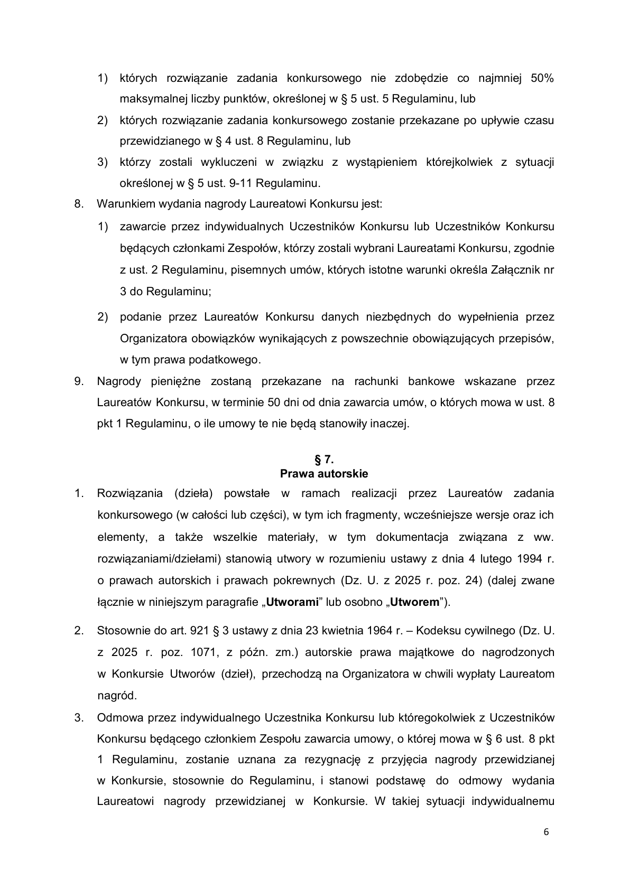
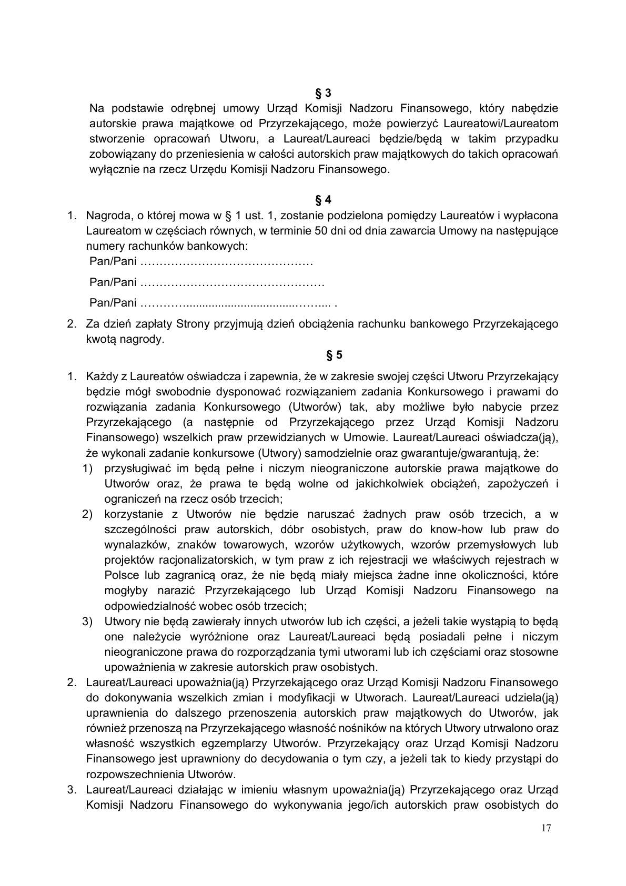
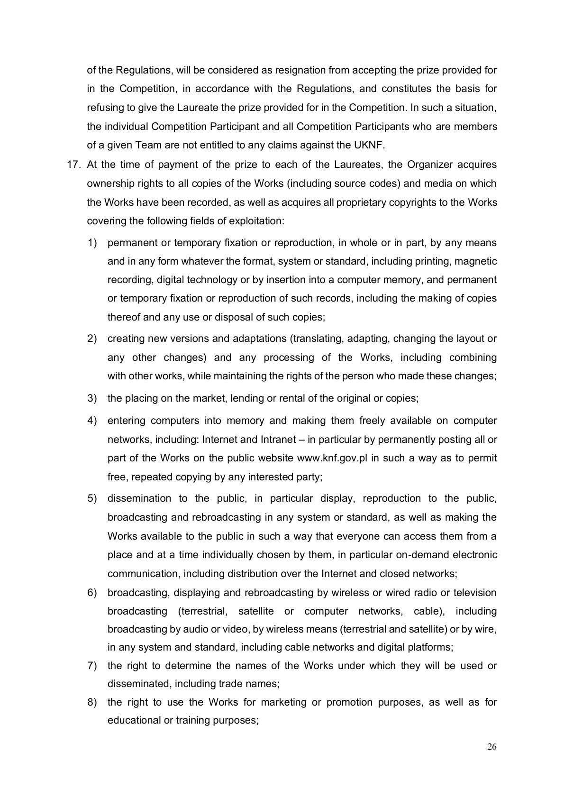

# RULES UKNF Prompt2Code2

> Converted from PDF automatically with section detection.
> Verify formatting, links, and section hierarchy manually.

<!-- Page 1 -->

1

# Regulamin konkursu Urzędu Komisji Nadzoru Finansowego w ramach

# HackYeah pod nazwą

# #Prompt2Code2

# § 1.

# Postanowienia Ogólne

# 1.

# Zważywszy, że Urząd Komisji Nadzoru Finansowego (dalej jako „

# UKNF

# ”) jest państwową

# osobą prawną i jego zadaniem jest zapewnienie obsługi Komisji Nadzoru Finansowego,

# której jednym z zadań jest podejmowanie działań mających na celu wspieranie rozwoju

# innowacyjności

# rynku

# finansowego

# oraz

# podejmowanie

# działań

# edukacyjnych

# i informacyjnych w zakresie funkcjonowania rynku finansowego, jego zagrożeń oraz

# podmiotów na nim funkcjonujących w celu ochrony uzasadnionych interesów uczestników

# tego rynku, UKNF ogłasza, w ramach HackYeah, konkurs pod nazwą #Prompt2Code2

# (dalej jako „

# Konkurs

# ”).

# 2.

# Niniejszy regulamin (dalej jako „

# Regulamin

# ”) określa zasady i warunki przeprowadzania

# Konkursu odbywającego się w ramach wydarzenia typu hackathon „HackYeah 2025”

# w Hali Widowiskowo-Sportowej Tauron Arena w Krakowie (31-571) przy ul. Stanisława

# Lema 7 (dalej jako „

# Hackathon

# ”), organizowanego w dniach 04-05.10.2025 roku przez

# spółkę PROIDEA sp. z o.o. z siedzibą w Krakowie (dalej jako „

# Organizator

# ”), w tym:

# 1) zasady przebiegu zadania konkursowego;

# 2) zasady przyznawania nagród w Konkursie.

# 3.

# Zasady uczestnictwa w Hackathonie, w ramach którego będzie odbywał się Konkurs,

# określa

# regulamin

# Hackathonu,

# opublikowany

# na

# stronie

# internetowej:

# https://hackyeah.pl/wp-content/uploads/2025/03/HackYeah_2025_Regulamin_Rules.pdf

# (dalej jako „

# Regulamin Hackathonu

# ”).

# 4.

# UKNF posiada status Partnera Zadania Hackathonu oraz jest autorem zadania

# konkursowego #Prompt2Code2.

# 5.

# Organizator składa przyrzeczenie wypłaty nagród Laureatom Konkursu na zasadach

# określonych w Regulaminie, pod warunkiem przeniesienia autorskich praw majątkowych

# do nagrodzonych w Konkursie utworów (dzieł) na zasadach określonych w Regulaminie.

# 6.

# Celem Regulaminu jest dokładne opisanie zasad uczestnictwa w Konkursie i nie stanowi

# on oferty umownej ani wzorca umownego.

# § 2.

# Czas trwania Konkursu

# 1.

# Konkurs rozpocznie się w dniu 4 października 2025 roku o godz. 12:00 i zakończy w dniu

<!-- Page 2 -->

2

# 5 października 2025 roku o godz. 12:00, zgodnie z § 4 ust. 1-3 Regulaminu.

# 2.

# Szczegółowy harmonogram Konkursu będzie udostępniony na stronie internetowej

# Organizatora

# www.hackyeah.pl

# § 3.

# Warunki uczestnictwa

# 1. Konkurs skierowany jest do osób fizycznych, uczestników Hackathonu, które w dniu

# rozpoczęcia Konkursu ukończyły 18 lat i posiadają pełną zdolność do czynności prawnych

# (dalej jako „

# Uczestnik Konkursu

# ”).

# 2. Przed przystąpieniem do udziału w Konkursie Uczestnik Konkursu zobowiązany jest do

# zapoznania się z Regulaminem.

# 3. Udział w Konkursie jest równoznaczny z zapoznaniem się z Regulaminem oraz akceptacją

# postanowień Regulaminu i jego załączników przez Uczestnika Konkursu oraz

# zobowiązaniem Uczestnika Konkursu do przestrzegania postanowień Regulaminu. Każdy

# z indywidualnych Uczestników Konkursu lub Uczestników Konkursu będących członkami

# Zespołu (dalej jako „

# Zespół

# ”) zobowiązany jest do wypełnienia udostępnionego na stronie

# internetowej

# www.hackyeah.pl

# Oświadczenia, którego wzór określa Załącznik nr 1 do

# Regulaminu, i złożenia go Organizatorowi.

# 4. Zgłoszenie do Konkursu następuje poprzez wypełnienie i elektroniczną akceptację, przez

# indywidualnego Uczestnika Konkursu, a w przypadku Zespołu - przez osobę wskazaną

# przez Uczestników Konkursu będących członkami Zespołu do reprezentowania Zespołu,

# udostępnionego na stronie internetowej Organizatora

# www.hackyeah.pl

# formularza

# zgłoszeniowego

# do Konkursu, którego wzór określa Załącznik nr 2 do Regulaminu.

# 5. Brak złożenia Oświadczenia, o którym mowa w ust. 3, przez indywidualnego Uczestnika

# Konkursu lub któregokolwiek z Uczestników Konkursu będących członkami Zespołu, czyni

# zgłoszenie, o którym mowa w ust. 4, bezskutecznym.

# 6. Uczestnicy Konkursu zobowiązani są do przestrzegania postanowień Regulaminu.

# § 4.

# Przebieg Konkursu

# 1. Konkurs polega na rozwiązaniu zadania konkursowego ustalonego przez UKNF,

# opublikowanego przez Organizatora na dedykowanej stronie internetowej (platformie

# konkursowej), która zostanie udostępniona o godz. 12.00 w dniu rozpoczęcia Konkursu,

# tj. 4 października 2025 roku, z zastrzeżeniem ust. 2.

# 2. Zapoznanie się przez Uczestników Konkursu z treścią zadania konkursowego oraz

# rozpoczęcie jego rozwiązywania możliwe będzie po uroczystym otwarciu Konkursu przez

<!-- Page 3 -->

3

# przedstawiciela Organizatora.

# 3. Uczestnicy Konkursu mają maksymalnie 24 godziny

# na rozwiązanie zadania

# konkursowego.

# 4. Udział w Hackathonie i Konkursie jest możliwy wyłącznie w formie stacjonarnej w Hali

# Widowiskowo-Sportowej Tauron Arena w Krakowie (31-571) przy ul. Stanisława Lema 7.

# 5. UKNF oraz Organizator nie zapewniają Uczestnikom Konkursu żadnego sprzętu ani

# wyposażenia, jak również nie świadczą usług wsparcia technicznego i naprawy sprzętu.

# 6. Uczestnicy Konkursu mogą brać udział w Konkursie indywidualnie lub w ramach Zespołów

# liczących nie więcej niż 6 osób.

# 7. Zadanie konkursowe realizowane jest w formule otwartej (nie ma jednego poprawnego

# rozwiązania), zaś projekty rozwiązań zadania konkursowego zgłoszone przez

# indywidualnych Uczestników Konkursu lub Zespoły ocenia Jury Konkursu, w którego skład

# wchodzi 5 przedstawicieli UKNF. Skład Jury Konkursu został ustalony z Organizatorem.

# 8. Projekty rozwiązań zadania konkursowego przygotowane przez indywidualnych

# Uczestników Konkursu lub Zespoły, aby mogły być brane pod uwagę przy rozstrzygnięciu

# Konkursu, muszą zostać przekazane Organizatorowi nie później niż do godz. 12.00 w dniu

# 5 października 2025 roku w formie określonej przez Organizatora na dedykowanej stronie

# internetowej (platformie konkursowej), na której przedstawiona zostanie treść zadania

# konkursowego. Projekty rozwiązań zadania konkursowego przekazane po tym terminie nie

# będą uwzględniane i nie będą poddane ocenie Jury Konkursu.

# § 5.

# Zasady oceny rozwiązań zadania konkursowego

# 1. Nagrody w Konkursie otrzymają indywidualni Uczestnicy Konkursu lub Uczestnicy

# Konkursu będący członkami Zespołu, których rozwiązania zadania konkursowego zostaną

# ocenione najwyżej przez Jury Konkursu, w skład którego wchodzą przedstawiciele UKNF.

# Skład Jury Konkursu zostanie opublikowany na stronie internetowej Hackathonu

# (www.hackyeah.pl) najpóźniej w dniu rozpoczęcia Konkursu.

# 2. Członkowie Jury Konkursu, przed przystąpieniem do oceny rozwiązania zadania

# konkursowego, wybiorą ze swego grona przewodniczącego.

# 3. Decyzje Jury Konkursu zapadają zwykłą większością głosów, w obecności wszystkich

# członków Jury Konkursu. W przypadku równej liczby głosów rozstrzyga głos

# przewodniczącego Jury Konkursu.

# 4. Jury Konkursu ocenia rozwiązanie zadania konkursowego zgłoszone przez indywidualnych

# Uczestników Konkursu lub Zespoły w skali punktowej od 0 do 100 punktów, biorąc pod

# uwagę następujące kryteria oceny:

<!-- Page 4 -->

4

# 1) aspekt technologiczny - jak ciekawe jest rozwiązanie, na ile jest gotowe na

# prezentację wersji demo - punktacja od 0 do 30 punktów;

# 2) innowacyjność wykonania rozwiązania - czy proces wytwarzania oprogramowania

# opiera się na istniejących standardach, jak opisany jest ustandaryzowany proces

# tworzenia oprogramowania przy pomocy asystentów AI - punktacja od 0 do 20

# punktów;

# 3) architektura rozwiązania - uwzględnia ocenę takich elementów jak: kompozycja

# modułów systemu, skalowalność, otwartość na rozbudowę - punktacja od 0 do 20

# punktów;

# 4) na ile rozwiązanie wpasowuje się w kategorię tematyczną zadania konkursowego -

# w szczególności zgodność ze specyfikacją zadania i preferowanymi technologiami -

# punktacja od 0 do 20 punktów;

# 5) efekt „wow” - jak bardzo zaskakujące i unikalne dla Jury Konkursu jest rozwiązanie lub

# praca nad rozwiązaniem problemu (zadania konkursowego) - punktacja od 0 do 10

# punktów.

# 5. Maksymalna liczba punktów, którą można uzyskać za przygotowane rozwiązanie zadania

# konkursowego wynosi 100 punktów.

# 6. Podczas trwania Konkursu pracę Uczestników Konkursu obserwować będą wyznaczeni

# przez UKNF Mentorzy, służący jako źródło wiedzy z obszaru zagadnienia przedstawionego

# w treści zadania konkursowego. Jury Konkursu może uwzględnić opinię Mentorów

# dotyczącą przygotowanego rozwiązania przy formułowaniu werdyktu i decyzji o przyznaniu

# punktów.

# 7. Zakres wiedzy Uczestników Konkursu z dziedziny nauk ekonomicznych oraz regulacji

# prawnych nie podlega ocenie Jury Konkursu.

# 8. Uczestnicy Konkursu zobowiązują się wykonać zadanie konkursowe z należytą

# starannością i w ramach ścisłej współpracy z Mentorami, którzy dostępni będą dla

# Uczestników Konkursu przez cały okres realizacji zadania konkursowego.

# 9. Uczestnikom Konkursu nie wolno, pod rygorem natychmiastowego wykluczenia z udziału

# w Konkursie przez Organizatora lub UKNF, podejmować prób uzyskania dostępu do treści

# zadania konkursowego przed rozpoczęciem Konkursu.

# 10. Organizator lub UKNF ma prawo wykluczyć indywidualnego Uczestnika Konkursu lub

# Zespół z Konkursu, jeżeli stwierdzi naruszenie postanowień Regulaminu lub Regulaminu

# Hackathonu, złożenie nieprawdziwego Oświadczenia, o którym mowa w § 3 ust. 3

# Regulaminu, lub podania nieprawdziwych danych w formularzu, o którym mowa w § 3 ust.

# 4 Regulaminu, ewentualnie jeżeli zajdzie podejrzenie naruszenia przez Uczestnika

# Konkursu przepisów prawa powszechnie obowiązującego. W przypadku podejrzenia

<!-- Page 5 -->

5

# naruszenia przez Uczestnika Konkursu przepisów prawa powszechnie obowiązującego,

# Organizator powiadomi o tym zdarzeniu właściwe organy ścigania oraz UKNF.

# 11. Niedozwolone jest wulgarne i nieobyczajne zachowanie Uczestników Konkursu wobec

# innych osób oraz uczestnictwo w Konkursie pod wpływem alkoholu lub środków

# odurzających. W przypadku zaistnienia takiej sytuacji UKNF lub Organizator mają prawo

# wykluczyć indywidualnego Uczestnika Konkursu lub Zespół z Konkursu.

# § 6.

# Rozstrzygnięcie Konkursu. Nagrody.

# 1.

# Rozstrzygnięcie Konkursu nastąpi w dniu 5 października 2025 r. podczas ceremonii

# kończącej Hackathon, która odbędzie się ok. godz. 17:45, poprzez podanie informacji

# o wynikach Konkursu na stronie internetowej www.hackyeah.pl. Laureaci Konkursu

# zostaną powiadomieni o wynikach Konkursu także pocztą elektroniczną (na adres e-mail

# podany w formularzu zgłoszeniowym do Konkursu, przy czym Uczestnicy Konkursu

# będący członkami Zespołów zobowiązani są do podania indywidualnego adresu

# mailowego każdego z członków Zespołu).

# 2.

# W Konkursie zostanie wyłonionych od 1 do 3 Laureatów (indywidualnych Uczestników

# Konkursu lub Zespołów), którzy zajmą kolejno miejsca od 1 do 3 (dalej jako „

# Laureaci

# ”).

# Laureatami mogą być indywidualni Uczestnicy Konkursu lub Uczestnicy Konkursu będący

# członkami Zespołu.

# 3.

# Kolejność Laureatów ustalana jest na podstawie sumy uzyskanych przez nich

# punktów. W przypadku uzyskania takiej samej liczby punktów przez co najmniej

# 2 Laureatów kolejność wskazuje przewodniczący Jury Konkursu.

# 4.

# UKNF ustanawia następujące nagrody w Konkursie:

# 1) za zajęcie I miejsca - 20 000 zł;

# 2) za zajęcie II miejsca - 10 000 zł;

# 3) za zajęcie III miejsca - 5 000 zł.

# 5.

# Kwoty, wskazane w ust. 4, zostaną pomniejszone o należne podatki, składki i opłaty

# przewidziane przepisami prawa.

# 6.

# W przypadku, gdy którąkolwiek z nagród określonych w ust. 4 zdobędzie Zespół, o którym

# mowa w § 4 ust. 6 Regulaminu, nagroda zostanie podzielona proporcjonalnie do liczby

# członków Zespołu i wypłacona przez Organizatora, po spełnieniu warunków wynikających

# z niniejszego Regulaminu, każdemu z Uczestników Konkursu będącemu członkiem

# nagrodzonego Zespołu na wskazany przez niego rachunek bankowy, w kwocie

# stanowiącej iloraz kwoty nagrody netto i liczby członków nagrodzonego Zespołu.

# 7.

# Laureatami nie mogą zostać indywidualni Uczestnicy Konkursu lub Zespoły:

<!-- Page 6 -->

6

# 1) których rozwiązanie zadania konkursowego nie zdobędzie co najmniej 50%

# maksymalnej liczby punktów, określonej w § 5 ust. 5 Regulaminu, lub

# 2) których rozwiązanie zadania konkursowego zostanie przekazane po upływie czasu

# przewidzianego w § 4 ust. 8 Regulaminu, lub

# 3) którzy zostali wykluczeni w związku z wystąpieniem którejkolwiek z sytuacji

# określonej w § 5 ust. 9-11 Regulaminu.

# 8.

# Warunkiem wydania nagrody Laureatowi Konkursu jest:

# 1) zawarcie przez indywidualnych Uczestników Konkursu lub Uczestników Konkursu

# będących członkami Zespołów, którzy zostali wybrani Laureatami Konkursu, zgodnie

# z ust. 2 Regulaminu, pisemnych umów, których istotne warunki określa Załącznik nr

# 3 do Regulaminu;

# 2) podanie przez Laureatów Konkursu danych niezbędnych do wypełnienia przez

# Organizatora obowiązków wynikających z powszechnie obowiązujących przepisów,

# w tym prawa podatkowego.

# 9.

# Nagrody pieniężne zostaną przekazane na rachunki bankowe wskazane przez

# Laureatów Konkursu, w terminie 50 dni od dnia zawarcia umów, o których mowa w ust. 8

# pkt 1 Regulaminu, o ile umowy te nie będą stanowiły inaczej.

# § 7.

# Prawa autorskie

# 1.

# Rozwiązania (dzieła) powstałe w ramach realizacji przez Laureatów zadania

# konkursowego (w całości lub części), w tym ich fragmenty, wcześniejsze wersje oraz ich

# elementy, a także wszelkie materiały, w tym dokumentacja związana z ww.

# rozwiązaniami/dziełami) stanowią utwory w rozumieniu ustawy z dnia 4 lutego 1994 r.

# o prawach autorskich i prawach pokrewnych (Dz. U. z 2025 r. poz. 24) (dalej zwane

# łącznie w niniejszym paragrafie „

# Utworami

# ” lub osobno „

# Utworem

# ”).

# 2.

# Stosownie do art. 921 § 3 ustawy z dnia 23 kwietnia 1964 r. - Kodeksu cywilnego (Dz. U.

# z 2025 r. poz. 1071, z późn. zm.) autorskie prawa majątkowe do nagrodzonych

# w Konkursie Utworów (dzieł), przechodzą na Organizatora w chwili wypłaty Laureatom

# nagród.

# 3.

# Odmowa przez indywidualnego Uczestnika Konkursu lub któregokolwiek z Uczestników

# Konkursu będącego członkiem Zespołu zawarcia umowy, o której mowa w § 6 ust. 8 pkt

# 1 Regulaminu, zostanie uznana za rezygnację z przyjęcia nagrody przewidzianej

# w Konkursie, stosownie do Regulaminu, i stanowi podstawę do odmowy wydania

# Laureatowi nagrody przewidzianej w Konkursie. W takiej sytuacji indywidualnemu

<!-- Page 7 -->

7

# Uczestnikowi Konkursu oraz wszystkim Uczestnikom Konkursu będącymi członkami

# danego Zespołu nie przysługują żadne roszczenia względem UKNF.

# 4.

# W chwili wypłaty nagrody odpowiednio każdemu z Laureatów Organizator nabywa prawa

# własności wszelkich egzemplarzy Utworów (w tym kodów źródłowych) i nośników, na

# których Utwory zostały utrwalone, a także nabywa całość autorskich praw majątkowych do

# Utworów obejmujących następujące pola eksploatacji:

# 1) trwałe lub czasowe utrwalanie lub zwielokrotnianie w całości lub w części,

# jakimikolwiek środkami i w jakiejkolwiek formie, niezależnie od formatu, systemu lub

# standardu, w tym techniką drukarską, techniką zapisu magnetycznego, techniką

# cyfrową lub poprzez wprowadzanie do pamięci komputera oraz trwałe lub czasowe

# utrwalanie lub zwielokrotnianie takich zapisów, włączając w to sporządzanie ich kopii

# oraz dowolne korzystanie i rozporządzanie tymi kopiami;

# 2) tworzenie nowych wersji i adaptacji (tłumaczenie, przystosowanie, zmianę układu lub

# jakiekolwiek inne zmiany) oraz dowolne przetwarzanie Utworów, w tym łączenie

# z innymi utworami, z zachowaniem praw osoby, która tych zmian dokonała;

# 3) wprowadzania do obrotu, użyczenia lub najmu oryginału albo egzemplarzy;

# 4) wprowadzanie do pamięci komputerów i swobodnego udostępniania w sieciach

# komputerowych, w tym: Internet oraz Intranet - w szczególności przez stałe

# umieszczenie na publicznej stronie www.knf.gov.pl całości Utworów lub ich części

# w

# sposób

# umożliwiający

# swobodne,

# wielokrotne

# kopiowanie

# każdemu

# zainteresowanemu;

# 5) publiczne rozpowszechnianie, w szczególności wyświetlanie, publiczne odtwarzanie,

# nadawanie i reemitowanie w dowolnym systemie lub standardzie, a także publiczne

# udostępnianie Utworów w ten sposób, aby każdy mógł mieć do nich dostęp w miejscu

# i czasie przez siebie wybranym, w szczególności elektroniczne udostępnianie na

# żądanie, w tym rozpowszechnianie w sieci Internet i sieciach zamkniętych;

# 6) wystawianie, wyświetlanie i nadawanie i reemitowanie drogą emisji radiowej lub

# telewizyjnej prowadzonej w sposób bezprzewodowy lub przewodowy (naziemny, za

# pośrednictwem satelity lub sieci komputerowych, drogą kablową), w tym nadawanie

# za pomocą fonii lub wizji, w sposób bezprzewodowy (drogą naziemną i satelitarną)

# lub w sposób przewodowy, w dowolnym systemie i standardzie, w tym także poprzez

# sieci kablowe i platformy cyfrowe;

# 7) prawa do określania nazw Utworów, pod którymi będą one wykorzystywane lub

# rozpowszechniane, w tym nazw handlowych;

# 8) prawa do wykorzystywania Utworów do celów marketingowych lub promocji, a także

<!-- Page 8 -->

8

# dla celów edukacyjnych lub szkoleniowych;

# 9) prawo do rozporządzania opracowaniami Utworów oraz prawo udostępniania ich do

# korzystania, w tym udzielania licencji na rzecz osób trzecich, na wszystkich

# wymienionych powyżej polach eksploatacji;

# 10) zezwalanie na wykonywanie przez osoby trzecie praw autorskich zależnych

# w stosunku do Utworów;

# 11) sporządzanie wersji obcojęzycznych (jak również z użyciem technik umożliwiających

# przekazywanie informacji dla osób z różnymi rodzajami niepełnosprawności);

# 12) nadawanie za pomocą wizji przewodowej albo bezprzewodowej lub w inny sposób

# poprzez sieć komputerową w tym zamieszczanie filmów w sieci Internet bez żadnych

# ograniczeń, z wyłączeniem możliwości publicznego emitowania filmów lub ich części

# w telewizji.

# 5.

# Przeniesienie autorskich praw majątkowych do Utworów, w odniesieniu do kodów

# źródłowych, następuje na wszystkich polach eksploatacji określonych w ust. 4 oraz

# obejmuje w szczególności modyfikację, kompilację i łączenie, testowanie, wdrażanie,

# używanie wytworzonego za jego pomocą Utworu, w szczególności oprogramowania oraz

# prawo do dalszego przenoszenia tych praw na podmioty trzecie w zakresie tak szerokim,

# w jakim Organizator nabył te prawa. Laureaci zobowiązani są do przekazania

# Organizatorowi kodów źródłowych.

# 6. W wyniku przeniesienia autorskich praw majątkowych, zgodnie z ust. 4, Organizator

# nabywa wyłączne prawo do korzystania z Utworów, w pełnym zakresie, w jakikolwiek

# sposób, bez ograniczeń czasowych i terytorialnych na wszystkich opisanych

# w Regulaminie polach eksploatacji oraz prawo do dalszego przenoszenia tych praw na

# podmioty trzecie w zakresie tak szerokim, w jakim Organizator nabył te prawa.

# 7. Laureat wyraża zgodę na dokonywanie przez Organizatora lub na jego zlecenie wszelkich

# zmian, aktualizacji i uzupełnień Utworów - opracowań. Wszelkie prawa w tym zakresie

# (prawa do opracowań Utworu) przysługiwać będą Organizatorowi. Laureat wyraża zgodę

# na rozporządzanie i korzystanie z opracowań Utworu przez Organizatora oraz prawo do

# dalszego przenoszenia tych praw na podmioty trzecie w zakresie tak szerokim, w jakim

# Organizator nabył te prawa.

# 8. Laureat przenosi na Organizatora wyłączne prawo do wykonywania zależnych praw

# autorskich oraz prawo do zezwalania na wykonywanie zależnych praw autorskich do

# Utworu, w szczególności do tłumaczenia, przystosowywania, zmiany układu oraz

# wprowadzania innych zmian lub modyfikacji oraz rozporządzania i korzystania

# z opracowań Utworów na polach eksploatacji określonych w ust. 4 i nie będzie domagał

# się z tego tytułu żadnego wynagrodzenia oraz prawo do dalszego przenoszenia tych praw

<!-- Page 9 -->

9

# na podmioty trzecie w zakresie tak szerokim, w jakim Organizator nabył te prawa.

# 9. Organizator może wykonywać autorskie prawa majątkowe samodzielnie lub może

# upoważnić do tego osoby trzecie oraz jest uprawniony do decydowania o tym, czy a jeżeli

# tak to kiedy przystąpi do rozpowszechniania Utworu, jak również może przenosić te prawa

# na podmioty trzecie w zakresie tak szerokim, w jakim Organizator je nabył.

# 10. Laureat wyraża zgodę na anonimowe korzystanie przez Organizatora i UKNF z Utworu

# na wszystkich polach eksploatacji wskazanych w Regulaminie, w szczególności podmioty

# te mają prawo korzystania z Utworu bez oznaczenia autorstwa na egzemplarzach.

# 11. Laureatowi nie przysługuje wynagrodzenie za każde odrębne pole eksploatacji.

# 12. Organizator jest uprawniony do korzystania z Utworów, na polach eksploatacji

# wskazanych w ust. 4, od daty udostępnienia Utworu Organizatorowi do daty nabycia

# autorskich praw majątkowych przez Organizatora. Laureat zapewnia, że takie korzystanie

# z Utworów nie będzie naruszać praw osobistych lub majątkowych Organizatora ani osób

# trzecich i nie będzie powodować żadnych dodatkowych kosztów ani obowiązku zapłaty

# jakichkolwiek dodatkowych opłat po stronie Organizatora.

# 13. Niezależnie od powyższego Laureat zobowiązuje się do:

# 1) przeniesienia w przyszłości autorskich praw majątkowych na UKNF (który nabędzie od

# Organizatora autorskie prawa majątkowe do Utworów) na polach eksploatacji nieznanych

# w chwili zawarcia umowy, o której mowa w § 6 ust. 8 pkt 1 Regulaminu, bez

# wynagrodzenia, w zakresie swojej części Utworu mającej samodzielne znaczenie;

# 2) niewykonywania autorskich praw osobistych do swojej części Utworu mającej

# samodzielne znaczenie na wszystkich polach eksploatacji wymienionych w ust. 4 oraz

# w art. 16 ustawy z dnia 4 lutego 1994 r. o prawie autorskim i prawach pokrewnych

# względem Organizatora oraz UKNF, jak również upoważnia Organizatora oraz UKNF do

# wykonywania ww. autorskich praw osobistych. Organizator oraz UKNF są uprawnieni

# m.in. do zrezygnowania z zamieszczania w Utworach imion i nazwisk Laureata lub

# Laureatów.

# § 8.

# Dane osobowe

# Organizator PROIDEA sp. z o.o. z siedzibą w Krakowie jest administratorem danych osobowych

# Uczestników Konkursu, w rozumieniu przepisów rozporządzenia Parlamentu Europejskiego

# i Rady (UE) 2016/679 z dnia 27 kwietnia 2016 r. w sprawie ochrony osób fizycznych w związku

# z przetwarzaniem danych osobowych i w sprawie swobodnego przepływu takich danych oraz

# uchylenia dyrektywy 95/46/WE. Wszelkie informacje dotyczące przetwarzania danych w tym

# zakresie są dostępne w Polityce Prywatności dostępnej na stronie internetowej

# https://hackyeah.pl/

# .

<!-- Page 10 -->

10

# § 9.

# Odpowiedzialność

# 1. UKNF ani Organizator nie ponoszą odpowiedzialności za brak możliwości przekazania

# nagrody w przypadku podania przez Uczestnika Konkursu nieprawidłowych, niepełnych

# lub nieprawdziwych danych osobowych, danych kontaktowych oraz innych informacji

# uniemożliwiających przekazanie nagrody.

# 2. Każdy Uczestnik Konkursu może wycofać się z Konkursu w dowolnym czasie. Wycofanie

# z Konkursu odbywa się poprzez poinformowanie Organizatora i jest równoznaczne z utratą

# prawa do nagrody.

# 3. Laureat traci prawo do nagrody w przypadku stwierdzenia przez UKNF lub Organizatora

# naruszenia postanowień Regulaminu przez Laureata Konkursu oraz zaistnienia przesłanek

# uzasadniających wykluczenie, o których mowa w Regulaminie.

# § 10.

# Postanowienia końcowe

# 1.

# UKNF zastrzega sobie prawo odwołania lub zakończenia Konkursu przed czasem bez

# podania przyczyny. W takiej sytuacji Uczestnikom Konkursu nie przysługują względem

# UKNF żadne roszczenia, w tym o nagrody.

# 2.

# Uczestnikom Konkursu nie przysługuje odwołanie od wyników Konkursu.

# 3.

# UKNF zastrzega sobie prawo dokonywania zmian w Regulaminie do zakończenia

# Konkursu. Zmiany Regulaminu Organizator publikuje na stronie internetowej

# www.hackyeah.pl .

# 4.

# W przypadku zaistnienia sporu związanego z uczestnictwem w Konkursie, UKNF będzie

# dążył do jego rozstrzygnięcia w drodze negocjacji. W razie nieosiągnięcia polubownego

# rozstrzygnięcia sporu ostateczną decyzję w tym zakresie podejmuje UKNF i jest ona

# wiążąca dla Uczestników Konkursu.

# 5.

# W przypadku rozbieżności pomiędzy treścią Regulaminu Hackathonu, Regulaminu oraz

# treścią Umowy pomiędzy Organizatorem a Laureatem Konkursu, której istotne warunki

# określa Załącznik nr 3 do Regulaminu, pierwszeństwo mają postanowienia Umowy

# pomiędzy Organizatorem a Laureatem Konkursu, następnie Regulaminu, a na końcu

# Regulaminu Hackathonu.

# 6.

# Regulamin obowiązuje od dnia jego publikacji przez Organizatora na stronie internetowej

# www.hackyeah.pl .

<!-- Page 11 -->

11

# Załącznik nr 1

# do Regulaminu

# OŚWIADCZENIE

# Ja, ..................................................................... (imię i nazwisko) oświadczam, że:

# 1) jestem pełnoletnia/ni i posiadam pełną zdolność do czynności prawnych;

# 2) zapoznałem się z Regulaminem konkursu Urzędu Komisji Nadzoru Finansowego w ramach

# HackYeah pod nazwą #Prompt2Code2 oraz akceptuję postanowienia tego regulaminu

# i załączników do niego, a także zobowiązuje się do przestrzegania jego postanowień;

# 3) wyrażam zgodę na przetwarzanie moich danych osobowych w związku z udziałem

# w konkursie organizowanym przez

# PROIDEA sp. z o.o. z siedzibą w Krakowie w ramach

# HackYeah pod nazwą#Prompt2Code2 (dalej jako „

# Konkurs

# ”);

# TAK / NIE*

# (wyrażenie zgody jest dobrowolne, jednakże niezbędne do wzięcia udziału w Konkursie - brak

# zgody oznacza, że nie będziemy mogli przetwarzać Twoich danych osobowych i tym samym

# udział w Konkursie będzie niemożliwy; zgodę można wycofać w każdym momencie - nie

# wpływa to jednak na zgodność z prawem przetwarzania, którego dokonano przed jej

# wycofaniem)

# 4) potwierdzam, że otrzymałam/otrzymałem informację dotyczącą danych osobowych

# przetwarzanych przez PROIDEA sp. z o.o. z siedzibą w Krakowie w związku z udziałem

# w Konkursie

# * proszę wskazać właściwą odpowiedź

<!-- Page 12 -->

12

# Załącznik nr 2

# do Regulaminu

# ……………………………………………………..

# (miejscowość, data)

# Formularz - Zgłoszenie Uczestników do Konkursu Urzędu Komisji Nadzoru

# Finansowego w ramach HackYeah pod nazwą #Prompt2Code2 (dalej jako

# „Konkurs”);

# Oświadczam, że ja ………………………………………….. (imię i nazwisko) składam zgłoszenie

# w swoim imieniu.*

# Oświadczam, że ja ………………………………………….. (imię i nazwisko) zostałem/zostałam

# wybrana przez Uczestników Konkursu do złożenia tego zgłoszenia w imieniu Zespołu.*

# Dane Uczestników Konkursu:

# Dane kontaktowe Uczestnika Konkursu

# Imię i nazwisko

# Telefon kontaktowy:

# Adres e-mail:

# Ulica i miejscowość,

# kod pocztowy:

# Dane kontaktowe Uczestnika Konkursu

# Imię i nazwisko

# Telefon kontaktowy:

# Adres e-mail:

# Ulica i miejscowość,

# kod pocztowy:

# Dane kontaktowe Uczestnika Konkursu

# Imię i nazwisko

# Telefon kontaktowy:

# Adres e-mail:

# Ulica i miejscowość,

# kod pocztowy:

<!-- Page 13 -->

13

# Dane kontaktowe Uczestnika Konkursu

# Imię i nazwisko

# Telefon kontaktowy:

# Adres e-mail:

# Ulica i miejscowość,

# kod pocztowy:

# Dane kontaktowe Uczestnika Konkursu

# Imię i nazwisko

# Telefon kontaktowy:

# Adres e-mail:

# Ulica i miejscowość,

# kod pocztowy:

# Dane kontaktowe Uczestnika Konkursu

# Imię i nazwisko

# Telefon kontaktowy:

# Adres e-mail:

# Ulica i miejscowość,

# kod pocztowy:

*niepotrzebne skreślić

<!-- Page 14 -->

14

# Załącznik nr 3

# do Regulaminu

# Umowa nr ………/2025

# (dalej jako „Umowa”) zawarta w dniu ……. w …… pomiędzy

# Panią / Panem

# ................................................................................PESEL,

# legitymującym/jącą się dowodem osobistym seria ……. nr …………….., zam. …

# ……..................................................…….,

# Panią / Panem

# ................................................................................PESEL,

# legitymującym/jącą się dowodem osobistym seria ……. nr …………….., zam. …

# ……..................................................…….,

# Panią / Panem

# ................................................................................PESEL,

# legitymującym/jącą się dowodem osobistym seria ……. nr …………….., zam. …

# ……..................................................…….,

# zwanymi dalej „

# Laureatami

# ”, a każdy z osobna „

# Laureatem

# ”,

# a

# ……………………………………… , zwany dalej „

# Przyrzekającym

# ”

# Laureat i Przyrzekający mogą być w dalszej części niniejszej Umowy zwani łącznie

# „

# Stronami

# ”, a każdy oddzielnie „

# Stroną

# ”.

# § 1

# Zważywszy, że:

# 1. Laureat/Laureaci zajął/zajęli …. miejsce w konkursie przeprowadzonym przez Urząd Komisji

# Nadzoru Finansowego z siedzibą w Warszawie (dalej „

# UKNF

# ” lub „Zamawiający”) na

# rozwiązanie zadania konkursowego pn. „#Prompt2Code2” przedstawionego przez UKNF oraz

# art. 921 § 3 Kodeksu cywilnego. Powyższa kwota przed jej uiszczeniem Laureatowi zostanie

# pomniejszona o należne podatki, składki i opłaty przewidziane przepisami prawa powszechnie

# obowiązującego.

# 2. Stosownie do art. 921 § 3 Kodeksu cywilnego, najpóźniej z chwilą wypłaty nagrody Laureatowi

# Konkursu, na Przyrzekającego przechodzi całość autorskich praw majątkowych do Utworów,

# o których mowa w § 2.

# 3. Strony oświadczają, że nagroda określona w ust. 1, stanowi całość należności przysługującej

# Laureatowi/Laureatom z tytułu zajęcia …. miejsca w Konkursie, w tym w związku z

# przeniesieniem autorskich praw majątkowych do Utworu oraz praw zależnych, na warunkach

# określonych w art. 921 § 3 Kodeksu cywilnego oraz § 2 Umowy.

# § 2

# 1. Strony zgodnie potwierdzają, że rozwiązania (dzieła) powstałe w ramach realizacji przez

# Laureatów zadania konkursowego (w całości lub części), w tym ich fragmenty, wcześniejsze

# wersje oraz ich elementy, a także wszelkie materiały, w tym dokumentacja związana z ww.

# rozwiązaniami/dziełami)

# stanowi

# utwory

# w

# rozumieniu

# ustawy

# z

# dnia

# 4 lutego 1994 r. o prawach autorskich i prawach pokrewnych (zwane łącznie „

# Utworami

# ” lub

# osobno „

# Utworem

# ”).

<!-- Page 15 -->

15

# 2. Strony zgodnie potwierdzają, że Przyrzekający, najpóźniej w chwili wypłaty nagrody

# Laureatowi/Laureatom, nabywa prawa własności wszelkich egzemplarzy Utworów (w tym

# kodów źródłowych) i nośników, na których Utwory zostały utrwalone, a także nabywa całość

# autorskich praw majątkowych do Utworów obejmujących następujące pola eksploatacji:

# 1)

# trwałe lub czasowe utrwalanie lub zwielokrotnianie w całości lub w części, jakimikolwiek

# środkami i w jakiejkolwiek formie, niezależnie od formatu, systemu lub standardu, w tym

# techniką drukarską, techniką zapisu magnetycznego, techniką cyfrową lub poprzez

# wprowadzanie do pamięci komputera oraz trwałe lub czasowe utrwalanie lub

# zwielokrotnianie takich zapisów, włączając w to sporządzanie ich kopii oraz dowolne

# korzystanie i rozporządzanie tymi kopiami;

# 2)

# tworzenie nowych wersji i adaptacji (tłumaczenie, przystosowanie, zmianę układu lub

# jakiekolwiek inne zmiany) oraz dowolne przetwarzanie Utworów, w tym łączenie z innymi

# utworami, z zachowaniem praw osoby, która tych zmian dokonała;

# 3)

# wprowadzania do obrotu, użyczenia lub najmu oryginału albo egzemplarzy;

# 4)

# wprowadzanie do pamięci komputerów i swobodnego udostępniania w sieciach

# komputerowych, w tym: Internet oraz Intranet - w szczególności przez stałe umieszczenie

# na publicznej stronie

# www.knf.gov.pl

# całości Utworów lub jego części w sposób

# umożliwiający swobodne, wielokrotne kopiowanie każdemu zainteresowanemu;

# 5)

# publiczne rozpowszechnianie, w szczególności wyświetlanie, publiczne odtwarzanie,

# nadawanie i reemitowanie w dowolnym systemie lub standardzie, a także publiczne

# udostępnianie Utworów w ten sposób, aby każdy mógł mieć do nich dostęp w miejscu i

# czasie przez siebie wybranym, w szczególności elektroniczne udostępnianie na żądanie,

# w tym rozpowszechnianie w sieci Internet i sieciach zamkniętych;

# 6)

# wystawiania, wyświetlania i nadawania i reemitowania drogą emisji radiowej lub

# telewizyjnej prowadzonej w sposób bezprzewodowy lub przewodowy (naziemny, za

# pośrednictwem satelity lub sieci komputerowych, drogą kablową), w tym nadawanie za

# pomocą fonii lub wizji, w sposób bezprzewodowy (drogą naziemną i satelitarną) lub w

# sposób przewodowy, w dowolnym systemie i standardzie, w tym także poprzez sieci

# kablowe i platformy cyfrowe;

# 7)

# prawa do określania nazw Utworów, pod którymi będą one wykorzystywane lub

# rozpowszechniane, w tym nazw handlowych;

# 8)

# prawa do wykorzystywania Utworów do celów marketingowych lub promocji, a także dla

# celów edukacyjnych lub szkoleniowych;

# 9)

# prawo do rozporządzania opracowaniami rozwiązania zadania oraz prawo udostępniania

# go do korzystania, w tym udzielania licencji na rzecz osób trzecich, na wszystkich

# wymienionych powyżej polach eksploatacji;

# 10) zezwalanie na wykonywanie przez osoby trzecie praw autorskich zależnych w stosunku

# do Utworów;

# 11) sporządzanie wersji obcojęzycznych (jak również z użyciem technik umożliwiających

# przekazywanie informacji dla osób z różnymi rodzajami niepełnosprawności);

# 12) nadawanie za pomocą wizji przewodowej albo bezprzewodowej lub w inny sposób

# poprzez sieć komputerową w tym zamieszczanie filmów w sieci Internet bez żadnych

# ograniczeń,

# z wyłączeniem możliwości publicznego emitowania filmów lub ich części w telewizji.

# 3. Przeniesienie autorskich praw majątkowych do Utworów w odniesieniu do kodów źródłowych,

# następuje na wszystkich polach eksploatacji określonych w ust. 2 oraz obejmuje

# w szczególności modyfikację, kompilację i łączenie, testowanie, wdrażanie, używanie

# wytworzonego za jego pomocą Utworu, w szczególności oprogramowania oraz prawo do

<!-- Page 16 -->

16

# dalszego przenoszenia tych praw na podmioty trzecie w zakresie tak szerokim w jakim

# Przyrzekający nabył te prawa.

# 4. W wyniku przeniesienia autorskich praw majątkowych, zgodnie z ust. 2, Przyrzekający

# nabywa wyłączne prawo do korzystania z Utworu, w pełnym zakresie, w jakikolwiek sposób,

# bez ograniczeń czasowych i terytorialnych na wszystkich opisanych w Umowie polach

# eksploatacji oraz prawo do dalszego przenoszenia tych praw na podmioty trzecie w zakresie

# tak szerokim w jakim Przyrzekający nabył te prawa.

# 5. Laureat/Laureaci wyraża(ją) zgodę na dokonywanie przez Przyrzekającego lub na jego

# zlecenie wszelkich zmian, aktualizacji i uzupełnień Utworu - opracowań. Wszelkie prawa w

# tym zakresie (prawa do opracowań Utworu) przysługiwać będą Przyrzekającemu.

# Laureat/Laureaci wyraża(ją) zgodę na rozporządzanie i korzystanie z opracowań Utworu

# przez Przyrzekającego oraz prawo do dalszego przenoszenia tych praw na podmioty trzecie

# w zakresie tak szerokim w jakim Przyrzekający nabył te prawa.

# 6. Laureat/Laureaci przenosi/przenoszą na Zamawiającego wyłączne prawo do wykonywania

# zależnych praw autorskich oraz prawo do zezwalania na wykonywanie zależnych praw

# autorskich do Utworu, w szczególności do tłumaczenia, przystosowywania, zmiany układu

# oraz wprowadzania innych zmian lub modyfikacji oraz rozporządzania i korzystania z

# opracowań Utworów na polach eksploatacji określonych w ust. 2 i nie będą domagali się z

# tego tytułu żadnego wynagrodzenia oraz prawo do dalszego przenoszenia tych praw na

# podmioty trzecie w zakresie tak szerokim w jakim Przyrzekający nabył te prawa.

# 7. Przyrzekający może wykonywać autorskie prawa majątkowe samodzielnie lub może

# upoważnić do tego osoby trzecie oraz przenosić te prawa na podmioty trzecie w zakresie tak

# szerokim w jakim Przyrzekający je nabył.

# 8. Laureat/Laureaci oświadcza/oświadczają, że wyrażają zgodę na anonimowe korzystanie

# przez Przyrzekającego oraz Urząd Komisji Nadzoru Finansowego z Utworów na wszystkich

# polach eksploatacji wskazanych w Umowie, a w szczególności podmioty te mają prawo

# korzystania z Utworów bez oznaczenia autorstwa Laureata/Laureatów na egzemplarzach.

# 9. Laureatowi/Laureatom nie przysługuje wynagrodzenie za każde odrębne pole eksploatacji.

# 10. Przyrzekający jest uprawniony do korzystania z Utworów, na polach eksploatacji wskazanych

# w ust. 2, od daty udostępnienia Utworu Przyrzekającemu do daty nabycia autorskich praw

# majątkowych przez Przyrzekającego. Laureat/Laureaci zapewnia/zapewniają, że takie

# korzystanie z Utworów nie będzie naruszać praw osobistych lub majątkowych

# Przyrzekającego ani osób trzecich i nie będzie powodować żadnych dodatkowych kosztów

# ani obowiązku zapłaty jakichkolwiek dodatkowych opłat po stronie Przyrzekającego.

# 11. Niezależnie od powyższego Laureat/Laureaci zobowiązuje/zobowiązują się do:

# 1) przeniesienia w przyszłości autorskich praw majątkowych na Urząd Komisji Nadzoru

# Finansowego (który nabędzie od Przyrzekającego autorskie prawa majątkowe do

# Utworów) na polach eksploatacji nieznanych w chwili zawarcia Umowy, bez

# wynagrodzenia, w zakresie swojej części Utworu mającej samodzielne znaczenie;

# 2) niewykonywania autorskich praw osobistych do swojej części Utworu mającej

# samodzielne znaczenie na wszystkich polach eksploatacji wymienionych w ust. 2 oraz

# w art. 16 ustawy z dnia 4 lutego 1994 r. o prawie autorskim i prawach pokrewnych

# względem Przyrzekającego oraz Urzędu Komisji Nadzoru Finansowego jak również

# upoważniają Przyrzekającego oraz Urząd Komisji Nadzoru Finansowego do

# wykonywania ww. autorskich praw osobistych. Przyrzekający oraz Urząd Komisji

# Nadzoru Finansowego są uprawnieni m.in. do zrezygnowania z zamieszczania w

# Utworach imion i nazwisk Laureata/Laureatów.

<!-- Page 17 -->

17

# § 3

# Na podstawie odrębnej umowy Urząd Komisji Nadzoru Finansowego, który nabędzie

# autorskie prawa majątkowe od Przyrzekającego, może powierzyć Laureatowi/Laureatom

# stworzenie opracowań Utworu, a Laureat/Laureaci będzie/będą w takim przypadku

# zobowiązany do przeniesienia w całości autorskich praw majątkowych do takich opracowań

# wyłącznie na rzecz Urzędu Komisji Nadzoru Finansowego.

# § 4

# 1. Nagroda, o której mowa w § 1 ust. 1, zostanie podzielona pomiędzy Laureatów i wypłacona

# Laureatom w częściach równych, w terminie 50 dni od dnia zawarcia Umowy na następujące

# numery rachunków bankowych:

# Pan/Pani ………………………………………

# Pan/Pani …………………………………………

# Pan/Pani …………..................................…….... .

# 2. Za dzień zapłaty Strony przyjmują dzień obciążenia rachunku bankowego Przyrzekającego

# kwotą nagrody.

# § 5

# 1. Każdy z Laureatów oświadcza i zapewnia, że w zakresie swojej części Utworu Przyrzekający

# będzie mógł swobodnie dysponować rozwiązaniem zadania Konkursowego i prawami do

# rozwiązania zadania Konkursowego (Utworów) tak, aby możliwe było nabycie przez

# Przyrzekającego (a następnie od Przyrzekającego przez Urząd Komisji Nadzoru

# Finansowego) wszelkich praw przewidzianych w Umowie. Laureat/Laureaci oświadcza(ją),

# że wykonali zadanie konkursowe (Utwory) samodzielnie oraz gwarantuje/gwarantują, że:

# 1) przysługiwać im będą pełne i niczym nieograniczone autorskie prawa majątkowe do

# Utworów oraz, że prawa te będą wolne od jakichkolwiek obciążeń, zapożyczeń i

# ograniczeń na rzecz osób trzecich;

# 2) korzystanie z Utworów nie będzie naruszać żadnych praw osób trzecich, a w

# szczególności praw autorskich, dóbr osobistych, praw do know-how lub praw do

# wynalazków, znaków towarowych, wzorów użytkowych, wzorów przemysłowych lub

# projektów racjonalizatorskich, w tym praw z ich rejestracji we właściwych rejestrach w

# Polsce lub zagranicą oraz, że nie będą miały miejsca żadne inne okoliczności, które

# mogłyby narazić Przyrzekającego lub Urząd Komisji Nadzoru Finansowego na

# odpowiedzialność wobec osób trzecich;

# 3) Utwory nie będą zawierały innych utworów lub ich części, a jeżeli takie wystąpią to będą

# one należycie wyróżnione oraz Laureat/Laureaci będą posiadali pełne i niczym

# nieograniczone prawa do rozporządzania tymi utworami lub ich częściami oraz stosowne

# upoważnienia w zakresie autorskich praw osobistych.

# 2. Laureat/Laureaci upoważnia(ją) Przyrzekającego oraz Urząd Komisji Nadzoru Finansowego

# do dokonywania wszelkich zmian i modyfikacji w Utworach. Laureat/Laureaci udziela(ją)

# uprawnienia do dalszego przenoszenia autorskich praw majątkowych do Utworów, jak

# również przenoszą na Przyrzekającego własność nośników na których Utwory utrwalono oraz

# własność wszystkich egzemplarzy Utworów. Przyrzekający oraz Urząd Komisji Nadzoru

# Finansowego jest uprawniony do decydowania o tym czy, a jeżeli tak to kiedy przystąpi do

# rozpowszechnienia Utworów.

# 3. Laureat/Laureaci działając w imieniu własnym upoważnia(ją) Przyrzekającego oraz Urząd

# Komisji Nadzoru Finansowego do wykonywania jego/ich autorskich praw osobistych do

<!-- Page 18 -->

18

# Utworów, jak również zobowiązują się w imieniu własnym do niewykonywania wobec

# Przyrzekającego oraz Urzędu Komisji Nadzoru Finansowego autorskich praw osobistych na

# wszystkich polach eksploatacji wskazanych w ust. 2 powyżej. Laureat/Laureaci

# gwarantuje/gwarantują, że prawa, opisane w zdaniu powyżej, nie będą wykonywane w

# sposób ograniczający Przyrzekającego lub Urząd Komisji Nadzoru Finansowego w

# wykonywaniu jego praw do rozwiązania zadania. Zdanie wcześniejsze dotyczy w

# szczególności

# decydowania

# o

# udostępnieniu

# rozwiązania

# zadania

# publiczności.

# Przyrzekający lub Urząd Komisji Nadzoru Finansowego jest ponadto uprawniony m.in. do

# zrezygnowania z zamieszczania w rozwiązaniu zadania firmy lub imion i nazwisk

# Laureata/Laureatów.

# 4. W razie pojawienia się nowego pola eksploatacji lub nowych pól eksploatacji każdy Laureat/z

# Laureatów zobowiązuje się przenieść autorskie prawa majątkowe do rozwiązania zadania na

# tym polu lub polach eksploatacji bez dodatkowego wynagrodzenia.

# 5. Laureatowi/Laureatom nie przysługuje wynagrodzenie za każde odrębne pole eksploatacji.

# 6. Każdy Laureat/z Laureatów przenosi na Przyrzekającego wyłączne oraz nieograniczone

# czasowo i terytorialnie prawo do wykonywania praw zależnych do rozwiązania zadania, jego

# fragmentów lub poszczególnych części, w szczególności prawo do rozporządzania i

# korzystania z opracowań Utworów. Każdy Laureat/z Laureatów przenosząc na

# Przyrzekającego prawo do wykonywania praw zależnych do Utworów w zakresie pól

# eksploatacji, o których mowa w § 2 ust. 2 wyraża tym samym zgodę na to, by Przyrzekający

# samodzielnie i bez konieczności jakichkolwiek dalszych ustaleń lub notyfikacji oraz bez

# jakiegokolwiek dalszego wynagrodzenia wykonywał autorskie prawa zależne do Utworów i

# nimi rozporządzał. Przyrzekający uprawniony jest do przeniesienia praw określonych w tym

# ustępie na Urząd Komisji Nadzoru Finansowego, bez konieczności uzyskania dodatkowych

# zgód.

# 7. Każdy Laureat/z Laureatów ponosi odpowiedzialność cywilnoprawną za wady prawne

# Utworów lub jego części. W przypadku zgłoszenia przez osoby trzecie jakichkolwiek

# roszczeń, w szczególności z tytułu naruszenia praw autorskich i pokrewnych oraz praw

# własności intelektualnej, jak również innych przepisów prawa powszechnie obowiązującego,

# w tym prawa celnego, każdy ze Współtwórców zobowiązany jest na żądanie Przyrzekającego

# lub Urzędu Komisji Nadzoru Finansowego podjąć niezbędne działania mające na celu

# zażegnanie sporu i ponieść w związku z tym wszelkie koszty. Każdy Laureat/z Laureatów jest

# w szczególności zobowiązany:

# 1)

# wstąpić do toczącego się postępowania na wezwanie Przyrzekającego lub Urzędu Komisji

# Nadzoru

# Finansowego

# oraz

# zapewnić

# pokrycie

# kosztów

# ochrony

# prawnej

# Przyrzekającego lub Urzędu Komisji Nadzoru Finansowego;

# 2)

# zwolnić Przyrzekającego i Urząd Komisji Nadzoru Finansowego z obowiązku zapłaty

# jakichkolwiek odszkodowań, zadośćuczynień, kar z tytułu naruszenia praw do rozwiązania

# zadania;

# 3)

# pokryć poniesione przez Przyrzekającego lub Urząd Komisji Nadzoru Finansowego

# koszty zasądzonych przez sąd kwot lub innych obowiązków zmierzających do usunięcia

# skutków naruszeń, w szczególności koszty złożenia publicznego oświadczenia o

# odpowiedniej treści i formie lub koszty wynikające z zawarcia ugody sądowej lub

# pozasądowej - do wysokości określonej przez obowiązujące przepisy prawa i o ile nie

# zostały pokryte przez drugą stronę sporu, przy czym rozstrzygnięcie sprawy w sposób

# pozasądowy wymaga uprzedniej akceptacji warunków takiego rozstrzygnięcia przez

# zwycięzcę konkursu (lub zwycięzcy konkursu, jeżeli zadanie konkursowe rozwiązane było

# przez grupę osób).

<!-- Page 19 -->

19

# 8. W razie wystąpienia którejkolwiek z sytuacji opisanych w ust. 7 powyżej, Przyrzekający lub

# Urząd Komisji Nadzoru Finansowego niezwłocznie zawiadomi o tym Laureata/Laureatów, a

# także przekaże posiadaną dokumentację oraz informacje o dodatkowych okolicznościach,

# które mogą być przydatne dla Laureata/ Laureatów lub o których wydanie Laureat/Laureaci

# się zwrócą.

# 9. Jeśli wykonane w ramach Umowy rozwiązanie zadania (Utwory) faktycznie naruszać będą

# prawa osób trzecich, Laureat/Laureaci niezwłocznie przystąpią do ich zmodyfikowania w

# sposób, pozwalający na dalsze ich wykorzystywanie bez naruszania praw osób trzecich lub

# uzyska dla Przyrzekającego, na swój koszt, licencję na część dotkniętą naruszeniem.

# § 6

# 1. Wszelkie zmiany Umowy wymagają formy pisemnej pod rygorem nieważności.

# 2. W sprawach nieuregulowanych Umową zastosowanie mają przepisy Kodeksu cywilnego

# oraz ustawy o prawie autorskim i prawach pokrewnych.

# 3. Wszelkie spory wynikłe na tle mowy rozstrzygane będą przez sąd powszechny właściwy

# miejscowo dla Przyrzekającego.

# 4. Umowę sporządzono w … jednobrzmiących egzemplarzach, jednym dla każdego z

# Laureatów i dwa dla Przyrzekającego.

# 5. Odpowiedzialność Laureatów ma charakter solidarny.

# 6. Umowa wchodzi w życie z dniem podpisania przez ostatnią ze Stron.

# Laureat/Laureaci

# Przyrzekający

<!-- Page 20 -->

20

# Regulations of the Competition

# of the Polish Financial Supervision Authority as part of HackYeah

# #Prompt2Code2

# § 1.

# General provisions

# 7.

# Given that the Polish Financial Supervision Authority (hereinafter referred to as the

# ‘

# UKNF’)

# is a State legal person and its task is to provide services to the Polish Financial

# Supervision Authority, one of whose tasks is to take action to support the development of

# financial market innovation and to undertake educational activities and information on the

# functioning of the financial market, its risks and entities operating on it in order to protect

# the legitimate interests of market participants, the UKNF is launching, as part of HackYeah,

# a competition called #Prompt2Code2 (hereinafter referred to as the “

# Competition

# ”).

# 8.

# These Terms and Conditions (hereinafter referred to as the ‘

# Regulations

# ’) set out the

# terms and conditions for the Competition to be held as part of the Hackathon 2025.

# in the Tauron Arena in Krakow (31-571) at ul. Stanisława Lema 7 (hereinafter referred to

# as

# ‘the

# Hackathon’),

# organized on 04-05.10.2025 by PROIDEA sp. z o.o. with its

# registered office in Kraków (hereinafter referred to as

# ‘the

# Organizer’),

# including:

# 1) the rules for the conduct of the competition task;

# 2) the rules for awarding prizes in the Competition.

# 9.

# The rules of participation in the Hackathon, under which the Competition will be held, are

# set out in the rules of the Hackathon, published on the website:

# https://hackyeah.pl/wp-

# content/uploads/2025/03/HackYeah_2025_Regulamin_Rules.pdf

# (

# ‘the

# Hackathon

# Rules’).

# 10. UKNF has the status of the Hackathon Task Partner and is the author of the

# #Prompt2Code2 Competition task.

# 11. The Organizer makes a promise to pay prizes to the Competition Laureates on the terms

# set out in the Regulations, provided that the copyrights to the works (works) awarded in

# the Competition are transferred on the terms set out in the Regulations.

# 12. The purpose of the Regulations is to accurately describe the rules of participation in the

<!-- Page 21 -->

21

# Competition and it does not constitute a contract offer or a contract template.

# § 2.

# Duration of the Competition

# 3.

# The Competition will start on 4th October 2025 at 12.00 p.m. and will end on 5th October

# 2025 at 12:00 p.m., in accordance with § 4 sec. 1-3 of the Regulations.

# 4.

# The detailed schedule of the Competition will be made available on the Organizer's

# website

# www.hackyeah.pl

# § 3.

# Conditions for participation

# 7. The Competition is open to natural persons, participants in the Hackathon, who are at least

# 18 years of age at the start of the Competition and have full legal capacity (‘

# the

# Competition Participant’).

# 8. Before participating in the Competition, the Competition Participant is obliged to read the

# Regulations.

# 9. Participation in the Competition is tantamount to reading the Regulations and acceptance

# of the provisions of the Regulations and its annexes by the Competition Participant and the

# obligation of the Competition Participant to comply with the provisions of the Regulations.

# Each of the individual Competition Participants or Competition Participants who are

# members of the Team (hereinafter referred to as ‘

# the

# Team’)

# is required to complete the

# Declaration made available on the website

# www.hackyeah.pl,

# the template of which is set

# out in Annex 1 to the Regulations, and submit it to the Organizer.

# 10. Submission to the Competition takes place by filling in and electronic acceptance, by the

# individual Competition Participant, and in the case of the Team - by a person indicated by

# the Competition Participants who are members of the Team to represent the Team, made

# available on the Organizer's

# website www.hackyeah.pl

# the application form for the

# Competition,

# the template of

# which is set out in Annex 2 to the Regulations.

# 11. Failure to submit the Declaration referred to in sec. 3, by an individual Competition

# Participant or any of the Competition Participants who are members of the Team, makes

# the application referred to in sec. 4 is ineffective.

# 12. Participants of the Competition are obliged to comply with the provisions of the Regulations.

# § 4.

# The course of the Competition

# 9. The Competition is about solving the competition task set by the UKNF, published by the

<!-- Page 22 -->

22

# Organizer on a dedicated website (competition platform), which will be made available at

# 12.00 p.m. on the day of the start of the Competition, i.e. 4th October 2025, subject to sec.

# 2.

# 10. The Competition Participants will be able to familiarize themselves with the content of the

# competition task and start solving it after the solemn opening of the Competition by the

# Organizer's representative.

# 11. The Competition Participants have a maximum of 24 hours

# to solve the competition task.

# 12. Participation in the Hackathon and the Competition is possible only in a stationary form in

# the Tauron Arena in Krakow (31-571) at ul. Stanislawa Lema 7.

# 13. UKNF and the Organizer do not provide the Competition Participants with any equipment or

# facilities, as well as do not provide technical support services and repair of equipment.

# 14. The Competition Participants may take part in the Competition individually or as part of

# Teams of no more than 6 people.

# 15. The competition task is carried out in an open formula (there is no single correct solution),

# while the draft solutions of the competition task submitted by individual Competition

# Participants or Teams are assessed by the Competition Jury, which consists of 5

# representatives of the UKNF. The composition of the Competition Jury has been agreed

# with the Organizer.

# 16. Projects of solutions for the competition task prepared by individual Competition

# Participants or Teams, in order to be taken into account when deciding the Competition,

# must be submitted to the Organizer no later than 12.00 p.m. on 5

th

# October 2025 in the

# form specified by the Organizer on a dedicated website (competition platform), where the

# content of the competition task will be presented. Draft solutions to the competition task

# submitted after this date will not be taken into account and will not be evaluated by the

# Competition Jury.

# § 5.

# Rules for assessing the solutions of the competition task

# 12. Prizes in the Competition will be awarded to individual Competition Participants or

# Competition Participants who are members of the Team, whose solutions to the

# competition task will be assessed by the Competition Jury, which consists of

# representatives of the UKNF. The composition of the Competition Jury will be published on

# the Hackathon website (www.hackyeah.pl) at the latest on the day of the start of the

# Competition.

# 13. Before assessing the solution of the competition task, the members of the Competition Jury

# will elect a chairperson from among themselves.

<!-- Page 23 -->

23

# 14. Decisions of the Competition Jury are made by a simple majority of votes, in the presence

# of all members of the Competition Jury. In the event of an equal number of votes, the vote

# of the Chairman of the Competition Jury shall decide.

# 15. The Competition Jury evaluates the solution of the competition task submitted by individual

# Competition Participants or Teams on a score scale from 0 to 100 points, taking into

# account the following evaluation criteria:

# 6) technological aspect - how interesting the solution is, how ready it is to present the

# demo version - scores from 0 to 30 points;

# 7) innovation in the implementation of the solution - whether the software development

# process is based on existing standards, as described in the standardized software

# development process with the help of AI assistants - scores from 0 to 20 points;

# 8) solution architecture - takes into account the assessment of elements such as:

# composition of system modules, scalability, openness to expansion - scores from 0 to

# 20 points;

# 9) to what extent the solution fits into the thematic category of the competition task - in

# particular compliance with the task specifications and preferred technologies - scores

# from 0 to 20 points;

# 10) the "wow" effect - how surprising and unique for the Competition Jury is the solution

# or work on solving the problem (competition task) - scores from 0 to 10 points.

# 16. The maximum number of points that can be obtained for the prepared solution of the

# competition task is 100 points.

# 17. During the Competition, the work of the Competition Participants will be observed by

# Mentors appointed by the UKNF, serving as a source of knowledge in the area of the issue

# presented in the content of the competition task. The Competition Jury may take into

# account the Mentors' opinion regarding the prepared solution when formulating the verdict

# and the decision to award points.

# 18. The scope of knowledge of the Competition Participants in the field of economic sciences

# and legal regulations is not subject to the assessment of the Competition Jury.

# 19. The Competition Participants undertake to perform the competition task with due diligence

# and in close cooperation with the Mentors, who will be available to the Competition

# Participants throughout the entire duration of the competition task.

# 20. The Competition Participants may not, under pain of immediate exclusion from participation

# in the Competition by the Organizer or the UKNF, attempt to gain access to the content of

# the competition task before the start of the Competition.

# 21. The Organizer or the UKNF has the right to exclude an individual Competition Participant

# or Team from the Competition if it finds a violation of the provisions of the Regulations or

<!-- Page 24 -->

24

# the Hackathon Rules, submitting a false Declaration referred to in § 3 sec. 3 of the

# Regulations, or providing false data in the application form referred to in § 3 sec. 4 of the

# Regulations, possibly if there is a suspicion of violation by the Competition Participant of

# the provisions of generally applicable law. In the event of a suspected violation of generally

# applicable law by the Competition Participant, the Organizer will notify the competent law

# enforcement authorities and the UKNF of this event.

# 22. The vulgar and indecent conduct of the Competition Participants towards other persons

# and participation in the Competition under the influence of alcohol or drugs is not allowed.

# In the event of such a situation, the UKNF or the Organizer have the right to exclude an

# individual Competition Participant or Team from the Competition.

# § 6.

# Settlement of the Contest. The prizes.

# 10. The Competition will be settled on 5th October 2025 during the closing ceremony of the

# Hackathon, which will take place at approx. 17:45, by providing information

# about the results of the Competition on the website www.hackyeah.pl. Laureates of the

# Competition will also be notified of the results of the Competition by e-mail (to the e-mail

# address provided in the application form for the Competition, while Competition

# Participants who are members of the Teams are obliged to provide an individual e-mail

# address of each Team member).

# 11. From 1 to 3 Laureates (individual Competition Participants or Teams) will be selected in

# the Competition and will take places from 1 to 3 (hereinafter referred to as ‘

# Laureates’).

# The Laureates may be individual Competition Participants or Competition Participants who

# are members of the Team.

# 12. The order of the Laureates is determined on the basis of the sum of their points. If you

# have scored the same number of points for at least the order of 2 Laureates is indicated

# by the Chairman of the Competition Jury.

# 13. UKNF establishes the following prizes in the Competition:

# 1) for 1st place - PLN 20 000;

# 2) for 2nd place - PLN 10 000;

# 3) for 3rd place - PLN 5 000.

# 14. Amounts indicated in sec. 4, will be reduced by due taxes, contributions and fees provided

# for by law.

# 15. In the event that any of the prizes specified in sec. 4 will win the Team referred to in § 4

# sec. 6 of the Regulations, the prize will be divided in proportion to the number of members

# of the Team and paid by the Organizer, after meeting the conditions resulting from these

<!-- Page 25 -->

25

# Regulations, to each of the Competition Participants who is a member of the awarded

# Team to the bank account indicated by him, in the amount constituting the quotient of the

# net amount of the prize and the number of members of the awarded Team.

# 16. The Laureates cannot be individual Competition Participants or Teams:

# 4) whose termination of the competition task will not earn at least 50% of the maximum

# number of points specified in § 5 sec. 5 of the Regulations, or

# 5) whose dissolution of the competition task will be communicated after the expiry of the

# time limit provided for in § 4 sec. 8 of the Regulations, or

# 6) who have been excluded due to the occurrence of any of the situations referred to in

# § 5 sec. 9-11 of the Regulations.

# 17. The condition for issuing the prize to the Competition Laureat is:

# 1) signing by individual Competition Participants or Competition Participants who are

# members of Teams who have been selected as Competition Laureates, in

# accordance with sec. 2 of the Regulations, written agreements, the essential

# conditions of which are set out in Annex 3 to the Regulations;

# 2) providing the Competition Laureates with the data necessary to fulfill the Organizer's

# obligations under generally applicable regulations, including tax law.

# 18. The cash prizes will be transferred to the bank accounts indicated by the Competition

# Laureates, within 50 days from the date of conclusion of the agreements referred to in sec.

# 8 point 1 of the Regulations, unless these agreements provide otherwise.

# § 7.

# Copyright

# 14. Solutions (works) created as part of the implementation by the Laureates of the

# competition task (in whole or in part), including their fragments, earlier versions and their

# elements, as well as all materials, including documentation related to the above-

# mentioned solutions/works) constitute works within the meaning of the Act of 4 February

# 1994.

# Copyright and Related Rights (Journal of Laws No. Journal of Laws of 2025, item 24)

# (hereinafter collectively referred to in this paragraph as ‘Works’ or separately as ‘Work

# ’).

# 15. Pursuant to Article 921(3) of the Civil Code Act of 23 April 1964 (Dz. Journal of Laws of

# 2025, item 1071, as amended) copyrights to the prize-winners in the Competition of Works

# (works), pass to the Organizer at the time of payment of prizes to the Laureates.

# 16. Refusal by an individual Competition Participant or any of the Competition Participants

# who is a member of the Team to conclude the agreement referred to in § 6 sec. 8 point 1

<!-- Page 26 -->

26

# of the Regulations, will be considered as resignation from accepting the prize provided for

# in the Competition, in accordance with the Regulations, and constitutes the basis for

# refusing to give the Laureate the prize provided for in the Competition. In such a situation,

# the individual Competition Participant and all Competition Participants who are members

# of a given Team are not entitled to any claims against the UKNF.

# 17. At the time of payment of the prize to each of the Laureates, the Organizer acquires

# ownership rights to all copies of the Works (including source codes) and media on which

# the Works have been recorded, as well as acquires all proprietary copyrights to the Works

# covering the following fields of exploitation:

# 1) permanent or temporary fixation or reproduction, in whole or in part, by any means

# and in any form whatever the format, system or standard, including printing, magnetic

# recording, digital technology or by insertion into a computer memory, and permanent

# or temporary fixation or reproduction of such records, including the making of copies

# thereof and any use or disposal of such copies;

# 2) creating new versions and adaptations (translating, adapting, changing the layout or

# any other changes) and any processing of the Works, including combining

# with other works, while maintaining the rights of the person who made these changes;

# 3) the placing on the market, lending or rental of the original or copies;

# 4) entering computers into memory and making them freely available on computer

# networks, including: Internet and Intranet - in particular by permanently posting all or

# part of the Works on the public website www.knf.gov.pl in such a way as to permit

# free, repeated copying by any interested party;

# 5) dissemination to the public, in particular display, reproduction to the public,

# broadcasting and rebroadcasting in any system or standard, as well as making the

# Works available to the public in such a way that everyone can access them from a

# place and at a time individually chosen by them, in particular on-demand electronic

# communication, including distribution over the Internet and closed networks;

# 6) broadcasting, displaying and rebroadcasting by wireless or wired radio or television

# broadcasting (terrestrial, satellite or computer networks, cable), including

# broadcasting by audio or video, by wireless means (terrestrial and satellite) or by wire,

# in any system and standard, including cable networks and digital platforms;

# 7) the right to determine the names of the Works under which they will be used or

# disseminated, including trade names;

# 8) the right to use the Works for marketing or promotion purposes, as well as for

# educational or training purposes;

<!-- Page 27 -->

27

# 9) the right to dispose of the works and the right to make them available for use, including

# licensing to third parties, in all the fields of exploitation mentioned above;

# 10) authorising the exercise by third parties of dependent copyrights in relation to the

# Works;

# 11) preparation of foreign language versions (as well as using techniques enabling the

# transmission of information for people with different types of disabilities);

# 12) broadcasting by wired or wireless vision or otherwise over a computer network,

# including the placing of films on the Internet without any restriction, excluding the

# possibility of public broadcasting of films or parts thereof on television.

# 18. The transfer of copyrights to the Works, in relation to source codes, takes place in all fields

# of exploitation specified in sec. 4 and includes, in particular, the modification, compilation

# and combination, testing, implementation, use of the Work created with it, in particular

# software, and the right to further transfer these rights to third parties to the extent that the

# Organizer has acquired these rights. The Laureates are obliged to provide the Organizer

# with source codes.

# 19. As a result of the transfer of copyright, in accordance with sec. 4, The Organizer acquires

# the exclusive right to use the Works, to the full extent, in any way, without time and

# territorial limitations on all described in the Terms of Use and the right to further transfer

# these rights to third parties to the extent that the Organizer has acquired these rights.

# 20. The Laureate agrees that the Organizer or the Organizer may make any changes, updates

# or additions to the Works - elaborations. All rights in this respect (rights to prepare the

# Work) shall be vested in the Organizer. The Laureate agrees to the Organizer's disposal

# and use of the Work's elaborations and the right to further transfer these rights to third

# parties to the extent that the Organizer has acquired these rights.

# 21. The Laureate transfers to the Organizer the exclusive right to exercise dependent

# copyrights and the right to authorize the exercise of dependent copyrights to the Work, in

# particular to translate, adapt, change the layout and make other changes or modifications,

# and to dispose of and use from the works on the fields of exploitation specified in sec. 4

# and will not demand any remuneration for this and the right to further transfer these rights

# to third parties to the extent that the Organizer has acquired these rights.

# 22. The Organizer may exercise proprietary copyrights itself or may authorize third parties to

# do so and is entitled to decide whether and, if so, when to distribute the Work, as well as

# may transfer these rights to third parties to the extent to which the Organizer has acquired

# them.

# 23. The Laureate agrees to the anonymous use of the Work by the Organizer and the UKNF

# on all fields of exploitation indicated in the Regulations, in particular, these entities have

<!-- Page 28 -->

28

# the right to use the Work without authorship on copies.

# 24. The Laureate is not entitled to remuneration for each separate field of exploitation.

# 25. The Organizer is entitled to use the Works in the fields of exploitation indicated in sec. 4,

# from the date of making the Work available to the Organizer until the date of acquisition

# of copyrights by the Organizer. The Laureate assures that such use of the Works will not

# violate the personal or property rights of the Organizer or third parties and will not cause

# any additional costs or obligation to pay any additional fees on the part of the Organizer.

# 26. Notwithstanding the above, the Laureate undertakes to:

# 3) transfer in the future of copyrights to the UKNF (which will acquire copyrights to the Works

# from the Organizer) in fields of exploitation unknown at the time of conclusion of the

# agreement referred to in § 6 sec. 8 point 1 of the Regulations, without remuneration, in

# the scope of its part of the Work having independent meaning;

# 4) not to exercise moral rights to its part of the Work of independent significance in all fields

# of exploitation listed in paragraph. 4 and Article 16 of the Act of 4 February 1994 on

# Copyright and Rights Related to the Organizer and the UKNF, as well as authorizes the

# Organizer and the UKNF to exercise the above-mentioned moral rights. The Organizer

# and the UKNF are entitled, among others, to resign from posting the names of the

# Laureate or Laureates in the Works.

# § 8.

# Personal data

# The organizer PROIDEA sp. z o.o. with its registered office in Krakow is the administrator of

# personal data of Competition Participants, within the meaning of the provisions of the Regulation

# of the European Parliament and Council Regulation (EU) 2016/679 of 27 April 2016 on the

# protection of natural persons with regard to the processing of personal data and on the free

# movement of such data, and repealing Directive 95/46/EC. All information regarding data

# processing in this regard is available in the Privacy Policy available at

# https://hackyeah.pl/

# .

# § 9.

# Liability

# 4. UKNF and the Organizer are not responsible for the inability to transfer the prize if the

# Competition Participant provides incorrect, incomplete or false personal data, contact

# details and other information that prevents the transfer of the prize.

# 5. Any Competition Participant may withdraw from the Contest at any time. Withdrawal from

# the Competition takes place by informing the Organizer and is tantamount to the loss of

# the right to the prize.

# 6. The Laureate loses the right to the prize if the UKNF or the Organizer finds that the

<!-- Page 29 -->

29

# provisions of the Regulations have been violated by the Laureate of the Competition and

# there are grounds for exclusion referred to in the Regulations.

# § 10.

# Final provisions

# 7.

# UKNF reserves the right to cancel or end the Competition ahead of time without giving

# any reason. In such a situation, the Competition Participants are not entitled to any claims

# against the UKNF, including for prizes.

# 8.

# Participants of the Competition are not entitled to appeal against the results of the

# Competition.

# 9.

# UKNF reserves the right to make changes to the Regulations until the end of the

# Competition. The Organizer publishes changes to the Regulations on the website

# www.hackyeah.pl .

# 10. In the event of a dispute related to participation in the Competition, the UKNF will seek to

# resolve it through negotiations. In the event of failure to reach an amicable settlement of

# the dispute, the final decision in this regard shall be taken by the UKNF and it shall be

# binding on the Competition Participants.

# 11. In the event of discrepancies between the content of the Hackathon Regulations, the

# Regulations and the content of the Agreement between the Organizer and the Competition

# Laureate, the essential terms of which are set out in Annex 3 to the Regulations, the

# provisions of the Agreement between the Organizer and the Competition Laureate then

# the Regulations, and at the end of the Hackathon Regulations shall prevail.

# 12. The Regulations shall apply from the date of its publication by the Organizer on the website

# www.hackyeah.pl .

<!-- Page 30 -->

30

# Annex 1

# to the Regulations

# STATEMENT

# Me, .................................................................... (name) declare that:

# 5) I am of legal age and have full legal capacity;

# 6) I have read the Rules and Regulations of the Competition of the Polish Financial

# Supervision Authority as part of HackYeah under the name #Prompt2Code2 and I accept

# the provisions of these Regulations and its annexes, and undertakes to comply with its

# provisions;

# 7)

# I

# agree to the processing of my personal data in connection with the participation

# in a competition organized by

# PROIDEA sp. z o.o., with its registered office in Krakow, as

# part of HackYeah, under the name #Prompt2Code2 (‘the

# Competition’);

# YES / NO*

# (consent is voluntary, but necessary to participate in the Contest - the lack of consent means

# that we will not be able to process your personal data and thus participation in the Contest will

# be impossible; consent can be withdrawn at any time - however, this does not affect the

# lawfulness of the processing that was carried out before its withdrawal)

# 8) I confirm that I have received information regarding personal data processed by PROIDEA

# sp. z o.o. with its registered office in Krakow in connection with the participation of

# the Competition

# * please indicate the correct answer

<!-- Page 31 -->

31

# Annex 2

# to the Regulations

# ..............................................................

# (town, date)

# Application Form - Submission of Participants to the Competition of the

# Polish Financial Supervision Authority as part of HackYeah under the name

# #Prompt2Code2 (hereinafter referred to as the "Competition");

# I declare that I ........................................................... (name and surname) I submit the

# application on my behalf.*

# I declare that I ........................................................... (name and surname) I was chosen by the

# Competition Participants to submit this application on behalf of the Team.*

# Data of Competition Participants:

# Contact details of the Competition Participant

# Name and Surname

# Contact phone:

# E-mail address:

# Street and town,

# postal code:

# Contact details of the Competition Participant

# Name and Surname

# Contact phone:

# E-mail address:

# Street and town,

# postal code:

# Contact details of the Competition Participant

# Name and Surname

# Contact phone:

# E-mail address:

# Street and town,

# postal code:

<!-- Page 32 -->

32

# Contact details of the Competition Participant

# Name and Surname

# Contact phone:

# E-mail address:

# Street and town,

# postal code:

# Contact details of the Competition Participant

# Name and Surname

# Contact phone:

# E-mail address:

# Street and town,

# postal code:

# Contact details of the Competition Participant

# Name and Surname

# Contact phone:

# E-mail address:

# Street and town,

# postal code:

*delete as appropriate

<!-- Page 33 -->

33

# Annex 3

# to the Regulations

# Contract No ........./2025

# (hereinafter referred to as "the Agreement") concluded on ....... in ...... between

# Mr/Ms

# …………………. Pesel number ………….., identity card………………., address ……

# Mr/Ms

# …………………. Pesel number ………….., identity card………………., address ……

# Mr/Ms

# …………………. Pesel number ………….., identity card………………., address ……

# hereinafter referred to as ‘the

# Laureates’

# and individually as ‘the L

# aureate’,

# a

# ......................................., hereinafter referred to as ‘the

# Promising Party’

# The Laureate and the Promising Party may be hereinafter referred to collectively as the

# ‘Parties’ and individually as the ‘Party’.

# § 1

# Whereas:

# 4. The Laureates took .... place in a Competition conducted by the Polish Financial Supervision

# Authority with its registered office in Warsaw (hereinafter referred to as the ‘UKNF’ or ‘the

# Contracting Authority’) to solve the competition task entitled: ‘#Prompt2Code2’ presented by the

# UKNF and Article 921(3) of the Civil Code. The above amount before its payment to the Laureate

# will be reduced by the taxes, contributions and fees due provided for by the provisions of

# generally applicable law.

# 5. Pursuant to Article 921 § 3 of the Civil Code, at the latest upon payment of the prize to the

# Competition Laureate, all proprietary copyrights to the Works referred to in § 2 shall pass to the

# Promising Party.

# 6. The parties declare that the prize referred to in sec. 1, constitutes the entire amount due to the

# Laureate / Laureates for taking .... place in the Competition, including in connection with the

# transfer of copyrights to the Work and dependent rights, under the conditions specified in Article

# 921 § 3 of the Civil Code and § 2 of the Agreement.

# § 2

# 12. The Parties agree that solutions (works) created as part of the implementation by the Laureates

# of the competition task (in whole or in part), including their fragments, earlier versions and their

# elements, as well as all materials, including documentation related to the above-mentioned

# solutions/works) constitute works within the meaning of the Act of 4 February 1994 on copyright

# and related rights (together referred to as ‘Works’ or separately as ‘Work

# ’).

# 13. The Parties agree that the Promising Party shall, at the latest at the time of payment of the

# Prize to the Laureate(s), acquire ownership of all copies of the Works (including source codes)

# and media on which the Works have been fixed, and shall acquire all proprietary copyrights in

# the Works covering the following fields of exploitation:

# 13) permanent or temporary fixation or reproduction, in whole or in part, by any means and in

# any form whatever the format, system or standard, including printing, magnetic recording,

<!-- Page 34 -->

34

# digital technology or by insertion into a computer memory, and permanent or temporary

# fixation or reproduction of such records, including the making of copies thereof and any use

# or disposal of such copies;

# 14) creating new versions and adaptations (translating, adapting, changing the layout or any

# other changes) and any processing of the Works, including combining with other works,

# while maintaining the rights of the person who made these changes;

# 15) the placing on the market, lending or rental of the original or copies;

# 16) entering computers into memory and making them freely available on computer networks,

# including: Internet and Intranet - in particular by permanently posting on the public website

# www.knf.gov.pl

# all or part of the Works in a way that allows free, multiple copying of each

# interested party;

# 17) dissemination to the public, in particular display, reproduction to the public, broadcasting

# and rebroadcasting in any system or standard, as well as making the Works available to the

# public in such a way that everyone can access them from a place and at a time individually

# chosen by them, in particular on-demand electronic communication, including distribution

# over the Internet and closed networks;

# 18) broadcasting, displaying and rebroadcasting by wireless or wired radio or television

# broadcasting (terrestrial, satellite or computer networks, cable), including broadcasting by

# audio or video, by wireless means (terrestrial and satellite) or by wire, in any system and

# standard, including cable networks and digital platforms;

# 19) the right to determine the names of the Works under which they will be used or

# disseminated, including trade names;

# 20) the right to use the Works for marketing or promotion purposes, as well as for educational

# or training purposes;

# 21) the right to dispose of the work on the solution to the task and the right to make it available

# for use, including licensing to third parties, in all the above-mentioned fields of use;

# 22) allowing third parties to exercise copyright dependent on the Works;

# 23) preparation of foreign language versions (as well as using techniques enabling the

# transmission of information for people with different types of disabilities);

# 24) broadcasting by wired or wireless vision or otherwise over a computer network, including

# the posting of films on the Internet without any restrictions, excluding the possibility of public

# broadcasting of films or parts thereof on television.

# 14. The transfer of copyrights to the Works in relation to source codes takes place in all fields of

# exploitation specified in sec. 2 and includes in particular, the modification, compilation and

# combination, testing, implementation, use of the Work created by it, in particular the software,

# and the right to further transfer these rights to third parties to the extent that the Promising Party

# has acquired these rights.

# 15. As a result of the transfer of copyright, in accordance with sec. 2, The Promising Party acquires

# the exclusive right to use the Work, to the full extent, in any way, without time and territorial

# limitations in all fields of exploitation described in the Agreement and the right to further transfer

# these rights to third parties to the extent that the Promising Party has acquired these rights.

# 16. The Laureate(s) agree to any changes, updates and additions to the Work - elaborations made

# by the Promising Party or at its request. All rights in this respect (rights to the preparation of the

# Work) shall be vested in the Promising Party. The Laureate(s) agree to the Promising Party's

# disposal and use of the Work and the right to further transfer these rights to third parties to the

# extent that the Promising Party has acquired these rights.

# 17. The Laureate(s) transfers to the Contracting Authority the exclusive right to exercise dependent

# copyrights and the right to authorize the exercise of dependent copyrights to the Work, in

# particular to translate, adapt, change the layout and make other changes or modifications and

<!-- Page 35 -->

35

# to dispose of and use the works in the fields of exploitation specified in sec. 2 and they will not

# demand any remuneration for this and the right to further transfer these rights to third parties to

# the extent that the Promising Party has acquired these rights.

# 18. The Promising Party may exercise proprietary copyrights itself or may authorize third parties to

# do so and transfer these rights to third parties to the extent that the Promising Party has

# acquired them.

# 19. The Laureate(s) declares that they agree to the anonymous use of the Works by the Promising

# Party and the Polish Financial Supervision Authority in all fields of exploitation indicated in the

# Agreement, and in particular these entities have the right to use the Works without the

# authorship of the Laureate on copies.

# 20. The Laureate(s) shall not be entitled to remuneration for each separate field of exploitation.

# 21. The Promising Party is entitled to use the Works in the fields of exploitation indicated in sec. 2,

# from the date of making the Work available to the Promising Party until the date of acquisition

# of copyrights by the Promising Party. The Laureate(s) assure(s) that such use of the Works will

# not infringe the personal or property rights of the Promising Party or third parties and will not

# result in any additional costs or obligation to pay any additional fees on the part of the Promising

# Party.

# 22. Notwithstanding the foregoing, the Laureate(s) undertake(s) to:

# 3) transfer in the future copyrights to the Polish Financial Supervision Authority (which will

# acquire from the Promising Party copyrights to the Works) in fields of exploitation unknown

# at the time of conclusion of the Agreement, without remuneration, in the scope of its part

# of the Work having independent significance;

# 4) not to exercise moral rights to its part of the Work of independent significance in all fields

# of exploitation listed in sec. 2 and Article 16 of the Act of 4 February 1994 on copyright and

# rights related to the Promising Party and the Polish Financial Supervision Authority, as well

# as authorize the Promising Party and the Polish Financial Supervision Authority to exercise

# the above-mentioned moral rights. The Promising Party and the Polish Financial

# Supervision Authority are entitled, among others, to refrain from including in the Works the

# names of the Laureate(s).

# § 3

# On the basis of a separate agreement, the Polish Financial Supervision Authority, which will

# acquire proprietary copyrights from the Promising Party, may entrust the Laureate(s) with the

# creation of works of the Work, and the Laureate(s) will be obliged in such a case to transfer all

# proprietary copyrights to such works exclusively to the Polish Financial Supervision Authority.

# § 4

# 3. The prize referred to in § 1 sec. 1, shall be divided among the Laureates and paid to the

# Laureates in equal parts, within 50 days from the date of conclusion of the Agreement to the

# following bank account numbers:

# Mr/Ms ...................................................

# Mr/Ms ......................................................

# Mr/Ms ............................................................. .

# 4. For the day of payment, the Parties shall accept the day on which the Promising Party's bank

# account is debited with the amount of the prize.

<!-- Page 36 -->

36

# § 5

# 10. Each of the Laureates declares and assures that in the scope of its part of the Work, the

# Promising Party will be able to freely dispose of the solution of the Competition task and the

# rights to solve the Competition task (Works) so that it is possible for the Promising Party (and

# then from the Promising Party by the Polish Financial Supervision Authority) to acquire all rights

# provided for in the Agreement. The Laureates(s) declare(s) that they have completed the

# contest task(s) themselves and warrant/guarantee that:

# 1) they will have full and unrestricted proprietary copyright in the Works and that these rights

# will be free from any encumbrances, borrowings or restrictions on behalf of third parties;

# 2) the use of the Works will not violate any rights of third parties, in particular copyrights,

# personality rights, rights to know-how or rights to inventions, trademarks, utility models,

# industrial designs or rationalization projects, including rights from their registration in

# relevant registers in Poland or abroad, and that no other circumstances will take place that

# could expose the Promising Party or the Polish Financial Supervision Authority to liability

# towards third parties;

# 3) Works will not contain other works or parts thereof, and if such occur, they will be duly

# highlighted and the Laureate(s) will have full and unrestricted rights to dispose of these

# works or parts thereof and appropriate authorizations with respect to moral rights.

# 11. The Laureate(s) authorize the Promising Party and the Polish Financial Supervision Authority

# to make any changes and modifications to the Works. The Laureate(s) grants the right to further

# transfer the copyright to the Works, as well as transfer to the Promising Party the ownership of

# the media on which the Works were recorded and the ownership of all copies of the Works. The

# Promising Party and the Polish Financial Supervision Authority are entitled to decide whether

# and, if so, when to distribute the Works.

# 12. The Laureate acting in his/her own name authorizes the Promising Party and the Polish

# Financial Supervision Authority to exercise his/her moral rights to the Works, as well as

# undertakes in his/her own name not to exercise moral rights to the Promising Party and the

# Polish Financial Supervision Authority in all fields of exploitation indicated in sec. 2 above. The

# Laureate warrants/guarantees that the rights described in the sentence above will not be

# exercised in a manner that restricts the Promising Party or the Polish Financial Supervision

# Authority in exercising its rights to terminate the task. The previous sentence concerns, in

# particular, the decision to make the solution of the task available to the public. The Promising

# Party or the Polish Financial Supervision Authority is also entitled, among others, to resign from

# including in the solution the company's task or the names and surnames of the Laureate(s).

# 13. In the event of the emergence of a new field of exploitation or new fields of exploitation, each

# Laureate undertakes to transfer copyrights to solve the task in this field or fields of exploitation

# without additional remuneration.

# 14. The Laureate(s) shall not be entitled to remuneration for each separate field of exploitation.

# 15. Each Laureate transfers to the Promising Party the exclusive and unlimited time and territory

# right to exercise dependent rights to solve the task, its fragments or individual parts, in particular

# the right to dispose of and use the Works. Each Leaureate(s) transferring to the Promising Party

# the right to exercise dependent rights to the Works in the fields of exploitation referred to in § 2

# sec. 2 hereby agrees that the Promising Party shall, independently and without the need for

# any further arrangements or notifications and without any further remuneration, exercise and

# dispose of the copyright dependent on the Works. The Promising Party is entitled to transfer

# the rights specified in this paragraph to the Polish Financial Supervision Authority, without the

# need to obtain additional consents.

<!-- Page 37 -->

37

# 16. Each Laureate(s) bears civil liability for legal defects in the Works or parts thereof. If third parties

# submit any claims, in particular for infringement of copyright and related rights and intellectual

# property rights, as well as other provisions of generally applicable law, including customs law,

# each of the contributors is obliged to take the necessary actions to resolve the dispute at the

# request of the Promising Party or the Polish Financial Supervision Authority and incur all costs.

# Each Laureate is in particular obliged to:

# 1)

# join the ongoing proceedings at the request of the Promising Party or the Polish Financial

# Supervision Authority and ensure that the costs of legal protection of the Promising Party

# or the Polish Financial Supervision Authority are covered;

# 2)

# release the Promising Party and the Polish Financial Supervision Authority from the

# obligation to pay any damages, reparations, penalties for violation of the rights to terminate

# the task;

# 3)

# cover the costs incurred by the Promising Party or the Polish Financial Supervision Authority

# in respect of amounts awarded by the court or other obligations aimed at removing the

# effects of the infringements, in particular the costs of submitting a public statement of

# appropriate content and form or the costs resulting from concluding a court or out-of-court

# settlement - up to the amount specified by applicable law and unless they were covered by

# the other party to the dispute, provided that the out-of-court settlement of the case requires

# prior acceptance of the terms of such settlement by the winner of the competition (or the

# winner of the competition if the competition task was solved by a group of people).

# 17. In the event of any of the situations described in sec. 7 above, the Promising Party or the Polish

# Financial Supervision Authority shall immediately notify the Laureate(s) thereof, as well as

# provide the documentation in its possession and information about additional circumstances

# that may be useful for the Laureate(s) or that the Laureate(s) request.

# 18. If the termination of the task (Works) performed under the Agreement actually violates the rights

# of third parties, the Laureate(s) shall immediately proceed to modify them in such a way as to

# allow their further use without violating the rights of third parties or obtain for the Promising

# Party, at its own expense, a license for the part affected by the violation.

# § 6

# 7. Any amendments to the Agreement shall be in writing, failing which they shall be null and void.

# 8. In matters not covered by the Agreement, the provisions of the Civil Code and the Act on

# Copyright and Related Rights shall apply.

# 9. All disputes arising from the speech will be settled by a common court competent locally for

# the Promising Party.

# 10. The agreement was drawn up in ... identical copies, one for each of the Laureates and two for

# the Promising Party.

# 11. The Laureates are jointly and severally liable.

# 12. The Agreement shall enter into force on the date of signature by the last Party.

# Laureate(s)

# Promising Party
