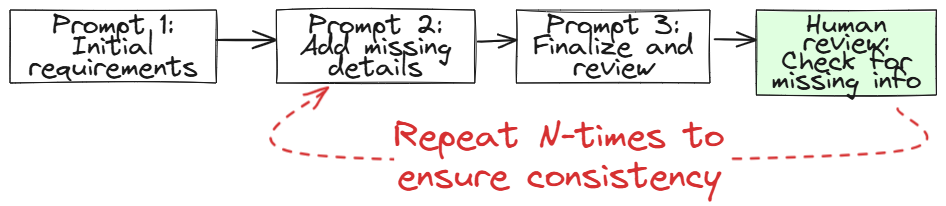
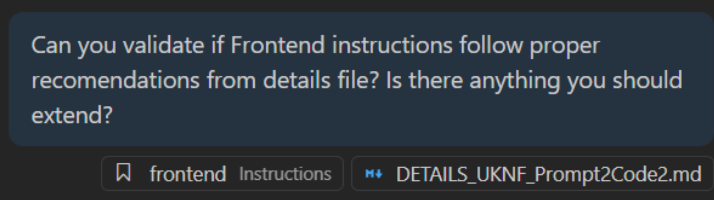
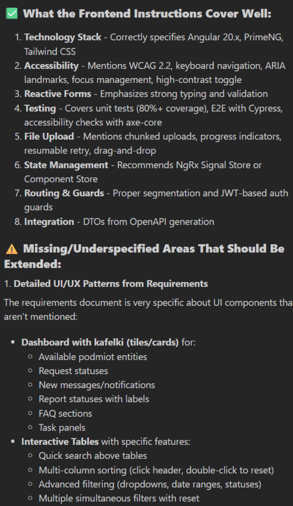

# Good Prompting Practices

## Key Elements of a Good Prompt
- **Context** (e.g. language, framework, architecture)
- **Task** (what needs to be done)
- **Expectations** (output, format, style, tests)

## Best Practices
- Prompts should be **feature-oriented**: focus on a single feature or change per prompt for clarity and traceability.
- Always write prompts in **English** – it is the primary language of the internet and AI models.
- **Review all code results**: The developer must always read, understand, and optimize the code generated by AI. Never blindly accept code.
> [!CAUTION]
> There are two types of developers using AI:
>	- Those who read and optimize code (recommended)
>	- Those who don't read and just pray (not recommended)
- Use **incremental prompting**: For complex tasks, break down the process into smaller steps and prompt the model multiple times, reviewing each output. Ask model to implement only a part of the solution, not everything.

## Human-in-the-Loop Example

Below is an Excalidraw diagram demonstrating the human-in-the-loop process. For example, when creating a requirements file, the model was prompted three times, with the developer checking the output after each step to ensure nothing important was missed.

> [!TIP]
> This diagram was AI-generated with Excalidraw - [source code](assets/human-in-the-loop.excalidraw)

