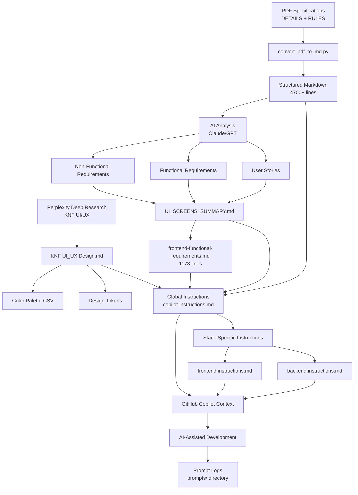
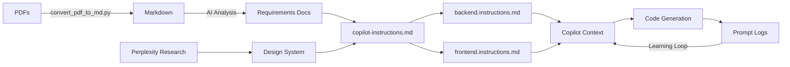
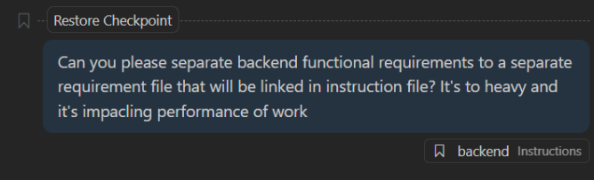

# 3. Working with AI - Complete Development Lifecycle

This document demonstrates how we leveraged AI tools across the entire software development lifecycle for the UKNF Communication Platform hackathon project.

## Table of Contents
- 3. Working with AI - Complete Development Lifec**Key Learnings:**
1. **Invest in AI-friendly formats early** - Markdown > PDF for LLM context
2. **Keep file separation/optimize file sizes** - The bigger file, the slower AI processing. Keep instructions separated, optimize for files smaller than 500 lines of code
3. **Structure matters** - Well-organized requirements = better AI suggestions
4. **Layered instructions** - Global + stack-specific > monolithic
5. **Research automation** - Deep research tools (Perplexity) > manual browsing
6. **Log everything** - Prompt logs are gold for iteration and learning

---

### 3.1.9. Visual Workflow & Process Diagrams

This section provides visual representations of our AI-assisted planning pipeline for better understanding and reproducibility.

#### Planning Pipeline Flow



#### Artifact Relationships



#### Data Flow Summary

| Stage | Input | AI Tool | Output | Time Saved |
|-------|-------|---------|--------|------------|
| **1. PDF Parsing** | 2 PDFs (~5000 lines) | Custom Python script | Structured Markdown | 8-10h → 15min |
| **2. UI/UX Research** | KNF website analysis | Perplexity Deep Research | Design system docs | 4-6h → 30min |
| **3. Requirements Synthesis** | Markdown specs | Claude/GPT | User stories, acceptance criteria | 16-20h → 2-3h |
| **4. Instruction Generation** | Synthesized requirements | Manual + AI review | Copilot instructions | 4-6h → 1-2h |
| **TOTAL** | Raw specifications | AI-assisted pipeline | Development-ready docs | **87-89% reduction** |

#### Quality Gates

Each planning artifact passes through validation checkpoints:

**1. PDF → Markdown Conversion**
- ✅ All headings properly detected
- ✅ Tables preserved
- ✅ Numbered lists intact
- ✅ Page numbers tracked
- ✅ Manual review of critical sections

**2. AI-Generated Requirements**
- ✅ Cross-reference with original PDFs
- ✅ Conflict detection (ambiguities flagged)
- ✅ Completeness check (all modules covered)
- ✅ Technical feasibility review

**3. Copilot Instructions**
- ✅ Test with sample prompts
- ✅ Verify context relevance
- ✅ Stack-specific applicability
- ✅ No conflicting rules

**4. Design System**
- ✅ Color contrast ratios (WCAG AA)
- ✅ Brand consistency
- ✅ Component coverage
- ✅ Responsive breakpoints defined

---

### 3.1.10. Prompt Engineering Strategy

Our iterative prompting approach follows a structured four-phase cycle:

#### Phase 1: Broad Extraction
```
"From DETAILS_UKNF_Prompt2Code2.md, extract all functional requirements 
and categorize them by module: Communication, Identity & Access, Administration."
```

**Goal:** High-level categorization and initial requirements discovery

#### Phase 2: Deep Dive
```
"For the Communication module requirements, create detailed user stories with:
- Role definitions
- User goals
- Acceptance criteria
- UI mockup descriptions
- API endpoint specifications"
```

**Goal:** Convert requirements into actionable user stories with complete context

#### Phase 3: Technical Specification
```
"Based on the user stories for 'Wiadomości' (Messages), generate:
- Angular component structure
- PrimeNG components to use
- API contract (OpenAPI spec)
- Database schema (PostgreSQL tables)"
```

**Goal:** Transform user stories into concrete technical specifications

#### Phase 4: Validation
```
"Review the generated specifications for the Messages module against 
the original requirements in DETAILS_UKNF_Prompt2Code2.md. 
Identify any gaps, conflicts, or ambiguities."
```

**Goal:** Quality assurance and gap analysis

---

### 3.1.11. Tools & Technologies Inventory

| Tool | Purpose | License | Integration |
|------|---------|---------|-------------|
| **PyMuPDF (fitz)** | PDF parsing | AGPL-3.0 | Custom script |
| **Perplexity AI** | UI/UX research | Commercial | Web interface |
| **GitHub Copilot** | Code generation | Commercial | VS Code extension |
| **Claude 4.5 Sonnet** | Requirements analysis | Commercial | API/Web |
| **GPT-5** | Document synthesis | Commercial | API/Web |

---

### 3.1.12. Lessons Learned & Best Practices

#### ✅ What Worked Well

1. **Early format conversion** - Converting PDFs to Markdown immediately unlocked AI capabilities
2. **Layered instructions** - Global + stack-specific > monolithic context
3. **Iterative prompting** - Broad → Deep → Technical → Validation cycle
4. **Logging discipline** - Every prompt logged = reproducible results
5. **Visual research** - Perplexity's image analysis captured color schemes perfectly

#### ⚠️ Challenges Encountered

1. **Context window limits** - Had to chunk large PDFs for analysis
2. **Hallucination risks** - Always cross-reference AI output with source
3. **Ambiguity in specs** - AI surfaced conflicts humans might miss (beneficial!)
4. **Instruction drift** - Needed to refine Copilot instructions based on early code generation
5. **Manual review bottleneck** - Critical sections still need human validation

___

## 3.2. Projektowanieworking-with-ai---complete-development-lifecycle)
- [3. Working with AI - Complete Development Lifecycle](#3-working-with-ai---complete-development-lifecycle)
  - [Table of Contents](#table-of-contents)
    - [3.1.9. Visual Workflow \& Process Diagrams](#319-visual-workflow--process-diagrams)
      - [Planning Pipeline Flow](#planning-pipeline-flow)
      - [Artifact Relationships](#artifact-relationships)
      - [Data Flow Summary](#data-flow-summary)
      - [Quality Gates](#quality-gates)
    - [3.1.10. Prompt Engineering Strategy](#3110-prompt-engineering-strategy)
      - [Phase 1: Broad Extraction](#phase-1-broad-extraction)
      - [Phase 2: Deep Dive](#phase-2-deep-dive)
      - [Phase 3: Technical Specification](#phase-3-technical-specification)
      - [Phase 4: Validation](#phase-4-validation)
    - [3.1.11. Tools \& Technologies Inventory](#3111-tools--technologies-inventory)
    - [3.1.12. Lessons Learned \& Best Practices](#3112-lessons-learned--best-practices)
      - [✅ What Worked Well](#-what-worked-well)
      - [⚠️ Challenges Encountered](#️-challenges-encountered)
  - [3.2. Projektowanieworking-with-ai---complete-development-lifecycle)](#32-projektowanieworking-with-ai---complete-development-lifecycle)
  - [3.1. Planning](#31-planning)
    - [3.1.1. Problem: Processing PDF Specifications](#311-problem-processing-pdf-specifications)
    - [3.1.2. Solution: Custom PDF-to-Markdown Parser](#312-solution-custom-pdf-to-markdown-parser)
    - [3.1.3. Creating Global Copilot Instructions](#313-creating-global-copilot-instructions)
    - [3.1.4. Technical Instructions per Stack](#314-technical-instructions-per-stack)
    - [3.1.5. UI/UX Research with AI](#315-uiux-research-with-ai)
    - [3.1.6. Requirements Analysis \& Synthesis](#316-requirements-analysis--synthesis)
    - [3.1.7. Prompt Logging Strategy](#317-prompt-logging-strategy)
    - [3.1.8. Planning Phase Summary](#318-planning-phase-summary)

---

## 3.1. Planning

This section documents our AI-driven approach to initial project planning for the UKNF Communication Platform, from raw PDF specifications to actionable development instructions.

### 3.1.1. Problem: Processing PDF Specifications

**Challenge:** We received two comprehensive PDF specifications from the hackathon organizers:
- `DETAILS_UKNF_Prompt2Code2.pdf` - Detailed functional requirements (3771 lines after conversion)
- `RULES_UKNF_Prompt2Code2.pdf` - Technical rules and constraints

PDFs are not AI-friendly formats:
- Poor text extraction quality
- Lost formatting and structure
- Difficult to reference specific sections in AI prompts
- Hard to parse and analyze programmatically

### 3.1.2. Solution: Custom PDF-to-Markdown Parser

**Tool:** `convert_pdf_to_md.py`

We developed a Python-based parser using PyMuPDF (`fitz`) that intelligently converts PDF specifications into structured Markdown:

**Key Features:**
- **Smart heading detection** - Analyzes font sizes, bold text, numbering patterns (e.g., "1.", "1.1", "A.")
- **Formatting preservation** - Detects and converts:
  - ALL CAPS headings
  - Bold/italic text
  - Bullet points (•, −, –, ➢, ◦, ●, ■, □) → Markdown lists
  - Tables
  - Numbered sections
- **Structure analysis** - Calculates average and maximum font sizes to determine heading hierarchy (h1-h6)
- **Page tracking** - Maintains page numbers and bounding boxes for reference
- **Text normalization** - Cleans whitespace, removes artifacts

**Benefits:**
1. **AI-digestible format** - Clean Markdown is ideal for LLM context windows
2. **Easy navigation** - Headings create logical structure for AI to reference
3. **Searchable** - Full-text search across requirements
4. **Version controllable** - Markdown files in Git track requirement changes
5. **Referenceable** - Direct links to specific sections in prompts

**Usage Example:**
```bash
python convert_pdf_to_md.py DETAILS_UKNF_Prompt2Code2.pdf -o DETAILS_UKNF_Prompt2Code2.md
```

**Output Structure:**
```markdown
# Main Heading (auto-detected)
## Section 1.1 (numbered heading)
### Subsection (bold detection)
- Bullet point (converted)
- Another point
```

### 3.1.3. Creating Global Copilot Instructions

**File:** `.github/copilot-instructions.md`

After converting PDFs to Markdown, we synthesized the requirements into a master instruction file that GitHub Copilot reads for every interaction:

**Structure:**
1. **Project in a nutshell** - High-level architecture summary
   - Angular 20 SPA + ASP.NET Core 8/9 REST API
   - PostgreSQL database
   - Three domains: Communication, Identity & Access, Administration

2. **How we collaborate with AI**
   - Incremental prompting strategy
   - Prompt/response logging in `prompts.md`
   - Manual review triggers for security/migration changes
   - Open-source licence compliance

3. **Architecture guardrails**
   - Frontend/backend separation
   - REST conventions (plural nouns, `/api/v1/...`, problem+json errors)
   - Non-functional requirements:
     - File management (chunked uploads, ZIP, virus scanning hooks)
     - Security (OAuth2/OIDC, JWT, encrypted secrets, audit trails)
     - Performance (caching, background jobs, pagination)
     - Accessibility (WCAG 2.2, high contrast, keyboard navigation)

4. **Delivery expectations**
   - Docker/docker-compose updates
   - Environment variable documentation
   - API documentation (Swagger/ReDoc)
   - Test coverage requirements

5. **Primary requirement sources** (with priority order)
   - Primary: `UI_SCREENS_SUMMARY.md`, `KNF UI_UX Design.md`
   - Secondary: `DETAILS_UKNF_Prompt2Code2.md`
   - Supporting: `RULES_UKNF_Prompt2Code2.md`, color palettes, test data

**Key Innovation:** This file is automatically loaded by GitHub Copilot as workspace-level context, ensuring every AI interaction is grounded in project requirements.

### 3.1.4. Technical Instructions per Stack

To avoid overwhelming Copilot with irrelevant context, we created separate technical instruction files. Those files were directly derived from Details and Project Technology stack requirements.

**`.github/instructions/backend.instructions.md`**
- Applies to: `backend/**/*.cs`, `backend/**/*.csproj`, `backend/**/Dockerfile`, `backend/**/*.sql`
- Contains:
  - ASP.NET Core 8/9 coding standards
  - Entity Framework Core patterns
  - PostgreSQL-specific conventions
  - API versioning strategy
  - Authentication/authorization patterns
  - Testing requirements (xUnit, integration tests)

**`.github/instructions/frontend.instructions.md`**
- Applies to: `frontend/**/*.ts`, `frontend/**/*.tsx`, `frontend/**/*.html`, `frontend/**/*.css`, `frontend/**/*.scss`, `frontend/**/*.json`
- Contains:
  - Angular 20 standalone component patterns
  - PrimeNG component usage
  - Tailwind CSS conventions
  - TypeScript strict mode rules
  - Accessibility requirements
  - Responsive design breakpoints
  - Testing patterns (Jasmine/Karma)

**How it works:**
GitHub Copilot automatically includes the relevant instruction file based on which file you're editing, ensuring context-appropriate suggestions. Those files were later spparated into separate guidlines and technical requirements, to limit system from including all requirements in each prompt.


### 3.1.5. UI/UX Research with AI

**Research Method:** Perplexity Deep Research

To ensure design consistency with KNF's brand identity, we used Perplexity AI's deep research mode to analyze:

**Research Query:**
> "Analyze KNF (Komisja Nadzoru Finansowego) official websites and visual identity. Extract color schemes, typography, layout patterns, accessibility standards, and UI/UX best practices for Polish government financial supervision authority."

**Output:** `KNF (Komisja Nadzoru Finansowego) UI_UX Design.md`

**Research Findings:**
1. **Core Visual Identity**
   - Primary: Deep Navy Blue (#003366) - authority, trust
   - Secondary: Accent Blue (#0073E6) - interactive elements
   - Neutrals: White (#FFFFFF), Light Gray (#F5F5F5), Dark Gray (#333333)
   - Semantic mapping to CSS custom properties

2. **Typography Standards**
   - Sans-serif families (Arial, Lato, Roboto)
   - Minimum 14-16px body text
   - Clear hierarchy (bold headers, regular body)

3. **Layout Patterns**
   - Horizontal top navigation with dropdowns
   - Card-based layouts with subtle shadows
   - Generous white space
   - Consistent button styling

4. **Accessibility Compliance**
   - WCAG AA standards (4.5:1 contrast minimum)
   - Font sizing controls
   - Keyboard navigation
   - Multi-language support (Polish/English)
   - Semantic HTML structure

5. **Government Website Trends**
   - Clean, minimal interfaces
   - Content-first design
   - Responsive (mobile-first)
   - Fast loading times

**Color Palette Export:**
Research also generated `knf_color_palette_recommendations.csv` for design tool import. This colour palette was used to define colouring standard in frontend development.

**AI Innovation Insight:**
The research revealed KNF's adoption of AI/NLP for document processing, validating our AI-first development approach.

### 3.1.6. Requirements Analysis & Synthesis

**Process:**
1. **Automated conversion** - PDFs → Markdown (3771 + ~1000 lines of structured content)
2. **AI-assisted analysis** - Used Claude/GPT-4 to:
   - Extract user stories from converted Markdown
   - Identify functional vs. non-functional requirements
   - Map requirements to modules (Communication, Identity, Administration)
   - Detect conflicts or ambiguities

3. **Synthesis into actionable documents:**
   - `UI_SCREENS_SUMMARY.md` - Consolidated screen-by-screen specifications
   - `frontend-functional-requirements.md` - Detailed UI component requirements (1173 lines)
   - Database schema requirements
   - API endpoint specifications

**Example AI Prompt for Synthesis:**
```
Given the converted Markdown from DETAILS_UKNF_Prompt2Code2.md, extract all requirements 
related to the "Wiadomości" (Messages) module. Create:
1. User stories in the format: As a [role], I want [feature] so that [benefit]
2. Acceptance criteria for each story
3. UI component requirements (forms, tables, buttons)
4. API endpoint specifications (HTTP methods, request/response schemas)
5. Database schema requirements (tables, columns, relationships)
```

### 3.1.7. Prompt Logging Strategy

**File:** `prompts/` directory

Per global instructions, *most* of AI interaction is logged as long as AI decided to log the prompt, which in reality is 50/50 pick. This proces was started after initial repository setup.

**Naming Convention:**
```
<branch_name>-<timestamp>.md
Example: FrontendNG-2025-10-05_063506.md
```

**Log Structure:**
```markdown
# Prompt Log: [Feature/Module Name]
**Branch:** [branch_name]
**Timestamp:** [YYYY-MM-DD HH:MM:SS]

## User Request
[Original prompt from developer]

## AI Response Summary
[High-level approach and actions taken]

## Files Modified
- file1.ts
- file2.html

## Tests
[Test results or pending tests]

## Requirements Coverage
- Requirement 1 - Done/Pending
- Requirement 2 - Done/Pending
```

**Benefits:**
1. **Audit trail** - Complete history of AI-generated code decisions
2. **Learning** - Identify effective vs. ineffective prompts
3. **Reproducibility** - Replay successful prompt patterns
4. **Documentation** - Auto-generated changelog
5. **Compliance** - Hackathon requirement for prompt engineering documentation

### 3.1.8. Planning Phase Summary

**Input Artifacts:**
- 2 PDF specifications (~5000 lines of requirements)
- Perplexity research on KNF UI/UX

**AI-Assisted Tools & Processes:**
1. Custom PDF parser (`convert_pdf_to_md.py`)
2. Requirement synthesis (Claude/GPT-4)
3. UI/UX research (Perplexity Deep Research)
4. Instruction file generation

**Output Artifacts:**
- `DETAILS_UKNF_Prompt2Code2.md` (3771 lines)
- `RULES_UKNF_Prompt2Code2.md` (~1000 lines)
- `.github/copilot-instructions.md` (global context)
- `.github/instructions/backend.instructions.md` (stack-specific)
- `.github/instructions/frontend.instructions.md` (stack-specific)
- `KNF UI_UX Design.md` (design system)
- `UI_SCREENS_SUMMARY.md` (consolidated screens)
- `frontend-functional-requirements.md` (1173 lines)
- `knf_color_palette_recommendations.csv`

**Time Saved:**
- Manual PDF parsing: ~8-10 hours → 15 minutes (automated)
- Requirements analysis: ~16-20 hours → 2-3 hours (AI-assisted)
- UI/UX research: ~4-6 hours → 30 minutes (Perplexity)
- **Total:** ~28-36 hours → ~3-4 hours (87-89% time reduction)

**Key Learnings:**
1. **Invest in AI-friendly formats early** - Markdown > PDF for LLM context
2. **Keep file separation/optimize file sizes** - The bigger file, the slower AI processing. Keep instructions separated, optimize for files smaller thann 500 lines of code
3. **Structure matters** - Well-organized requirements = better AI suggestions
4. **Layered instructions** - Global + stack-specific > monolithic
5. **Research automation** - Deep research tools (Perplexity) > manual browsing
6. **Log everything** - Prompt logs are gold for iteration and learning

